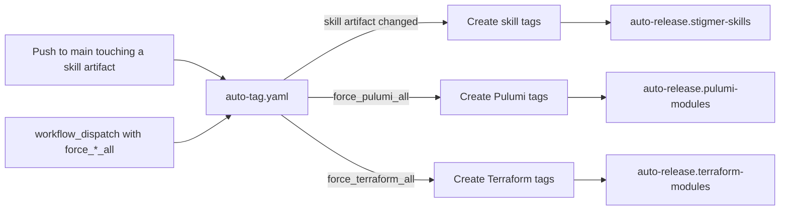
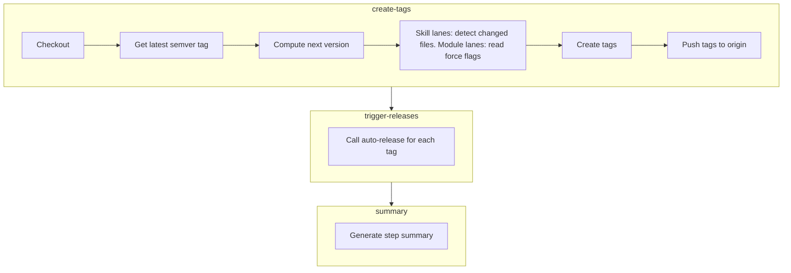

# Auto-Tag and Auto-Release System

Per-component pre-release tags and the release pipelines they trigger: Pulumi modules, Terraform modules, and Stigmer skills.

## Why it exists

A full release (`release.yaml` at a `vX.Y.Z` tag) ships everything at once. Between full releases, one component sometimes needs to go out on its own: a skill definition its consumer reads the same day, or a module someone wants in users' hands before the next full cut. The auto-tag system mints a semver-compliant pre-release tag for exactly that component and triggers its build, so a single component can be released without cutting the world.

## Two kinds of lane, two triggers

Founder direction, 2026-09-04: **module tags are cut on dispatch only; skill tags are cut on push.**

- **Skill lanes tag on push.** The skills under `skills/` are definitions that a consumer (Stigmer) reads the same day they change, so a merge to `main` is the publish decision for them. A push produces at most two skill tags however many files it touched.
- **Module lanes tag on dispatch only.** A merge to `main` is not a release decision for a Pulumi or Terraform module; the full release ships every module. When a module release is wanted between full releases, someone runs `auto-tag` with `force_pulumi_all` / `force_terraform_all`, which tags every module of that flavor.

Until 2026-09-04 the module lanes also tagged on push, filtered by `catalog/**/iac/pulumi/**` and `catalog/**/iac/tf/**`, with change-based detection (`tools/ci/release/detect_module_dirs.sh`) and a mass-change guard (`MODULE_AUTO_TAG_THRESHOLD`, default 5: a push touching that many unique components skipped module tags, because a sweep signals a full release is coming). All of that is retired from the workflow. The detector script stays in `tools/ci/release/` with its own self-test, so re-enabling push module tags is a restore (the two paths, the detector call and its self-test step, the guard) rather than a rewrite.

## How it works



The `auto-tag.yaml` workflow triggers component-specific release workflows directly:

- **`auto-tag.yaml`** - Creates tags, triggers the matching releases
- **`auto-release.pulumi-modules.yaml`** - Builds Pulumi binaries
- **`auto-release.terraform-modules.yaml`** - Creates Terraform zips
- **`auto-release.stigmer-skills.yaml`** - Packages and publishes a Stigmer skill

## Tag format

Tags use semver pre-release format based on the _next_ patch version:

```
v{next_patch}-{engine}.{component}.{YYYYMMDD}.{sequence}
```

| Component     | Example Tag                                    | Sorted Position |
| ------------- | ---------------------------------------------- | --------------- |
| Pulumi        | `v0.3.5-pulumi.postgres.20260108.0`            | Above `v0.3.4`  |
| Terraform     | `v0.3.5-terraform.postgres.20260108.0`         | Above `v0.3.4`  |
| Stigmer skill | `v0.3.5-skill.multi-cloud-catalog.20260108.0`  | Above `v0.3.4`  |

### Why next version?

Auto-release tags are based on the _next_ patch version so they appear **above** the current stable release in GitHub's tag list. If the latest release is `v0.3.4`, auto-releases become `v0.3.5-pulumi.*`. This provides immediate visibility into what's been built since the last official release.

### Why hyphen, not plus?

Semver supports two metadata formats:

- **Pre-release** (`-`): `v1.0.0-alpha.1` - affects version precedence
- **Build metadata** (`+`): `v1.0.0+build.123` - ignored for precedence

We use hyphen (`-`) because GitHub Actions tag patterns don't support the `+` character. The hyphen format is valid semver.

## Path detection (skill lanes)

Only the skill lanes detect changes. A skill is tagged when a push touches its published artifact:

| Skill                 | Trigger set                                                                                                                                                                              |
| --------------------- | ---------------------------------------------------------------------------------------------------------------------------------------------------------------------------------------- |
| `planton`             | `skills/planton/**`                                                                                                                                                                      |
| `multi-cloud-catalog` | `skills/multi-cloud-catalog/**`, plus every file its embedded reference pack selects: `catalog/**/{reference,GUIDE,reference-index,reference-commons}.md`, `catalog/**/reference-graph.yaml`, `catalog/_patterns/**` (`_test` excluded) |

The catalog skill's trigger set mirrors `pkg/skills/defspack/catalogpack.go`; change the assembler and the trigger set together.

Module lanes have no path detection: they tag every module of a flavor when its force flag is set, and never otherwise. The `_test` provider is skipped in every lane (`hack/guards/ensure_test_provider_stays_internal.sh` asserts this).

## Sequence numbers

Multiple releases on the same day increment a sequence number:

```
v0.3.5-pulumi.awsvpc.20260108.0  # First release of this module today
v0.3.5-pulumi.awsvpc.20260108.1  # Second release of this module today
```

The sequence resets when the base semver changes (after a new official release).

## Workflow details

### auto-tag.yaml

**Triggers:**

- Push to `main` touching a skill's trigger set (skill tags only)
- Manual dispatch with `force_pulumi_all` / `force_terraform_all` (module tags only)

**Jobs:**



**Permissions required:**

- `contents: write` - Create and push tags
- `actions: write` - Trigger auto-release workflow

### Component release workflows

Each engine has its own release workflow triggered directly by `auto-tag.yaml`:

| Workflow                              | Trigger Inputs                         |
| ------------------------------------- | -------------------------------------- |
| `auto-release.pulumi-modules.yaml`    | `tag`, `component`, `provider`, `path` |
| `auto-release.terraform-modules.yaml` | `tag`, `component`, `provider`, `path` |
| `auto-release.stigmer-skills.yaml`    | `tag`, `skill`                         |

## Why workflow_dispatch instead of tag push?

GitHub's `GITHUB_TOKEN` has a security feature: events triggered by it don't create new workflow runs. This prevents infinite loops but means tag pushes from `auto-tag` won't trigger release workflows.

We solve this by having `auto-tag` explicitly call each engine's release workflow via `workflow_dispatch`. This provides:

- **Explicit control** - Clear which tags trigger which releases
- **No external tokens** - Uses built-in `GITHUB_TOKEN`
- **Visible chain** - Both workflows appear in Actions UI
- **Debuggable** - Easy to trace what triggered what

## Releasing modules

This is the only way module tags are cut. Run `auto-tag` with a force flag:

```
gh workflow run auto-tag.yaml -f force_pulumi_all=true
```

Available flags:

- `force_pulumi_all` - Tag every Pulumi module
- `force_terraform_all` - Tag every Terraform module

Both flags tag every module of that flavor; there is no per-module dispatch. Skill tags cannot be forced from here; they come from a push that changes the skill (see "Path detection").

### Re-run a failed release

If a release fails, run the specific engine workflow manually:

```bash
gh workflow run auto-release.pulumi-modules.yaml \
  -f tag=v0.3.5-pulumi.awsecsservice.20260108.0 \
  -f component=awsecsservice \
  -f provider=aws \
  -f path=catalog/aws/awsecsservice/iac/pulumi
```

## Release artifacts by component

| Component | Build Tool | Output                            |
| --------- | ---------- | --------------------------------- |
| Pulumi    | Go build   | Pre-compiled binaries per module  |
| Terraform | Archive    | Zip files uploaded per module     |

## Troubleshooting

### Tag created but no release

Check if `trigger-releases` job ran in `auto-tag`. If it failed, manually trigger the engine workflow with the tag (see "Re-run a failed release").

### Skill not tagged after a push

Check the pushed files against the skill's trigger set in "Path detection". The `push.paths` filter in `auto-tag.yaml` and the `grep` in its skill section must agree; if you changed one, change the other.

### Module not tagged after a push

Expected: module tags are dispatch-only (see "Two kinds of lane, two triggers"). Run `auto-tag` with the force flag for that flavor.

### Sequence number collision

If you delete and recreate tags on the same day, sequence detection uses `git tag -l`. Make sure remote tags are fetched:

```bash
git fetch --tags
```

## Related files

- [`auto-tag.yaml`](../auto-tag.yaml) - Tag creation and release triggering
- [`auto-release.pulumi-modules.yaml`](../auto-release.pulumi-modules.yaml) - Pulumi binary builds
- [`auto-release.terraform-modules.yaml`](../auto-release.terraform-modules.yaml) - Terraform zip archives
- [`auto-release.stigmer-skills.yaml`](../auto-release.stigmer-skills.yaml) - Stigmer skill packaging and publish
- [`release.yaml`](../release.yaml) - Full semver releases (separate from auto-release)
- `tools/ci/release/detect_module_dirs.sh` - The retired push-time module detector, kept for re-enabling
