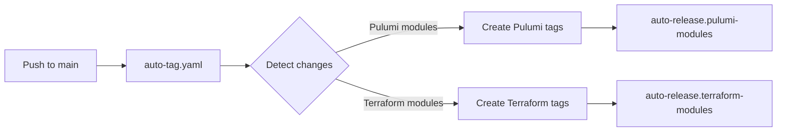
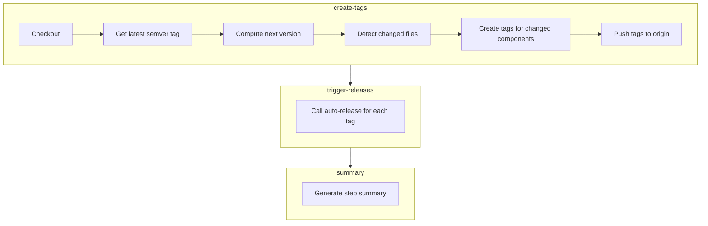

# Auto-Tag and Auto-Release System

Automated tag creation and release pipeline that triggers per-module builds whenever IaC module changes land on `main`.

## Why it exists

Manual releases are error-prone and create bottlenecks. Developers forget to tag, version numbers drift, and releases pile up. The auto-tag system eliminates this friction: push module code, get a module release. Every commit to `main` that touches a component's IaC module automatically creates a semver-compliant tag and triggers the appropriate build pipeline.

## How it works



The `auto-tag.yaml` workflow triggers component-specific release workflows directly:

- **`auto-tag.yaml`** - Detects changes, creates tags, triggers module releases
- **`auto-release.pulumi-modules.yaml`** - Builds Pulumi binaries
- **`auto-release.terraform-modules.yaml`** - Creates Terraform zips

## Tag format

Tags use semver pre-release format based on the _next_ patch version:

```
v{next_patch}-{engine}.{component}.{YYYYMMDD}.{sequence}
```

| Component | Example Tag                            | Sorted Position |
| --------- | -------------------------------------- | --------------- |
| Pulumi    | `v0.3.5-pulumi.postgres.20260108.0`    | Above `v0.3.4`  |
| Terraform | `v0.3.5-terraform.postgres.20260108.0` | Above `v0.3.4`  |

### Why next version?

Auto-release tags are based on the _next_ patch version so they appear **above** the current stable release in GitHub's tag list. If the latest release is `v0.3.4`, auto-releases become `v0.3.5-pulumi.*`. This provides immediate visibility into what's been built since the last official release.

### Why hyphen, not plus?

Semver supports two metadata formats:

- **Pre-release** (`-`): `v1.0.0-alpha.1` - affects version precedence
- **Build metadata** (`+`): `v1.0.0+build.123` - ignored for precedence

We use hyphen (`-`) because GitHub Actions tag patterns don't support the `+` character. The hyphen format is valid semver.

## Path detection

The system monitors the IaC module paths to determine which components need releases:

| Component | Monitored Paths          |
| --------- | ------------------------ |
| Pulumi    | `catalog/**/iac/pulumi/` |
| Terraform | `catalog/**/iac/tf/`     |

A single commit can trigger multiple releases if it touches multiple components. The detection patterns live in `tools/ci/release/detect_module_dirs.sh` (single source, maturity-grammar-aware, self-tested before every detection run).

## Mass-change guard

A push that touches many modules at once (a sweeping refactor, a lint fix
across all components) is a signal that a proper full release is coming.
Auto-tagging every affected module would flood Actions with redundant
per-module releases, so `auto-tag.yaml` skips module tags when the number of
unique changed components reaches a threshold:

- **Threshold:** `MODULE_AUTO_TAG_THRESHOLD` in the `env` block at the top of
  [`auto-tag.yaml`](../auto-tag.yaml) (default: `5`). Tune it there.
- **Counting:** unique `provider/component` pairs. A component changed in both
  its `iac/pulumi` and `iac/tf` directories counts once; `_test` providers are
  excluded.
- **Bypass:** the guard applies only to push events. Manual dispatch with
  `force_pulumi_all` / `force_terraform_all` always tags, regardless of count.

When the guard trips, the run's step summary explains what was skipped and
why. To release the modules anyway, cut a proper release or force module tags
via manual dispatch.

## Sequence numbers

Multiple releases on the same day increment a sequence number:

```
v0.3.5-pulumi.awsvpc.20260108.0  # First release of this module today
v0.3.5-pulumi.awsvpc.20260108.1  # Second release of this module today
```

The sequence resets when the base semver changes (after a new official release).

## Workflow details

### auto-tag.yaml

**Triggers:**

- Push to `main` with changes in monitored paths
- Manual dispatch with force flags

**Jobs:**



**Permissions required:**

- `contents: write` - Create and push tags
- `actions: write` - Trigger auto-release workflow

### Component release workflows

Each engine has its own release workflow triggered directly by `auto-tag.yaml`:

| Workflow                              | Trigger Inputs                         |
| ------------------------------------- | -------------------------------------- |
| `auto-release.pulumi-modules.yaml`    | `tag`, `component`, `provider`, `path` |
| `auto-release.terraform-modules.yaml` | `tag`, `component`, `provider`, `path` |

## Why workflow_dispatch instead of tag push?

GitHub's `GITHUB_TOKEN` has a security feature: events triggered by it don't create new workflow runs. This prevents infinite loops but means tag pushes from `auto-tag` won't trigger release workflows.

We solve this by having `auto-tag` explicitly call each engine's release workflow via `workflow_dispatch`. This provides:

- **Explicit control** - Clear which tags trigger which releases
- **No external tokens** - Uses built-in `GITHUB_TOKEN`
- **Visible chain** - Both workflows appear in Actions UI
- **Debuggable** - Easy to trace what triggered what

## Manual triggers

### Force all modules

Run `auto-tag` manually with force flags:

```
gh workflow run auto-tag.yaml -f force_pulumi_all=true
```

Available flags:

- `force_pulumi_all` - Force tags for all Pulumi modules
- `force_terraform_all` - Force tags for all Terraform modules

### Re-run a failed release

If a release fails, run the specific engine workflow manually:

```bash
gh workflow run auto-release.pulumi-modules.yaml \
  -f tag=v0.3.5-pulumi.awsecsservice.20260108.0 \
  -f component=awsecsservice \
  -f provider=aws \
  -f path=catalog/aws/awsecsservice/iac/pulumi
```

## Release artifacts by component

| Component | Build Tool | Output                            |
| --------- | ---------- | --------------------------------- |
| Pulumi    | Go build   | Pre-compiled binaries per module  |
| Terraform | Archive    | Zip files uploaded per module     |

## Troubleshooting

### Tag created but no release

Check if `trigger-releases` job ran in `auto-tag`. If it failed, manually trigger the engine workflow with the tag (see "Re-run a failed release").

### Wrong component detected

The detection patterns in `tools/ci/release/detect_module_dirs.sh` determine component type. Verify your changes match the expected patterns in the "Path detection" section above.

### Sequence number collision

If you delete and recreate tags on the same day, sequence detection uses `git tag -l`. Make sure remote tags are fetched:

```bash
git fetch --tags
```

## Related files

- [`auto-tag.yaml`](../auto-tag.yaml) - Tag creation and release triggering
- [`auto-release.pulumi-modules.yaml`](../auto-release.pulumi-modules.yaml) - Pulumi binary builds
- [`auto-release.terraform-modules.yaml`](../auto-release.terraform-modules.yaml) - Terraform zip archives
- [`release.yaml`](../release.yaml) - Manual semver releases (separate from auto-release)
