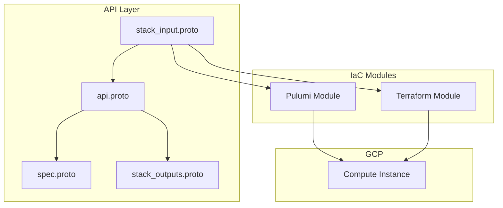

# GCP Compute Instance Deployment Component

**Date**: January 20, 2026
**Type**: Feature
**Components**: API Definitions, Pulumi CLI Integration, Terraform Module, Provider Framework

## Summary

Added a complete `GcpComputeInstance` deployment component for provisioning Google Compute Engine virtual machines. This new component includes full proto API definitions with validations, both Pulumi and Terraform IaC modules, comprehensive documentation, and 64 validation tests. The component supports all essential VM configuration options including machine types, boot disks, networking, service accounts, and Spot/Preemptible VMs.

## Problem Statement / Motivation

Google Compute Engine is a foundational IaaS offering that was missing from Project Planton's GCP provider suite. Teams needed a standardized, declarative way to provision VMs with consistent patterns matching other deployment components.

### Pain Points

- No Project Planton component for GCP Compute Engine VMs
- Manual VM provisioning lacks validation and consistency
- Cross-resource references (project, VPC, subnet, service account) required manual coordination
- No unified interface for Pulumi and Terraform VM deployments

## Solution / What's New

Created `GcpComputeInstance` as a complete deployment component following the ideal state architecture with:

- **Proto API Definitions**: 4 proto files with buf.validate rules and CEL validations
- **Dual IaC Implementation**: Full Pulumi (Go) and Terraform modules with feature parity
- **Cross-Resource References**: StringValueOrRef support for project, network, subnetwork, and service account
- **Comprehensive Documentation**: User-facing README, examples, and research documentation

### Component Architecture



## Implementation Details

### Proto API Definitions

**Files Created:**
- `v1/spec.proto` - Configuration schema with 17 fields and nested messages
- `v1/api.proto` - KRM wiring (apiVersion, kind, metadata, spec, status)
- `v1/stack_input.proto` - IaC module inputs
- `v1/stack_outputs.proto` - Deployment outputs (9 fields)
- `v1/spec_test.go` - 64 validation tests

**Key Spec Fields:**
```protobuf
message GcpComputeInstanceSpec {
  StringValueOrRef project_id = 1;      // Cross-ref to GcpProject
  string zone = 2;                       // e.g., "us-central1-a"
  string machine_type = 3;               // e.g., "e2-medium"
  GcpComputeInstanceBootDisk boot_disk = 4;
  repeated GcpComputeInstanceNetworkInterface network_interfaces = 5;
  GcpComputeInstanceServiceAccount service_account = 7;
  bool spot = 9;                         // Spot VM support
  GcpComputeInstanceScheduling scheduling = 17;
}
```

### Cross-Resource Reference Support

The component supports `StringValueOrRef` for 4 fields enabling declarative resource composition:

| Field | Default Kind | Default Field Path |
|-------|-------------|-------------------|
| `spec.project_id` | GcpProject | `status.outputs.project_id` |
| `network_interfaces[].network` | GcpVpc | `status.outputs.network_self_link` |
| `network_interfaces[].subnetwork` | GcpSubnetwork | `status.outputs.subnetwork_self_link` |
| `service_account.email` | GcpServiceAccount | `status.outputs.email` |

### Pulumi Module Structure

```
iac/pulumi/
├── main.go           # Entrypoint, stack input loading
├── Pulumi.yaml       # Project configuration
├── Makefile          # Build automation
├── debug.sh          # Debugging helper
├── README.md         # Usage documentation
├── overview.md       # Architecture documentation
└── module/
    ├── main.go       # Provider setup, resource orchestration
    ├── locals.go     # Label generation, data transformations
    ├── outputs.go    # Export constants
    └── instance.go   # Instance resource creation
```

### Terraform Module Structure

```
iac/tf/
├── provider.tf       # Google provider configuration
├── variables.tf      # Input variables (mirrors spec.proto)
├── locals.tf         # Computed values, label merging
├── main.tf           # google_compute_instance resource
├── outputs.tf        # Output values
└── README.md         # Usage documentation
```

### Cloud Resource Registry

Added enum entry to `cloud_resource_kind.proto`:

```protobuf
GcpComputeInstance = 617 [(kind_meta) = {
  provider: gcp
  version: v1
  id_prefix: "gcpvm"
}];
```

## Benefits

### For Users

- **Declarative VM Provisioning**: Define VMs in YAML with validation
- **Cross-Resource Composition**: Reference other Project Planton resources
- **Dual IaC Support**: Choose Pulumi or Terraform based on preference
- **Cost Optimization**: Built-in Spot VM support
- **Security Integration**: Service account attachment with value_from references

### For Developers

- **64 Validation Tests**: Comprehensive coverage of all validation rules
- **Documented Patterns**: README, examples, and research documentation
- **Debug Support**: Delve debugging script for Pulumi module

### Example Usage

**Literal Values:**
```yaml
apiVersion: gcp.project-planton.org/v1
kind: GcpComputeInstance
metadata:
  name: my-vm
spec:
  projectId:
    value: my-gcp-project
  zone: us-central1-a
  machineType: e2-medium
  bootDisk:
    image: debian-cloud/debian-11
  networkInterfaces:
    - network:
        value: default
```

**Value From References:**
```yaml
apiVersion: gcp.project-planton.org/v1
kind: GcpComputeInstance
metadata:
  name: prod-vm
spec:
  projectId:
    valueFrom:
      kind: GcpProject
      name: prod-project
      fieldPath: status.outputs.project_id
  zone: us-central1-a
  machineType: n2-standard-4
  bootDisk:
    image: debian-cloud/debian-11
    sizeGb: 100
    type: pd-ssd
  networkInterfaces:
    - network:
        valueFrom:
          kind: GcpVpc
          name: prod-vpc
          fieldPath: status.outputs.network_self_link
  serviceAccount:
    email:
      valueFrom:
        kind: GcpServiceAccount
        name: prod-sa
        fieldPath: status.outputs.email
```

## Impact

### Files Created

| Category | Files |
|----------|-------|
| Proto definitions | 4 |
| Generated stubs (.pb.go) | 4 |
| Tests | 1 (64 test cases) |
| Pulumi module | 8 |
| Terraform module | 6 |
| Documentation | 5 |
| Supporting files | 5 |
| **Total** | **33** |

### Registry Updates

- Added `GcpComputeInstance = 617` to cloud_resource_kind.proto
- Updated kind_map_gen.go with new component

### Validation Results

- **Build**: ✅ Passed (`make build`)
- **Tests**: ✅ 64/64 passed
- **Terraform Validate**: ✅ Valid
- **Proto Lint**: ✅ Passed

## Related Work

- **GcpCloudSql**: Used as reference implementation for GCP component patterns
- **GcpServiceAccount**: Now referenceable via `service_account.email` field
- **GcpVpc/GcpSubnetwork**: Network configuration references

---

**Status**: ✅ Production Ready
**Timeline**: Single session implementation
