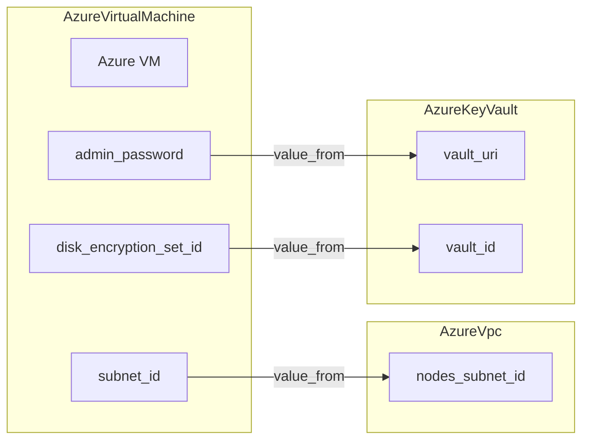

# Azure Virtual Machine Deployment Component

**Date**: January 20, 2026
**Type**: Feature
**Components**: API Definitions, Provider Framework, Pulumi CLI Integration, Terraform Module

## Summary

Forged a complete Azure Virtual Machine deployment component with cross-references to other Azure resources, enabling users to deploy VMs that automatically wire to existing VPCs and Key Vaults. The implementation includes Proto API definitions with comprehensive validation, Pulumi Go module, Terraform HCL module, and supporting documentation.

## Problem Statement / Motivation

OpenMCF needed an Azure Virtual Machine component to complete its Azure compute offering. Unlike simple VM provisioning, users needed:

1. **Cross-resource wiring** - Reference subnets from AzureVpc resources without hardcoding Azure resource IDs
2. **Secure credential management** - Reference passwords from AzureKeyVault instead of storing them in manifests
3. **Consistent patterns** - Follow the established 80/20 approach matching AWS EC2 and GCP Compute Instance components

### Pain Points

- No declarative way to deploy Azure VMs through OpenMCF
- Manual subnet ID lookup required when connecting VMs to VNets
- No integration with Azure Key Vault for secure password storage
- Missing alignment with existing AWS and GCP compute components

## Solution / What's New

Implemented the `AzureVirtualMachine` component following the 21-step forge flow with extensive cross-referencing capabilities.

### Cross-Reference Integration



### Key Features

| Feature | Description |
|---------|-------------|
| **Network Integration** | Cross-reference subnets from AzureVpc resources |
| **Secure Authentication** | SSH keys for Linux, passwords (via KeyVault) for Windows |
| **Managed Identities** | System-assigned and user-assigned identity support |
| **Disk Configuration** | OS disk and data disk attachment with encryption |
| **Availability Zones** | Deploy to specific zones (1, 2, 3) |
| **Spot Instances** | Cost-optimized pricing for fault-tolerant workloads |
| **Boot Diagnostics** | Serial console access for debugging |

## Implementation Details

### Proto API Structure

```
apis/org/openmcf/provider/azure/azurevirtualmachine/v1/
├── api.proto          # KRM envelope (AzureVirtualMachine, Status)
├── spec.proto         # Configuration with validations
├── stack_outputs.proto # Deployment outputs
├── stack_input.proto  # IaC module input wrapper
└── spec_test.go       # 16 validation tests
```

### Cross-Reference Fields

The spec uses `StringValueOrRef` from the foreign key proto for three fields:

```protobuf
// Subnet from AzureVpc
org.openmcf.shared.foreignkey.v1.StringValueOrRef subnet_id = 4 [
  (buf.validate.field).required = true,
  (org.openmcf.shared.foreignkey.v1.default_kind) = AzureVpc,
  (org.openmcf.shared.foreignkey.v1.default_kind_field_path) = "status.outputs.nodes_subnet_id"
];

// Password from AzureKeyVault
org.openmcf.shared.foreignkey.v1.StringValueOrRef admin_password = 10 [
  (org.openmcf.shared.foreignkey.v1.default_kind) = AzureKeyVault,
  (org.openmcf.shared.foreignkey.v1.default_kind_field_path) = "status.outputs.vault_uri"
];
```

### CEL Validations

Message-level validations enforce conditional requirements:

```protobuf
// Either SSH key or password required for authentication
option (buf.validate.message).cel = {
  id: "auth_required"
  message: "Either ssh_public_key or admin_password must be provided"
  expression: "this.ssh_public_key != '' || has(this.admin_password.value) || has(this.admin_password.value_from)"
};

// Spot price only valid when spot instance enabled
option (buf.validate.message).cel = {
  id: "spot_price_requires_spot_instance"
  expression: "this.spot_max_price == 0.0 || this.is_spot_instance"
};
```

### IaC Modules

**Pulumi (Go):**
- Uses Azure Native SDK v3 (`compute/v3`, `network/v3`)
- Creates NIC, optional Public IP, and VirtualMachine
- Exports vm_id, private/public IPs, identity principal ID

**Terraform (HCL):**
- Conditional Linux/Windows VM resources based on authentication method
- Dynamic blocks for identity, source image, and boot diagnostics
- Managed disk resources for data disk attachments

### CloudResourceKind Registration

Added `AzureVirtualMachine = 407` with id_prefix `azvm` to the central registry.

## Benefits

### For Users

- **Simplified wiring**: Reference AzureVpc by name instead of Azure resource IDs
- **Secure credentials**: Store passwords in Key Vault, reference in manifests
- **Consistent experience**: Same patterns as AWS EC2 and GCP Compute Instance
- **Sensible defaults**: Production-ready configuration out of the box

### For Developers

- **Complete validation**: 16 test cases cover all validation scenarios
- **Dual IaC support**: Both Pulumi and Terraform implementations
- **Clear documentation**: README, examples, and copy-paste manifests

## Impact

### Files Created

| Category | Count | Files |
|----------|-------|-------|
| Proto definitions | 4 | api.proto, spec.proto, stack_outputs.proto, stack_input.proto |
| Generated Go stubs | 4 | *.pb.go files |
| Tests | 1 | spec_test.go (16 tests) |
| Documentation | 2 | README.md, examples.md |
| Pulumi module | 4 | main.go, module/main.go, outputs.go, Makefile |
| Terraform module | 6 | variables.tf, provider.tf, locals.tf, main.tf, outputs.tf, README.md |
| Hack manifest | 1 | manifest.yaml |

### Modified Files

- `cloud_resource_kind.proto` - Added AzureVirtualMachine = 407
- `kind_map_gen.go` - Updated kind mapping
- `go.mod/go.sum` - Added pulumi-azure-native-sdk compute/v3, network/v3

## Related Work

- **GCP Compute Instance** (`2026-01-17`) - Similar VM component for GCP
- **AWS EC2 Instance** - Established patterns for VM configuration
- **AzureVpc** - Source for subnet cross-references
- **AzureKeyVault** - Source for password and encryption key cross-references

---

**Status**: ✅ Production Ready
**Timeline**: Single session
