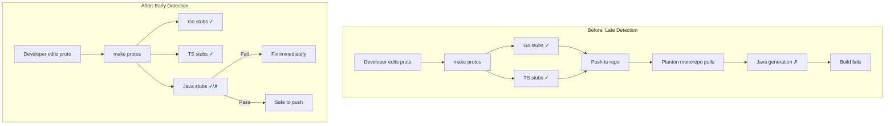

# Java Stubs Generation for Early Reserved Keyword Detection

**Date**: January 20, 2026
**Type**: Enhancement
**Components**: Build System, API Definitions, Code Generation

## Summary

Added Java protobuf stubs generation to the openmcf build pipeline to catch Java reserved keyword violations early, before they propagate to downstream consumers. This prevents broken builds in the planton monorepo by detecting issues like using `static` or `class` as enum values during local development.

## Problem Statement / Motivation

Protocol Buffer enum values and field names become identifiers in generated code. When these names conflict with language-specific reserved keywords, code generation fails.

### The Incident

The `AzureVirtualMachine` deployment component defined a `PublicIpAllocation` enum with these values:

```protobuf
enum PublicIpAllocation {
  public_ip_allocation_unspecified = 0;
  dynamic = 1;
  static = 2;  // ← Java reserved keyword!
}
```

This worked fine for Go and TypeScript generation but failed when the planton monorepo attempted to generate Java stubs, breaking the downstream build.

### Pain Points

- **Late detection**: Reserved keyword issues only surfaced in downstream repos
- **Broken builds**: The planton monorepo Java generation failed
- **No local validation**: Developers had no way to catch these issues before pushing
- **Manual review burden**: Relied on developers knowing all Java reserved keywords

## Solution / What's New

Added Java stubs generation to the openmcf build pipeline as an early warning system.



### Key Changes

1. **Added Java plugins to `buf.gen.yaml`**:
   ```yaml
   # Generate Java stubs to catch reserved keyword conflicts early
   - remote: buf.build/protocolbuffers/java:v30.1
     out: generated/stubs/java
   - remote: buf.build/grpc/java:v1.65.0
     out: generated/stubs/java
   ```

2. **Modified Makefile to preserve Java stubs**:
   - Go and TS stubs are copied to their destinations then cleaned up
   - Java stubs remain in `generated/stubs/java/` for inspection
   - Already gitignored via `apis/generated/` entry

3. **Created cursor rule for reserved word guidance**:
   - Lists all 50 Java reserved keywords
   - Provides naming alternatives for common concepts
   - Auto-applies to all `apis/**/*.proto` file changes

## Implementation Details

### File Changes

**`apis/buf.gen.yaml`** - Added Java plugin configuration:

```yaml
# Generate Java stubs to catch reserved keyword conflicts early (e.g., 'static', 'class')
# These are NOT committed - generated/stubs/java is gitignored
- remote: buf.build/protocolbuffers/java:v30.1
  out: generated/stubs/java
- remote: buf.build/grpc/java:v1.65.0
  out: generated/stubs/java
```

**`apis/Makefile`** - Modified cleanup to preserve Java stubs:

```makefile
# Keep Java stubs in generated/ for early detection of reserved keyword issues
# Go and TS stubs are copied to their destinations, so we only clean those
rm -rf generated/stubs/go generated/stubs/ts
```

**`apis/_rules/avoid-reserved-words-in-openmcf-apis.mdc`** - New cursor rule:

- Comprehensive list of all Java reserved keywords
- Before/after examples for common violations
- Naming pattern suggestions for problematic concepts

### The Fix Applied

Renamed the problematic enum values to use prefixes:

```protobuf
// Before
enum PublicIpAllocation {
  public_ip_allocation_unspecified = 0;
  dynamic = 1;
  static = 2;
}

// After
enum PublicIpAllocation {
  public_ip_allocation_unspecified = 0;
  public_dynamic = 1;
  public_static = 2;
}
```

Also updated the Pulumi module to use the new enum names:

```go
// Before
if *spec.Network.PublicIpAllocation == azurevirtualmachinev1.AzureVirtualMachineNetworkConfig_dynamic

// After  
if *spec.Network.PublicIpAllocation == azurevirtualmachinev1.AzureVirtualMachineNetworkConfig_public_dynamic
```

## Benefits

### Developer Experience
- **Immediate feedback**: Reserved keyword issues caught during `make protos`
- **Clear guidance**: Cursor rule provides alternatives when editing protos
- **No surprises**: Problems surface before pushing, not after

### Build Reliability
- **Downstream protection**: Planton monorepo won't receive broken protos
- **Consistent generation**: All target languages validated locally
- **Zero additional CI cost**: Java stubs generated but not committed

### Knowledge Capture
- **Documented keywords**: All 50 Java reserved words listed in cursor rule
- **Pattern library**: Common naming alternatives documented
- **Institutional memory**: Future developers guided by the rule

## Impact

| Aspect | Before | After |
|--------|--------|-------|
| Detection timing | Downstream build failure | Local `make protos` |
| Feedback loop | Hours/days | Seconds |
| Developer guidance | None | Cursor rule auto-applies |
| Java stubs in repo | None | Generated locally, gitignored |

### Who's Affected

- **Proto authors**: Get immediate feedback on reserved word violations
- **Downstream consumers**: Protected from receiving broken proto definitions
- **CI/CD**: No change - Java stubs not committed

## Related Work

- **Azure Virtual Machine Component**: The deployment component that triggered this enhancement
- **Planton Monorepo Java Generation**: The downstream consumer that would have failed

---

**Status**: ✅ Production Ready
