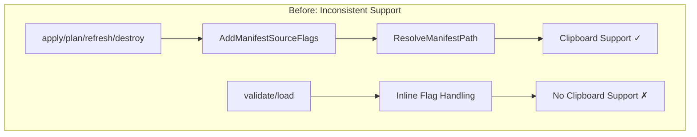
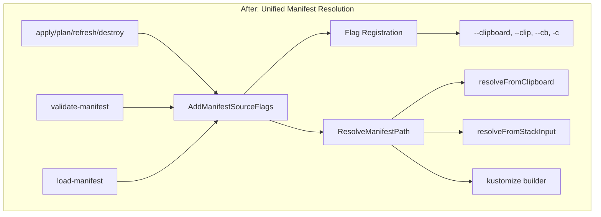

# Clipboard Flag Extension for Validate and Load Commands

**Date**: January 20, 2026
**Type**: Enhancement
**Components**: CLI Flags, Manifest Processing, User Experience

## Summary

Extended clipboard manifest input support (`--clipboard`, `-c`) to `validate-manifest` and `load-manifest` commands, and added `--clip` and `--cb` as convenient aliases. This brings feature parity across all manifest-consuming commands and improves the developer experience with shorter flag options.

## Problem Statement

The clipboard manifest input feature (introduced in `2026-01-15-141248-clipboard-manifest-input-support.md`) only worked for IaC operation commands (`apply`, `plan`, `refresh`, `destroy`). The `validate` and `load` commands had inline flag handling that bypassed the shared manifest resolver.

### Pain Points

- **Inconsistent UX**: Users could use `--clipboard` with `apply` but not with `validate`
- **Duplicate code**: Both commands had their own kustomize flag registration and resolution logic
- **Limited flag options**: Only `--clipboard` and `-c` were available, users wanted shorter alternatives



## Solution

Refactored `validate-manifest` and `load-manifest` commands to use the shared `AddManifestSourceFlags()` and `ResolveManifestPath()` functions, and added hidden alias flags for clipboard.

### Architecture After Changes



## Implementation Details

### 1. Flag Aliases in `manifest_source_flags.go`

Added hidden alias flags (`--clip`, `--cb`) that work alongside the primary `--clipboard` flag:

```go
// Primary clipboard flag with shorthand -c
cmd.PersistentFlags().BoolP(string(flag.Clipboard), "c", false,
    "read manifest content from system clipboard (aliases: --clip, --cb)")

// Hidden alias flags for convenience
cmd.PersistentFlags().Bool("clip", false, "alias for --clipboard")
cmd.PersistentFlags().Bool("cb", false, "alias for --clipboard")

// Hide alias flags from help output
_ = cmd.PersistentFlags().MarkHidden("clip")
_ = cmd.PersistentFlags().MarkHidden("cb")
```

Created `IsClipboardFlagSet()` helper function that checks all clipboard flag variants:

```go
func IsClipboardFlagSet(cmd *cobra.Command) (bool, error) {
    for _, name := range clipboardFlagNames {
        if cmd.Flags().Changed(name) {
            val, err := cmd.Flags().GetBool(name)
            if err != nil {
                return false, err
            }
            if val {
                return true, nil
            }
        }
    }
    return false, nil
}
```

### 2. Updated Clipboard Resolver

Updated `resolve_from_clipboard.go` to use the new helper function instead of directly reading the flag by name:

```go
func resolveFromClipboard(cmd *cobra.Command) (manifestPath string, isTemp bool, err error) {
    useClipboard, err := iacflags.IsClipboardFlagSet(cmd)
    if err != nil {
        return "", false, errors.Wrap(err, "failed to get clipboard flag")
    }
    // ... rest of implementation
}
```

### 3. Refactored Command Handlers

Both `validate_manifest.go` and `load_manifest.go` now use the shared pattern:

```go
func init() {
    iacflags.AddManifestSourceFlags(ValidateManifest)
}

func validateHandler(cmd *cobra.Command, args []string) {
    // Positional arg takes priority (backward compatibility)
    if len(args) > 0 {
        manifestPath = args[0]
    } else {
        // Use unified resolver for --clipboard, --manifest, etc.
        manifestPath, isTemp, err = climanifest.ResolveManifestPath(cmd)
        // ...
    }
}
```

## Files Changed

| File | Change |
|------|--------|
| `internal/cli/iacflags/manifest_source_flags.go` | Added alias flags, `IsClipboardFlagSet()` helper |
| `internal/cli/manifest/resolve_from_clipboard.go` | Use `IsClipboardFlagSet()` instead of direct flag lookup |
| `cmd/openmcf/root/validate_manifest.go` | Refactored to use shared flags and resolver |
| `cmd/openmcf/root/load_manifest.go` | Refactored to use shared flags and resolver |

## Benefits

### For Users

- **Consistent experience**: Same flags work across all manifest commands
- **Shorter options**: `--clip` and `--cb` are quicker to type than `--clipboard`
- **Zero-friction validation**: Copy manifest → `openmcf validate --cb` → Instant feedback

### For Developers

- **Single source of truth**: All manifest resolution logic in one place
- **Easier maintenance**: Changes to manifest sources propagate automatically
- **Clean separation**: Command handlers are thin orchestrators, not flag parsers

## Usage Examples

```bash
# All these variants now work for validate and load commands:
openmcf validate --clipboard
openmcf validate --clip
openmcf validate --cb
openmcf validate -c

# Combined with other flags
openmcf load --clip --set spec.version=v2.0.0

# Backward compatibility preserved
openmcf validate manifest.yaml
openmcf load manifest.yaml
```

## Impact

### Commands Affected

| Command | Before | After |
|---------|--------|-------|
| `validate-manifest` | Manual kustomize flags only | Full manifest source support |
| `load-manifest` | Manual kustomize flags only | Full manifest source support |
| `apply`, `plan`, `refresh`, `destroy` | `--clipboard`, `-c` | `--clipboard`, `--clip`, `--cb`, `-c` |

### Backward Compatibility

- Positional arguments still work: `openmcf validate manifest.yaml`
- Existing `--kustomize-dir` + `--overlay` pattern unchanged
- All existing commands continue to work identically

## Related Work

- Original clipboard feature: `2026-01-15-141248-clipboard-manifest-input-support.md`
- CGO-free implementation: `2026-01-15-144126-clipboard-cgo-free-implementation.md`

---

**Status**: ✅ Production Ready
**Timeline**: ~30 minutes implementation
