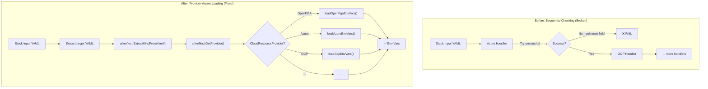

# IaC-Agnostic Provider Configuration Loading

**Date**: January 20, 2026
**Type**: Fix / Refactor
**Components**: Stack Input Processing, Provider Environment Variables

## Summary

Refactored provider configuration loading to be IaC-agnostic by creating a new `pkg/iac/stackinput/providerenvvars` package. This fixes a critical bug where OpenFGA provider config was incorrectly being loaded as Azure provider config, and establishes a clean architectural pattern for provider detection based on the target resource's `api_version`.

## Problem Statement / Motivation

When deploying an OpenFGA store using `--provisioner tofu`, the IaC runner failed with:

```
failed to add Azure provider config: failed to get provider config from stack-input content: 
failed to load yaml bytes into provider config: proto: (line 1:2): unknown field "api_url"
```

### Root Cause Analysis

The Terraform/Tofu provider config loading code in `pkg/iac/tofu/tofumodule/providers.go` had a fundamental design flaw:

1. **Sequential Provider Checking**: The code called ALL provider config handlers (`AddAzureProviderConfigEnvVars`, `AddGcpProviderConfigEnvVars`, etc.) sequentially for every stack input
2. **Shared Config Key**: All providers used `"provider_config"` as the YAML key
3. **Strict Proto Unmarshaling**: `protojson.Unmarshal` rejects unknown fields by default

When an OpenFGA stack input with `provider_config.api_url` was processed:
1. Azure handler ran first
2. Found `provider_config` key
3. Tried to unmarshal into `AzureProviderConfig`
4. Failed because `api_url` is not an Azure field

### Why Other Providers Worked

This bug was latent because:
- All existing deployments (AWS, GCP, Kubernetes, Cloudflare, Auth0) used **Pulumi**
- Pulumi uses typed deserialization within each module, not sequential checking
- OpenFGA was the **first Terraform-only** deployment component, exposing this Tofu-specific bug

## Solution / What's New

Created an IaC-agnostic provider configuration loading system that:

1. **Determines provider from target**: Uses `target.api_version` and `target.kind` to identify the `CloudResourceKind`
2. **Leverages crkreflect**: Uses existing `crkreflect.ExtractKindFromYaml()` and `crkreflect.GetProvider()` utilities
3. **Loads correct proto**: Only unmarshals `provider_config` into the correct proto type for that provider

### Architecture



### New Package Structure

```
pkg/iac/stackinput/providerenvvars/
├── loader.go          # Main entry point: GetEnvVars(), GetEnvVarsWithOptions()
├── proto_loader.go    # Shared utility: loadProviderConfigProto()
├── openfga.go         # OpenFGA env var generation
├── gcp.go             # GCP env var generation
├── azure.go           # Azure env var generation
├── aws.go             # AWS env var generation
├── atlas.go           # MongoDB Atlas env var generation
├── auth0.go           # Auth0 env var generation
├── confluent.go       # Confluent env var generation
├── kubernetes.go      # Kubernetes env var generation (with kubeconfig)
└── snowflake.go       # Snowflake env var generation
```

### API Design

```go
// Simple usage
envVars, err := providerenvvars.GetEnvVars(stackInputYaml)

// With options (for Kubernetes kubeconfig file)
envVars, err := providerenvvars.GetEnvVarsWithOptions(stackInputYaml, providerenvvars.Options{
    FileCacheLoc: "/tmp/cache",
})
```

## Implementation Details

### Loader Flow

1. Parse stack input YAML into map
2. Extract `target` section and marshal to YAML bytes
3. Call `crkreflect.ExtractKindFromYaml()` to get `CloudResourceKind`
4. Call `crkreflect.GetProvider()` to get `CloudResourceProvider`
5. Extract `provider_config` section
6. Call provider-specific handler (e.g., `loadOpenFgaEnvVars()`)
7. Return environment variables map

### Provider Handler Pattern

Each provider has a dedicated file with a single function:

```go
func loadOpenFgaEnvVars(providerConfigYaml []byte) (map[string]string, error) {
    config := new(openfgaprovider.OpenFgaProviderConfig)
    if err := loadProviderConfigProto(providerConfigYaml, config); err != nil {
        return nil, errors.Wrap(err, "failed to load OpenFGA provider config")
    }
    
    envVars := map[string]string{
        "FGA_API_URL": config.ApiUrl,
    }
    // ... optional fields ...
    return envVars, nil
}
```

### Tofu Integration

The old Tofu `providers.go` is now a thin wrapper:

```go
func GetProviderConfigEnvVars(stackInputYaml, fileCacheLoc, kubeContext string) ([]string, error) {
    providerConfigEnvVars, err := providerenvvars.GetEnvVarsWithOptions(stackInputYaml, providerenvvars.Options{
        FileCacheLoc: fileCacheLoc,
    })
    if err != nil {
        return nil, errors.Wrap(err, "failed to get provider env vars from stack input")
    }
    
    if kubeContext != "" {
        providerConfigEnvVars["KUBE_CTX"] = kubeContext
    }
    
    return mapToSlice(providerConfigEnvVars), nil
}
```

## Files Changed

| Category | Action | Files |
|----------|--------|-------|
| New Package | Created | `pkg/iac/stackinput/providerenvvars/*.go` (10 files) |
| Integration | Updated | `pkg/iac/tofu/tofumodule/providers.go` |
| Cleanup | Deleted | `pkg/iac/tofu/tofumodule/providerconfig/*.go` (10 files) |

**Total**: 10 files created, 1 file updated, 10 files deleted

## Benefits

### For Users

- **OpenFGA Works**: OpenFGA deployments now work correctly with Tofu
- **No Breaking Changes**: Existing Pulumi deployments unaffected

### For Developers

- **Single Responsibility**: Each provider handler has one job
- **Testable**: Provider handlers are pure functions
- **Clear Flow**: Provider detection is deterministic, not sequential guessing

### For Architecture

- **IaC-Agnostic**: Core logic works for both Pulumi and Terraform
- **Leverages Existing Code**: Uses crkreflect instead of maintaining duplicate mappings
- **Extensible**: Adding a new provider = adding one file

## Risk Assessment

### Low Risk

- **Isolated to Tofu**: Only affects Terraform/Tofu code path
- **Pulumi Unchanged**: Pulumi has its own provider handling
- **Build Verified**: All packages build successfully

### Mitigation

- All existing provider handlers ported with same env var mappings
- Kubernetes handler maintains kubeconfig file writing behavior
- KUBE_CTX special handling preserved in Tofu wrapper

## Testing

1. **Build Verification**: `bazelw build //pkg/iac/stackinput/providerenvvars:all` ✅
2. **Integration**: `bazelw build //pkg/iac/tofu/tofumodule:all` ✅
3. **Manual Test**: Deploy OpenFGA store with `--provisioner tofu` (pending)

## Related Work

- Builds on OpenFGA provider integration (2026-01-17-075626-openfga-provider-integration.md)
- OpenFgaStore component (2026-01-17-085733-openfgastore-deployment-component.md)
- Uses crkreflect package for provider detection

---

**Status**: ✅ Implementation Complete, Awaiting Manual Testing
**Build**: All packages compile successfully
