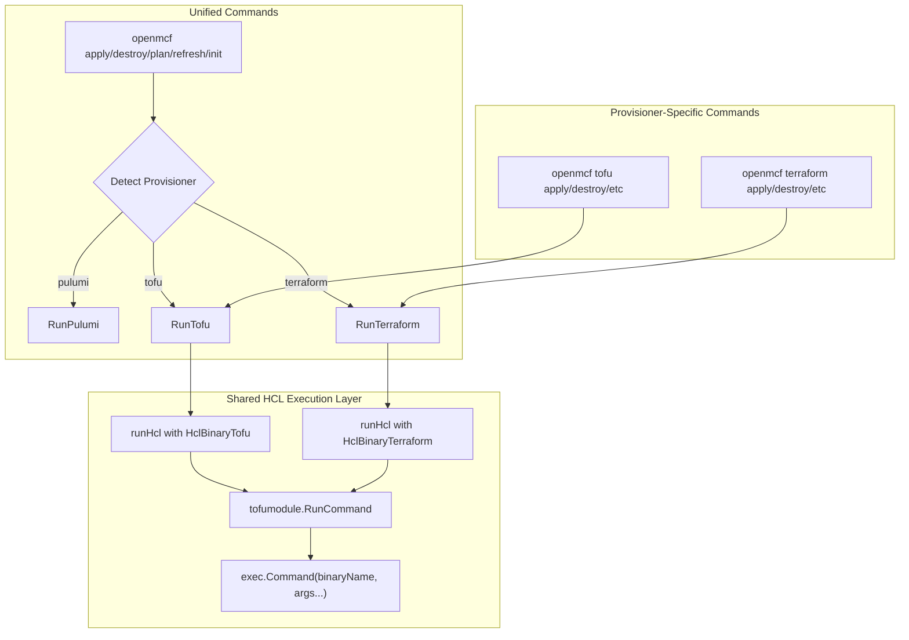

# Full Terraform CLI Support

**Date**: January 21, 2026
**Type**: Feature
**Components**: CLI Commands, IAC Execution, Provider Framework, Terraform Integration

## Summary

Implemented complete Terraform support in the `openmcf` CLI, enabling users to deploy infrastructure using either OpenTofu or Terraform based on the `openmcf.org/provisioner` manifest label. The implementation follows a binary-agnostic architecture where Tofu and Terraform share the same HCL execution logic, with only the underlying CLI binary differing. This provides an identical user experience for both provisioners while respecting user choice.

## Problem Statement / Motivation

Previously, when users set the provisioner label to `terraform` in their manifests, the CLI would exit with an error message stating "Terraform provisioner is not yet implemented. Please use 'tofu' instead." This was incorrect—Terraform should be fully supported as a first-class provisioner alongside OpenTofu.

### Pain Points

- Users with existing Terraform workflows couldn't use `openmcf` without switching to OpenTofu
- The unified commands (`apply`, `destroy`, `plan`, `refresh`, `init`) rejected Terraform manifests
- No `openmcf terraform` subcommand existed for direct Terraform operations
- The codebase had Tofu-specific hardcoding that prevented Terraform usage

## Solution / What's New

Created a binary-agnostic HCL execution layer that parameterizes the CLI binary name throughout the stack, then added a complete `terraform` command tree mirroring the existing `tofu` commands.

### Architecture Overview



### Key Features

1. **New `HclBinary` Type** - Strongly-typed enum representing `"tofu"` or `"terraform"` with utility methods
2. **Parameterized HCL Execution** - `tofumodule` package now accepts binary name as first parameter
3. **Binary Availability Check** - Pre-execution validation with helpful error messages
4. **Complete `terraform` Command Tree** - Full parity with `tofu` subcommands
5. **Unified Command Routing** - Auto-detection routes to correct provisioner based on manifest

## Implementation Details

### New HclBinary Type

Created `pkg/iac/provisioner/binary.go` to centralize binary management:

```go
type HclBinary string

const (
    HclBinaryTofu      HclBinary = "tofu"
    HclBinaryTerraform HclBinary = "terraform"
)

func (b HclBinary) CheckAvailable() error {
    _, err := exec.LookPath(string(b))
    if err != nil {
        return fmt.Errorf("%s CLI not found in PATH. Please install %s to continue", 
            b.DisplayName(), b.DisplayName())
    }
    return nil
}
```

### Parameterized Module Functions

Updated `tofumodule` package to accept binary name:

**Before:**
```go
func RunCommand(inputModuleDir string, ...) error {
    // Hardcoded "tofu" binary
}

const TofuCommand = "tofu"
```

**After:**
```go
func RunCommand(binaryName string, inputModuleDir string, ...) error {
    // Binary name passed through to exec.Command
}

func Init(binaryName string, modulePath string, ...) error {
    cmd := exec.Command(binaryName, cmdArgs...)
}
```

### Shared HCL Runner

Created a shared `runHcl()` function in `internal/cli/iacrunner/run_tofu.go`:

```go
func runHcl(ctx *Context, cmd *cobra.Command, operation terraform.TerraformOperationType, binary provisioner.HclBinary) error {
    // Check binary availability first
    if err := binary.CheckAvailable(); err != nil {
        cliprint.PrintError(err.Error())
        os.Exit(1)
    }
    
    cliprint.PrintHandoff(binary.DisplayName())
    
    err = tofumodule.RunCommand(
        string(binary),
        ctx.ModuleDir,
        // ... rest of args
    )
    // ...
}

func RunTofu(ctx *Context, cmd *cobra.Command, op terraform.TerraformOperationType) error {
    return runHcl(ctx, cmd, op, provisioner.HclBinaryTofu)
}

func RunTerraform(ctx *Context, cmd *cobra.Command, op terraform.TerraformOperationType) error {
    return runHcl(ctx, cmd, op, provisioner.HclBinaryTerraform)
}
```

### Command Routing Update

Updated unified commands to route Terraform:

```go
switch provType {
case provisioner.ProvisionerTypePulumi:
    // ... pulumi handling
case provisioner.ProvisionerTypeTofu:
    if err := iacrunner.RunTofu(ctx, cmd, terraform.TerraformOperationType_apply); err != nil {
        os.Exit(1)
    }
case provisioner.ProvisionerTypeTerraform:
    if err := iacrunner.RunTerraform(ctx, cmd, terraform.TerraformOperationType_apply); err != nil {
        os.Exit(1)
    }
}
```

### New Terraform Command Tree

Created `cmd/openmcf/root/terraform/` with full command parity:

```
terraform/
├── apply.go     # terraform apply
├── destroy.go   # terraform destroy  
├── init.go      # terraform init
├── plan.go      # terraform plan
└── refresh.go   # terraform refresh
```

## User Experience

### Binary Not Found Error

When Terraform is not installed:

```
✗ Terraform CLI not found in PATH. Please install Terraform to continue
```

### Successful Execution

```
Loading manifest...
✓ Manifest loaded
Validating manifest...
✓ Manifest validated
Preparing Terraform execution...
✓ Execution prepared
⟱ Handing off to Terraform...
terraform module directory: /path/to/module
running command: terraform init ...
...
✓ Terraform operation completed successfully
```

### Available Commands

```bash
# Direct terraform commands
openmcf terraform apply --manifest postgres.yaml
openmcf terraform plan --manifest postgres.yaml --destroy
openmcf terraform destroy --manifest postgres.yaml --auto-approve
openmcf terraform init --manifest postgres.yaml
openmcf terraform refresh --manifest postgres.yaml

# Unified commands (auto-detect from manifest label)
openmcf apply -f manifest.yaml      # Routes to terraform if label says so
openmcf destroy -f manifest.yaml
```

## Files Changed

### New Files (9)

| File | Purpose | Lines |
|------|---------|-------|
| `pkg/iac/provisioner/binary.go` | HclBinary type and utilities | ~55 |
| `internal/cli/iacrunner/run_terraform.go` | Terraform execution wrapper | ~12 |
| `cmd/openmcf/root/terraform.go` | Parent command | ~48 |
| `cmd/openmcf/root/terraform/apply.go` | terraform apply | ~148 |
| `cmd/openmcf/root/terraform/destroy.go` | terraform destroy | ~148 |
| `cmd/openmcf/root/terraform/plan.go` | terraform plan | ~146 |
| `cmd/openmcf/root/terraform/refresh.go` | terraform refresh | ~142 |
| `cmd/openmcf/root/terraform/init.go` | terraform init | ~165 |

### Modified Files (13)

| File | Change |
|------|--------|
| `pkg/iac/tofu/tofumodule/run_operation.go` | Added binaryName parameter |
| `pkg/iac/tofu/tofumodule/tofu_init.go` | Renamed TofuInit→Init, added binaryName |
| `pkg/iac/tofu/tofumodule/run_command.go` | Added binaryName parameter |
| `internal/cli/iacrunner/run_tofu.go` | Added runHcl(), binary check |
| `cmd/openmcf/root/apply.go` | Route Terraform case |
| `cmd/openmcf/root/destroy.go` | Route Terraform case |
| `cmd/openmcf/root/plan.go` | Route Terraform case |
| `cmd/openmcf/root/refresh.go` | Route Terraform case |
| `cmd/openmcf/root/init.go` | Added initWithTerraform() |
| `cmd/openmcf/root/tofu/*.go` | Pass "tofu" to RunCommand |
| `cmd/openmcf/root.go` | Register Terraform command |

### Auto-Generated Files (3)

| File | Change |
|------|--------|
| `pkg/iac/provisioner/BUILD.bazel` | Include binary.go |
| `internal/cli/iacrunner/BUILD.bazel` | Include run_terraform.go |
| `cmd/openmcf/root/BUILD.bazel` | Include terraform directory |

## Benefits

### For Users

- **Choice of Tooling** - Use Terraform or OpenTofu based on preference/requirements
- **Identical Experience** - Same commands, flags, and outputs regardless of provisioner
- **Clear Error Messages** - Helpful guidance when binary not installed
- **No Workflow Changes** - Existing Tofu workflows continue unchanged

### For Developers

- **Zero Code Duplication** - Single HCL execution path for both binaries
- **Easy Extension** - Adding new HCL-based provisioners is trivial
- **Type Safety** - HclBinary enum prevents string typos
- **Clean Architecture** - Binary-agnostic module design

## Impact

### Who is Affected

- **Terraform Users** - Can now use `openmcf` with existing Terraform installations
- **Enterprise Users** - Organizations with Terraform license requirements are unblocked
- **CI/CD Pipelines** - Can use either provisioner based on environment configuration

### Backward Compatibility

- ✅ All existing `tofu` commands work identically
- ✅ Unified commands continue to work for Pulumi and Tofu
- ✅ No changes to manifest format required
- ✅ Existing scripts and automation unaffected

## Related Work

- [2025-11-18 Unified Apply/Destroy Commands](../2025-11/2025-11-18-unified-apply-destroy-commands.md) - Initial unified command implementation (noted Terraform as "not yet implemented")
- [2025-11-18 Unified Init/Plan/Refresh Commands](../2025-11/2025-11-18-125409-unified-init-plan-refresh-commands.md) - Extended unified commands
- [2026-01-13 Stack Input CLI Support](2026-01-13-084929-stack-input-cli-support-and-command-refactoring.md) - iacrunner/iacflags refactoring that made this change easier

## Coding Guidelines Updated

Also updated `_rules/coding-guidelines/` to capture the project's Go coding standards:

- File size limits (50-150 ideal, 250 max)
- Function size limits (20-40 lines)
- Single Responsibility Principle
- Error wrapping requirements
- Import organization

These guidelines apply to all `**/*.go` files via glob pattern.

---

**Status**: ✅ Production Ready
**Timeline**: Single session implementation
