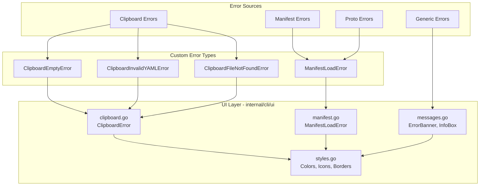
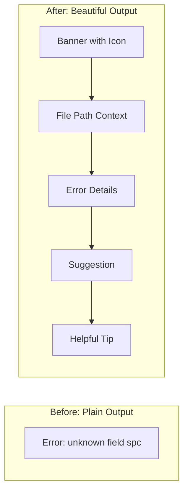

# Beautiful Terminal Experience: CLI Error Display Overhaul

**Date**: January 21, 2026
**Type**: Enhancement
**Components**: User Experience, Error Handling, CLI Output, Clipboard Integration

## Summary

Transformed the OpenMCF CLI error display from plain, unformatted error messages into a beautiful, structured terminal experience using the `charmbracelet/lipgloss` library. The new error handling provides actionable, visually distinct error messages with color-coded banners, icons, contextual tips, and intelligent suggestions for common mistakes.

## Problem Statement / Motivation

The CLI was producing inconsistent, hard-to-read error output that left users confused about what went wrong and how to fix it.

### Pain Points

- **Raw error dumps**: Errors were displayed as unformatted text, often with technical jargon
- **No visual hierarchy**: Users couldn't quickly identify the error type or severity
- **Missing context**: Error messages didn't explain what the user should do next
- **Ugly clipboard errors**: When invalid content was passed via `--clip`, the output was particularly confusing
- **Proto unmarshaling errors**: Manifest field errors like "unknown field spc" were displayed without helpful suggestions
- **Inconsistent styling**: Different parts of the CLI used different output patterns

### Example: Before

```
Error: failed to load manifest: proto: (line 5:3): unknown field "spc"
```

This tells the user almost nothing about how to fix the issue.

## Solution / What's New

Implemented a comprehensive terminal UI system built on `charmbracelet/lipgloss` that provides:

1. **Structured error banners** with visual hierarchy
2. **Color-coded sections** (red for errors, green for success, yellow for warnings)
3. **Contextual icons** for quick visual identification
4. **Intelligent suggestions** using Levenshtein distance for typo detection
5. **Clipboard-specific error handlers** for common clipboard issues
6. **Manifest load error handlers** for proto unmarshaling failures

### Architecture



## Implementation Details

### New Package: `internal/cli/ui`

Created a dedicated UI package with focused, single-responsibility files:

**`styles.go`** - Centralized styling definitions:
```go
var (
    // Colors
    ErrorColor   = lipgloss.Color("#FF6B6B")
    SuccessColor = lipgloss.Color("#4ECDC4")
    WarningColor = lipgloss.Color("#FFE66D")
    DimColor     = lipgloss.Color("#6C757D")
    AccentColor  = lipgloss.Color("#4A90D9")
    
    // Icons
    ErrorIcon   = "✗"
    SuccessIcon = "✓"
    InfoIcon    = "ℹ"
    TipIcon     = "💡"
    
    // Styles
    errorTitle = lipgloss.NewStyle().
        Foreground(ErrorColor).
        Bold(true)
)
```

**`messages.go`** - Core message rendering:
```go
func ErrorBanner(title string) {
    banner := lipgloss.NewStyle().
        BorderStyle(lipgloss.RoundedBorder()).
        BorderForeground(ErrorColor).
        Padding(0, 1).
        Render(fmt.Sprintf("%s %s", ErrorIcon, title))
    fmt.Println(banner)
}
```

**`clipboard.go`** - Clipboard-specific error display:
- Empty clipboard detection
- Invalid YAML with content preview
- File path resolution errors
- Actionable tips for each scenario

**`manifest.go`** - Manifest loading error display:
- Field name extraction from proto errors
- Line number display when available
- Typo detection using Levenshtein distance
- Suggestions for common field names (spec, metadata, apiVersion, kind)

### Smart Typo Detection

The manifest error handler uses Levenshtein distance to suggest corrections:

```go
func suggestCorrection(fieldName string) string {
    commonFields := []string{"spec", "metadata", "apiVersion", "kind", "status", "name", "labels", "annotations"}
    
    var bestMatch string
    bestDistance := 3 // Maximum distance to consider
    
    for _, field := range commonFields {
        distance := levenshteinDistance(strings.ToLower(fieldName), strings.ToLower(field))
        if distance < bestDistance {
            bestDistance = distance
            bestMatch = field
        }
    }
    
    return bestMatch
}
```

### Example: After

```
╭─────────────────────────────────────────────╮
│ ✗ Manifest Load Error                       │
╰─────────────────────────────────────────────╯

Failed to load manifest from: /path/to/manifest.yaml

Error: Unknown field "spc" (line 5, column 3)

This field is not recognized in the manifest schema.

💡 Did you mean "spec"?

Tip: Check the API documentation for valid field names
     for this resource type.
```

### Custom Error Types

Defined structured error types for proper error handling:

```go
// ClipboardEmptyError indicates the clipboard is empty
type ClipboardEmptyError struct{}

// ClipboardInvalidYAMLError indicates clipboard content is not valid YAML
type ClipboardInvalidYAMLError struct {
    Content  string
    ParseErr error
}

// ManifestLoadError represents proto unmarshaling failures
type ManifestLoadError struct {
    ManifestPath string
    Err          error
}
```

### Error Flow Integration

Updated all command handlers to check for custom error types before printing generic errors:

```go
if err != nil {
    // Only print error if it wasn't already handled beautifully
    if !climanifest.IsClipboardError(err) && !manifest.IsManifestLoadError(err) {
        cliprint.PrintError(err.Error())
    }
    os.Exit(1)
}
```

## Benefits

### For Users

- **Instant clarity**: Visual hierarchy makes errors immediately understandable
- **Actionable guidance**: Every error includes tips for resolution
- **Smart suggestions**: Typo detection prevents frustration from simple mistakes
- **Professional feel**: Modern terminal aesthetics inspire confidence

### For Developers

- **Consistent patterns**: All error display follows the same visual language
- **Extensible framework**: Easy to add new error types with beautiful display
- **Testable components**: Separated error detection from display logic

### Visual Comparison



## Impact

### Files Changed

| Package | Files | Purpose |
|---------|-------|---------|
| `internal/cli/ui` | 4 files (NEW) | Core UI components |
| `internal/cli/manifest` | 3 files | Clipboard error handling |
| `internal/manifest` | 3 files | Manifest load errors |
| `cmd/openmcf/root` | 6 files | Error handler integration |

### User Experience

- Error messages now provide a "path to success" rather than just stating failure
- Clipboard workflow issues are caught early with specific guidance
- Proto validation errors explain exactly what field is wrong and suggest fixes

## Design Ethos

The "Beautiful Terminal Experience" follows these principles:

1. **Errors are opportunities to guide**: Every error should help users succeed
2. **Visual hierarchy matters**: Important information should be immediately visible
3. **Context is king**: Always show what file, what line, what field
4. **Suggestions over complaints**: Don't just say "wrong" - say "try this instead"
5. **Consistency builds trust**: Same visual language throughout the CLI
6. **Professional aesthetics**: Modern, polished output reflects product quality

## Related Work

- [Terraform CLI Support](2026-01-21-064104-full-terraform-cli-support.md) - Used the UI system for Terraform-specific messages
- [Stack Input CLI Support](2026-01-13-084929-stack-input-cli-support-and-command-refactoring.md) - Clipboard integration foundation

## Future Enhancements

- Progress indicators for long-running operations
- Interactive prompts with styled input fields
- Diff display for plan/preview operations
- Structured JSON output mode for CI/CD pipelines

---

**Status**: ✅ Production Ready
**Timeline**: ~3 hours of focused development
