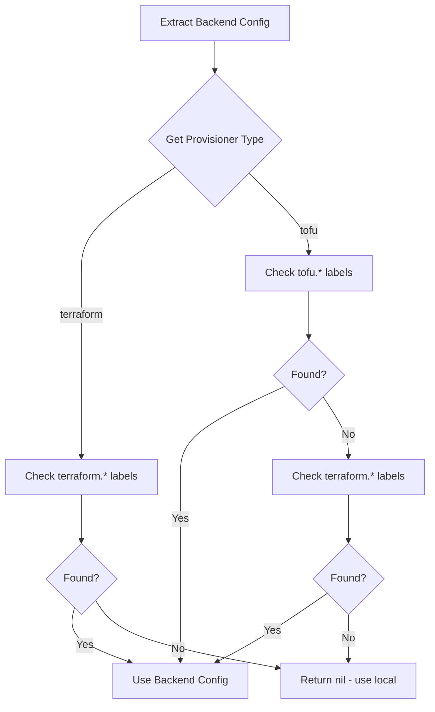
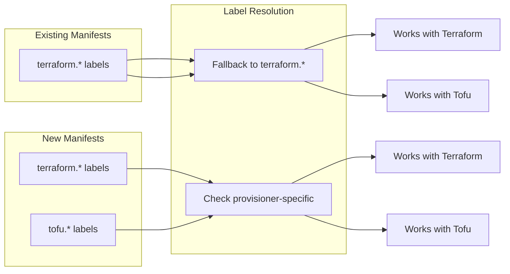

# Provisioner-Aware State Backend Labels for Terraform and OpenTofu

**Date**: January 21, 2026
**Type**: Enhancement
**Components**: IAC Stack Runner, Manifest Processing, CLI Configuration, Documentation

## Summary

Implemented provisioner-aware state backend labels that allow Terraform and OpenTofu to use their own label prefixes (`terraform.openmcf.org/*` and `tofu.openmcf.org/*` respectively) for backend configuration. The system maintains backward compatibility by falling back to legacy `terraform.*` labels when provisioner-specific labels are not found. Added comprehensive documentation for state backend configuration across all provisioners.

## Problem Statement / Motivation

The existing backend configuration system was hardcoded to only look for `terraform.openmcf.org/*` labels, regardless of whether the user was using Terraform or OpenTofu as their provisioner.

### Pain Points

- **Label confusion**: Users expected `tofu.openmcf.org/*` labels when using OpenTofu
- **No provisioner distinction**: Both Terraform and Tofu shared the same label namespace
- **Documentation gap**: No comprehensive guide for state backend configuration
- **Inconsistent with provisioner label**: The provisioner is selected via `openmcf.org/provisioner`, but backend used a fixed `terraform.*` prefix

### Expected Behavior

```yaml
# When using Terraform
openmcf.org/provisioner: terraform
terraform.openmcf.org/backend.type: s3
terraform.openmcf.org/backend.object: bucket/path/state.tfstate

# When using OpenTofu
openmcf.org/provisioner: tofu
tofu.openmcf.org/backend.type: gcs
tofu.openmcf.org/backend.object: bucket/path/state.tfstate
```

## Solution / What's New

### Label Resolution Strategy



### Label Reference

| Provisioner | Backend Type Label | Backend Object Label |
|-------------|-------------------|---------------------|
| **Terraform** | `terraform.openmcf.org/backend.type` | `terraform.openmcf.org/backend.object` |
| **OpenTofu** | `tofu.openmcf.org/backend.type` | `tofu.openmcf.org/backend.object` |
| **Pulumi** | N/A | `pulumi.openmcf.org/stack.name` |

## Implementation Details

### 1. Label Key Functions

**File**: `pkg/iac/tofu/tofulabels/labels.go`

Replaced static constants with dynamic functions:

```go
// BackendTypeLabelKey returns the backend type label for the given provisioner
func BackendTypeLabelKey(provisioner string) string {
    return fmt.Sprintf("%s.openmcf.org/backend.type", provisioner)
}

// BackendObjectLabelKey returns the backend object label for the given provisioner
func BackendObjectLabelKey(provisioner string) string {
    return fmt.Sprintf("%s.openmcf.org/backend.object", provisioner)
}

// Legacy constants for backward compatibility
const (
    LegacyBackendTypeLabelKey   = "terraform.openmcf.org/backend.type"
    LegacyBackendObjectLabelKey = "terraform.openmcf.org/backend.object"
)
```

### 2. Provisioner-Aware Extraction

**File**: `pkg/iac/tofu/backendconfig/backend_config.go`

Updated `ExtractFromManifest` to accept provisioner type:

```go
func ExtractFromManifest(manifest proto.Message, provisionerType string) (*TofuBackendConfig, error) {
    labels := metadatareflect.ExtractLabels(manifest)
    
    // Try provisioner-specific labels first
    typeLabelKey := tofulabels.BackendTypeLabelKey(provisionerType)
    objectLabelKey := tofulabels.BackendObjectLabelKey(provisionerType)
    
    backendType, hasType := labels[typeLabelKey]
    backendObject, hasObject := labels[objectLabelKey]
    
    // Fallback to legacy terraform.* labels for backward compatibility
    if !hasType && !hasObject {
        backendType, hasType = labels[tofulabels.LegacyBackendTypeLabelKey]
        backendObject, hasObject = labels[tofulabels.LegacyBackendObjectLabelKey]
    }
    
    // ... validation logic
}
```

### 3. Caller Updates

**File**: `pkg/iac/tofu/tofumodule/run_command.go`

Pass binary name to extraction:

```go
tofuBackendConfig, err := backendconfig.ExtractFromManifest(manifestObject, binaryName)
```

### 4. Test Coverage

**File**: `pkg/iac/tofu/backendconfig/backend_config_test.go`

Added comprehensive tests:

- `TestExtractFromManifest_TerraformProvisioner` - Terraform with `terraform.*` labels
- `TestExtractFromManifest_TofuProvisioner` - OpenTofu with `tofu.*` labels
- `TestExtractFromManifest_LegacyFallback` - Backward compatibility scenarios

## Documentation

### New Guide: State Backends

**File**: `site/public/docs/guides/state-backends.md`

Created comprehensive documentation covering:

1. **Overview** - What state backends are and why they matter
2. **Pulumi State** - Stack labels and Pulumi Cloud
3. **Tofu/Terraform State** - Provisioner-specific labels
4. **Backend Types** - S3, GCS, Azure Storage, Local with examples
5. **Best Practices** - Production recommendations
6. **Troubleshooting** - Common issues and solutions

### Updated Documentation

- **Guides Index** - Added State Backends to core guides
- **Unified Commands** - Updated troubleshooting section with both label formats
- **Labels README** - Updated with function-based API
- **Backend Config README** - Updated with provisioner parameter

## Benefits

### For Users

- **Intuitive labels**: Use `tofu.*` when using OpenTofu, `terraform.*` when using Terraform
- **Backward compatible**: Existing manifests with `terraform.*` labels continue to work
- **Better documentation**: Clear guide for setting up state backends
- **Consistent UX**: Label prefix matches the provisioner being used

### For Developers

- **Clean API**: Function-based label generation instead of magic strings
- **Testable**: Comprehensive test coverage for all scenarios
- **Extensible**: Easy to add new provisioner types in the future

## Impact

### Files Changed

| Category | Files | Changes |
|----------|-------|---------|
| Labels | 2 | Dynamic functions + legacy constants |
| Backend Config | 2 | Provisioner parameter + fallback logic |
| Module Runner | 1 | Pass provisioner type |
| Tests | 1 | 3 new test functions |
| Documentation | 4 | New guide + updates |

### Backward Compatibility

The implementation ensures zero breaking changes:



## Usage Examples

### Terraform with S3 Backend

```yaml
apiVersion: aws.openmcf.org/v1
kind: AwsVpc
metadata:
  name: production-vpc
  labels:
    openmcf.org/provisioner: terraform
    terraform.openmcf.org/backend.type: s3
    terraform.openmcf.org/backend.object: terraform-state/vpc/production.tfstate
spec:
  cidrBlock: 10.0.0.0/16
```

### OpenTofu with GCS Backend

```yaml
apiVersion: gcp.openmcf.org/v1
kind: GkeCluster
metadata:
  name: staging-cluster
  labels:
    openmcf.org/provisioner: tofu
    tofu.openmcf.org/backend.type: gcs
    tofu.openmcf.org/backend.object: tofu-state/gke/staging-cluster
spec:
  projectId: my-project
  region: us-central1
```

### Legacy Support (Still Works)

```yaml
apiVersion: aws.openmcf.org/v1
kind: AwsRdsInstance
metadata:
  name: database
  labels:
    openmcf.org/provisioner: tofu  # Using Tofu...
    # ...but with terraform.* labels (legacy)
    terraform.openmcf.org/backend.type: s3
    terraform.openmcf.org/backend.object: legacy-bucket/rds/state.tfstate
spec:
  engine: postgres
```

## Related Work

- [Full Terraform CLI Support](2026-01-21-064104-full-terraform-cli-support.md) - Terraform provisioner implementation
- [Unified Commands](2025-11-18-unified-apply-destroy-commands.md) - Provisioner detection from labels
- [Manifest Backend Configuration](2025-09-16-manifest-backend-configuration.md) - Original backend label design

## Future Enhancements

- Environment variable overrides for backend configuration
- CLI flags for ad-hoc backend specification
- Backend migration tooling between Terraform and OpenTofu

---

**Status**: ✅ Production Ready
**Timeline**: ~1 hour implementation + documentation
