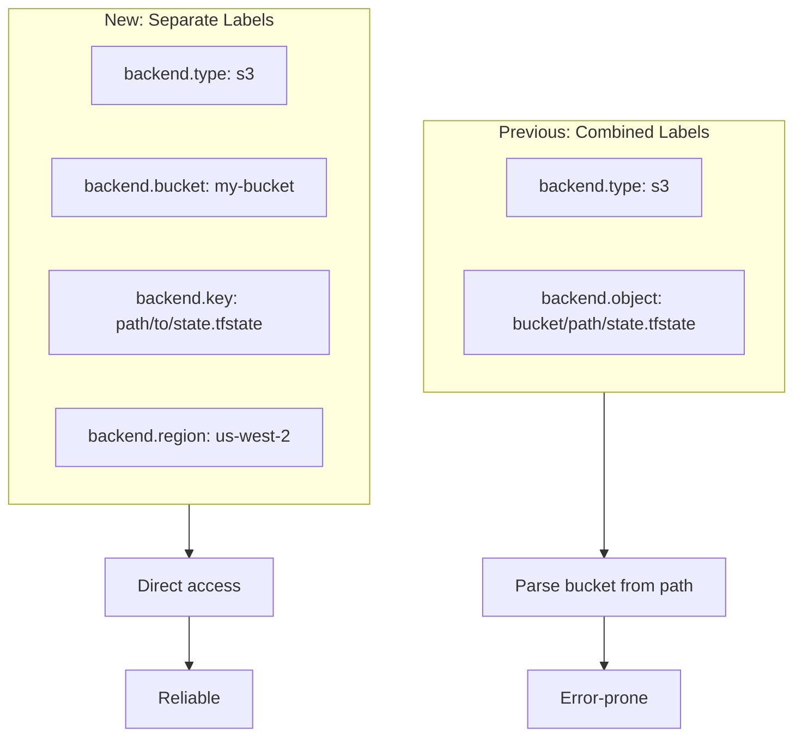

# Separate Backend Labels and Reconfigure Flag

**Date**: January 21, 2026
**Type**: Enhancement
**Components**: CLI Configuration, IAC Stack Runner, Documentation, State Backend

## Summary

Implemented separate backend configuration labels (`backend.bucket`, `backend.key`, `backend.region`) for Terraform/OpenTofu state backends, replacing the combined `backend.object` approach. Added the `--reconfigure` flag to handle backend configuration changes. Updated comprehensive documentation and CLI display to use "Key" terminology for Terraform parity.

## Problem Statement / Motivation

The previous implementation used a single `backend.object` label that contained the combined bucket and path, requiring parsing to extract individual values. This approach had several issues:

### Pain Points

- **Parsing complexity**: Extracting bucket name from a combined path was error-prone
- **Missing region support**: S3 backend required region but it wasn't being read from labels
- **Terminology mismatch**: Terraform uses `key` for the state file path, not `object`
- **Backend reconfiguration**: No way to force backend reconfiguration when labels changed
- **Incorrect display**: CLI showed "Object" instead of "Key", inconsistent with Terraform terminology

### Observed Issues

```bash
# Previous behavior - incorrect parsing
📦 State Backend Configuration
   Type:        s3
   Bucket:      .terraform           # Wrong! This should be the bucket name
   Object:      myapplication.tfstate  # Wrong! Missing full path
```

## Solution / What's New

### Separate Label System



### New Label Schema

| Label | Description | Required For |
|-------|-------------|--------------|
| `backend.type` | Backend type: `s3`, `gcs`, `azurerm`, `local` | All |
| `backend.bucket` | Bucket/container name | S3, GCS, Azure |
| `backend.key` | State file path within bucket | All |
| `backend.region` | AWS region | S3 only |

### Example Manifest

```yaml
apiVersion: aws.project-planton.org/v1
kind: AwsVpc
metadata:
  name: production-vpc
  labels:
    project-planton.org/provisioner: terraform
    terraform.project-planton.org/backend.type: s3
    terraform.project-planton.org/backend.bucket: my-terraform-state
    terraform.project-planton.org/backend.key: vpc/production.tfstate
    terraform.project-planton.org/backend.region: us-west-2
spec:
  cidrBlock: 10.0.0.0/16
```

### `--reconfigure` Flag

Added support for reconfiguring backend without state migration:

```bash
# When backend configuration changes
project-planton init -f manifest.yaml --reconfigure

# Also works with other commands that run init internally
project-planton apply -f manifest.yaml --reconfigure
project-planton refresh -f manifest.yaml --reconfigure
```

## Implementation Details

### 1. Label Key Functions

**File**: `pkg/iac/tofu/tofulabels/labels.go`

Added new label key functions:

```go
func BackendKeyLabelKey(provisioner string) string {
    return fmt.Sprintf("%s.project-planton.org/backend.key", provisioner)
}

func BackendRegionLabelKey(provisioner string) string {
    return fmt.Sprintf("%s.project-planton.org/backend.region", provisioner)
}

// Legacy constants for backward compatibility
const (
    LegacyBackendKeyLabelKey    = "terraform.project-planton.org/backend.key"
    LegacyBackendObjectLabelKey = "terraform.project-planton.org/backend.object"
    LegacyBackendRegionLabelKey = "terraform.project-planton.org/backend.region"
)
```

### 2. Backend Config Struct

**File**: `pkg/iac/tofu/backendconfig/backend_config.go`

Updated struct with separate fields:

```go
type TofuBackendConfig struct {
    BackendType   string
    BackendBucket string
    BackendKey    string  // renamed from BackendObject
    BackendRegion string  // NEW
}
```

### 3. Extraction Logic

**File**: `pkg/iac/tofu/backendconfig/backend_config.go`

Updated `ExtractFromManifest` with priority-based label reading:

```go
// For key: prioritize backend.key, fallback to backend.object
keyLabelKey := tofulabels.BackendKeyLabelKey(provisionerType)
backendKey, hasKey := labels[keyLabelKey]
if !hasKey {
    // Try legacy backend.object label
    objectLabelKey := tofulabels.BackendObjectLabelKey(provisionerType)
    backendKey, hasKey = labels[objectLabelKey]
}
```

### 4. Backend Config Args Builder

**File**: `pkg/iac/tofu/tofumodule/run_command.go`

Simplified argument building using direct field access:

```go
func buildBackendConfigArgs(config *backendconfig.TofuBackendConfig) []string {
    var args []string
    switch config.BackendType {
    case "s3":
        if config.BackendBucket != "" {
            args = append(args, fmt.Sprintf("bucket=%s", config.BackendBucket))
        }
        if config.BackendKey != "" {
            args = append(args, fmt.Sprintf("key=%s", config.BackendKey))
        }
        if config.BackendRegion != "" {
            args = append(args, fmt.Sprintf("region=%s", config.BackendRegion))
        }
    // ... similar for gcs and azurerm
    }
    return args
}
```

### 5. CLI Display Update

**File**: `internal/cli/cliprint/print.go`

Updated display to show "Key" instead of "Object":

```go
fmt.Printf("   %-12s %s\n", white("Key:"), blue(key))
```

### 6. Reconfigure Flag

**Files**: `internal/cli/iacflags/tofu_flags.go`, `cmd/project-planton/root/init.go`, etc.

Added `--reconfigure` flag to all relevant commands:

```go
func AddTofuInitFlags(cmd *cobra.Command) {
    cmd.PersistentFlags().Bool(string(flag.Reconfigure), false,
        "Reconfigure backend, ignoring any saved configuration (Tofu/Terraform)")
}
```

## Documentation Updates

### Updated Files

| File | Changes |
|------|---------|
| `site/public/docs/guides/state-backends.md` | Complete rewrite with new label format |
| `site/public/docs/cli/unified-commands.md` | Added `--reconfigure` flag, updated examples |
| `site/public/docs/cli/tofu-commands.md` | Added `--reconfigure` flag documentation |
| `site/public/docs/cli/cli-reference.md` | Added `--reconfigure` flag, updated Terraform status |

### Key Documentation Changes

1. **Quick Reference Table**: Shows all four backend labels per provisioner
2. **Complete Examples**: All backend type examples use separate labels
3. **Troubleshooting**: Added "Backend configuration changed" section
4. **Backward Compatibility**: Documented `backend.object` as deprecated

## Benefits

### For Users

- **Terraform parity**: Labels match Terraform's `bucket`, `key`, `region` terminology
- **Clear configuration**: Each setting has its own label, no parsing needed
- **Region support**: S3 backends now properly configure the region
- **Reconfigure support**: Easy backend changes with `--reconfigure` flag
- **Better CLI output**: "Key" terminology matches Terraform

### For Developers

- **Simpler code**: Direct field access instead of string parsing
- **Type safety**: Each configuration value is a separate field
- **Backward compatible**: `backend.object` still works for existing manifests
- **Cleaner logic**: No complex parsing logic in backend config builder

## Impact

### CLI Output Change

```
# Before
📦 State Backend Configuration
   Type:        s3
   Bucket:      .terraform           # Incorrect parsing
   Object:      state.tfstate

# After
📦 State Backend Configuration
   Type:        s3
   Bucket:      my-terraform-state   # Correct!
   Key:         vpc/production.tfstate
```

### Backward Compatibility

The implementation maintains full backward compatibility:

- `backend.object` label still works (deprecated)
- Legacy `terraform.*` labels work with OpenTofu
- Existing manifests require no changes

### Files Changed

| Category | Files | Changes |
|----------|-------|---------|
| Labels | 1 | New `BackendKeyLabelKey`, `BackendRegionLabelKey` |
| Backend Config | 1 | Struct updates, extraction logic |
| Module Runner | 1 | Simplified arg builder |
| CLI Display | 2 | "Key" terminology, struct field rename |
| Init Handler | 1 | Reconfigure flag usage |
| IAC Runner | 1 | Updated field access |
| Documentation | 4 | Comprehensive updates |

## Related Work

- [Provisioner-Aware Backend Labels](2026-01-21-083037-provisioner-aware-backend-labels.md) - Previous backend label implementation
- [Full Terraform CLI Support](2026-01-21-064104-full-terraform-cli-support.md) - Terraform provisioner
- [Beautiful Terminal Experience](2026-01-21-083036-beautiful-terminal-experience.md) - CLI output styling

---

**Status**: ✅ Production Ready
**Timeline**: ~30 minutes implementation + documentation
