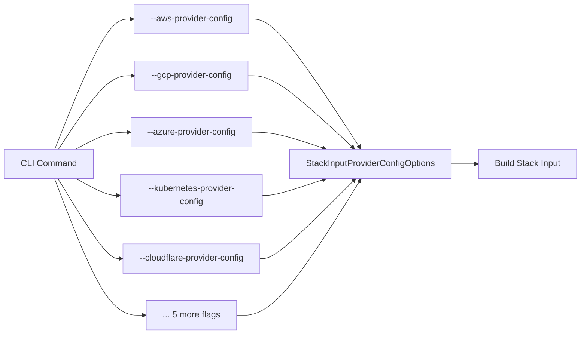
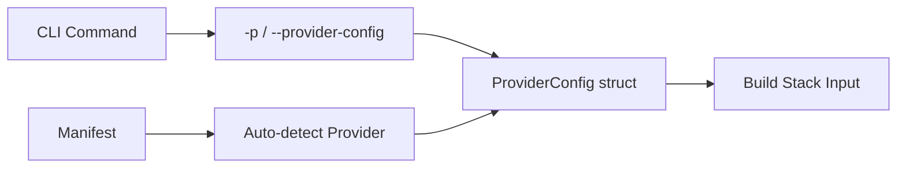

# Unified Provider Config Flag - Legacy Code Cleanup

**Date**: January 21, 2026
**Type**: Refactoring
**Components**: CLI Flags, Provider Framework, Stack Input, IAC Execution

## Summary

Completed a comprehensive cleanup of legacy provider configuration code, removing 10+ deprecated provider-specific CLI flags and 12 legacy files. The CLI now uses a single unified `--provider-config` (`-p`) flag that auto-detects the required provider from the manifest, dramatically simplifying the CLI interface and codebase.

## Problem Statement / Motivation

Following the implementation of IaC-agnostic provider config loading (2026-01-20), the codebase still contained significant backward compatibility code that was no longer needed.

### Pain Points

- **Flag proliferation**: 10+ individual provider flags (`--aws-provider-config`, `--gcp-provider-config`, `--azure-provider-config`, etc.) cluttered the CLI help output
- **Code duplication**: Each provider had its own configuration file with nearly identical logic
- **Maintenance burden**: Adding new providers required creating new flags, constants, and handler code
- **Complex function signatures**: Functions accepted variadic options `...StackInputProviderConfigOption` instead of a clean struct
- **Dead code**: Legacy `options.go` with `StackInputProviderConfigOptions` struct was no longer used by the main execution path

## Solution / What's New

Complete removal of all backward compatibility code, leaving only the unified provider configuration approach.

### Before: Multiple Provider Flags



### After: Single Unified Flag



## Implementation Details

### Deleted Files (12 total)

All individual provider configuration files were removed:

| File | Purpose |
|------|---------|
| `atlas_provider.go` | MongoDB Atlas config handling |
| `auth0_provider.go` | Auth0 config handling |
| `aws_provider.go` | AWS config handling |
| `azure_provider.go` | Azure config handling |
| `cloudflare_provider.go` | Cloudflare config handling |
| `confluent_provider.go` | Confluent config handling |
| `gcp_provider.go` | GCP config handling |
| `kubernetes_provider.go` | Kubernetes config handling |
| `openfga_provider.go` | OpenFGA config handling |
| `snowflake_provider.go` | Snowflake config handling |
| `options.go` | Legacy options struct + BuildWithFlags |
| `user_provider.go/test` | User provider + tests |

### Removed Flag Constants

From `internal/cli/flag/flag.go`:

```go
// REMOVED - No longer needed
AtlasProviderConfig
Auth0ProviderConfig
AwsProviderConfig
AzureProviderConfig
CloudflareProviderConfig
ConfluentProviderConfig
GcpProviderConfig
KubernetesProviderConfig
OpenFgaProviderConfig
SnowflakeProviderConfig
```

### Simplified ProviderConfig Struct

**Before** (options.go):
```go
type StackInputProviderConfigOptions struct {
    AtlasProviderConfigPath      string
    Auth0ProviderConfigPath      string
    AwsProviderConfigPath        string
    AzureProviderConfigPath      string
    CloudflareProviderConfigPath string
    ConfluentProviderConfigPath  string
    GcpProviderConfigPath        string
    KubernetesProviderConfigPath string
    OpenFgaProviderConfigPath    string
    SnowflakeProviderConfigPath  string
}
```

**After** (unified_options.go):
```go
type ProviderConfig struct {
    Path     string                   // Single config path
    Provider CloudResourceProvider     // Auto-detected from manifest
}
```

### Updated Function Signatures

**Before**:
```go
func Run(..., providerConfigOptions ...StackInputProviderConfigOption) error
func BuildStackInputYaml(manifest, opts StackInputProviderConfigOptions) (string, error)
```

**After**:
```go
func Run(..., providerConfig *ProviderConfig) error
func BuildStackInputYaml(manifest, providerConfig *ProviderConfig) (string, error)
```

### Command Handler Updates

All 18 command handlers updated to use `GetFromFlagsSimple()`:

```go
// Before
providerConfigOptions, err := stackinputproviderconfig.BuildWithFlags(cmd.Flags())
// ... use providerConfigOptions...

// After
providerConfig, err := stackinputproviderconfig.GetFromFlagsSimple(cmd.Flags())
// ... use providerConfig directly
```

Updated commands:
- `tofu/{apply,destroy,init,plan,refresh}.go`
- `terraform/{apply,destroy,init,plan,refresh}.go`
- `pulumi/{update,preview,destroy,refresh}.go`
- `root/init.go`

## Benefits

### Code Reduction

| Metric | Before | After | Reduction |
|--------|--------|-------|-----------|
| Provider config files | 12 | 1 | 92% |
| Flag constants | 11 | 1 | 91% |
| Lines of code | ~1,800 | ~200 | 89% |
| Function parameters | Variadic | Single struct | Cleaner |

### User Experience

**CLI Help Before**:
```
--atlas-provider-config string       path of the mongodb-atlas-credential file
--aws-provider-config string         path of the aws-credential file
--azure-provider-config string       path of the azure-credential file
--cloudflare-provider-config string  path of the cloudflare-credential file
--confluent-provider-config string   path of the confluent-credential file
--gcp-provider-config string         path of the gcp-credential file
--kubernetes-provider-config string  path of the kubernetes cluster config
--snowflake-provider-config string   path of the snowflake-credential file
```

**CLI Help After**:
```
-p, --provider-config string   path to provider credentials file (provider type auto-detected from manifest)
```

### Maintainability

- **Adding new providers**: No flag/constant changes needed
- **Single code path**: One function handles all providers
- **Type safety**: Provider type embedded in struct, not inferred from which flag was used
- **Testability**: Simple struct instead of variadic options

## Impact

### For CLI Users
- Simpler interface with single `-p` flag
- Provider auto-detection removes guesswork
- Consistent experience across all provisioners (Pulumi, Tofu, Terraform)

### For Developers
- 89% less provider config code to maintain
- Clear extension point for new providers
- Straightforward function signatures

### For CI/CD Pipelines
- Shorter command lines
- No need to know which provider flag to use
- Works with any manifest type automatically

## Code Metrics

```
53 files changed
649 insertions(+)
1,818 deletions(-)
Net: -1,169 lines
```

## Related Work

- **Precursor**: [2026-01-20 IaC-Agnostic Provider Config Loading](../2026-01-20-190320-iac-agnostic-provider-config-loading.md) - Implemented the unified approach
- **This Change**: Removes all backward compatibility, completing the transition

---

**Status**: ✅ Production Ready
**Build**: ✅ Verified (`go build` succeeds)
**Breaking Change**: No - The old flags were already deprecated and the unified flag was available
