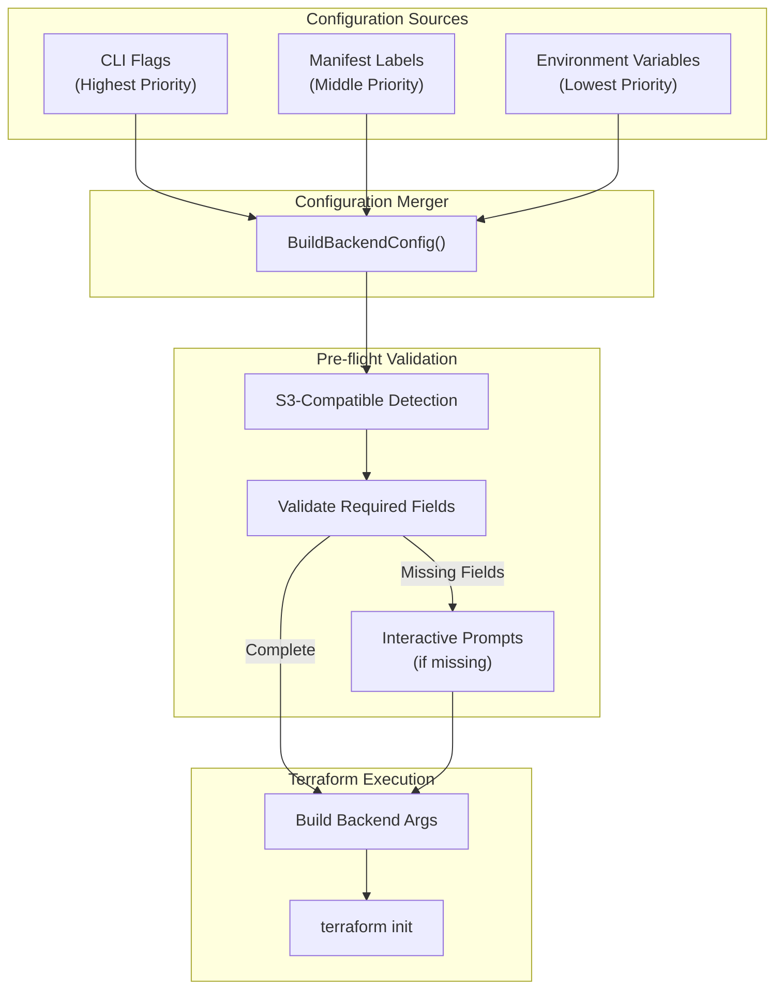
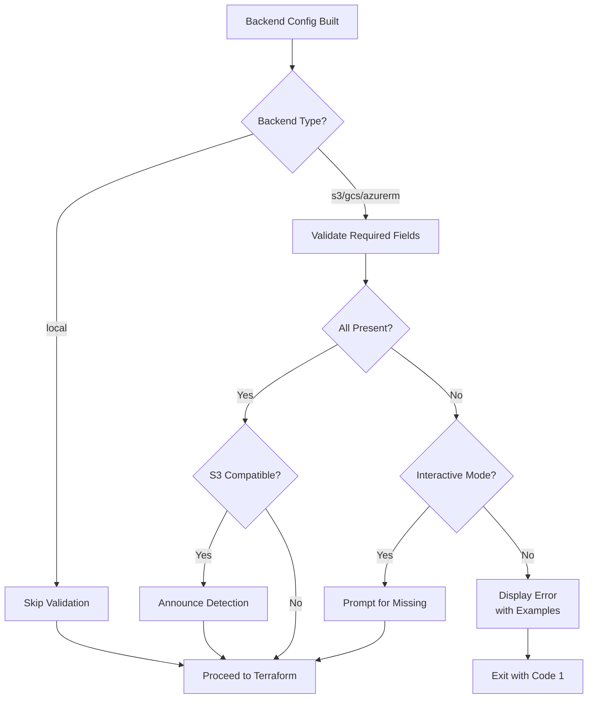

# S3-Compatible Backend Support with CLI Flags and Environment Variables

**Date**: January 21, 2026
**Type**: Feature
**Components**: CLI Flags, Backend Configuration, User Experience, IAC Stack Runner

## Summary

Comprehensive S3-compatible backend support for Terraform/OpenTofu state storage, enabling seamless use of Cloudflare R2, MinIO, and other S3-compatible services. The implementation introduces CLI flags for backend configuration, environment variable support for CI/CD pipelines, smart S3-compatible detection, pre-flight validation with interactive prompts, and a world-class terminal experience that guides users to success.

## Problem Statement / Motivation

When using Terraform/OpenTofu with S3-compatible backends like Cloudflare R2 or MinIO, users encountered cryptic errors like `InvalidClientTokenId: The security token included in the request is invalid`. This occurred because Terraform's S3 backend defaults to AWS-specific validation that fails with non-AWS credentials.

### Pain Points

- **Cryptic Errors**: Terraform's default S3 backend configuration attempts AWS STS validation, which fails with R2/MinIO credentials
- **Manual Configuration**: Users had to manually discover and add multiple skip flags (`skip_credentials_validation`, `skip_region_validation`, etc.)
- **No CLI Override**: Backend configuration was only possible via manifest labels, making CI/CD and ad-hoc testing difficult
- **Silent Failures**: Missing configuration resulted in Terraform failures rather than helpful guidance
- **No Environment Variable Support**: No way to configure backends via environment variables for 12-factor apps or CI/CD

## Solution / What's New

A multi-layered backend configuration system with smart detection, validation, and interactive guidance.

### Configuration Architecture



### New CLI Flags

| Flag | Description |
|------|-------------|
| `--backend-type` | Backend type: `local`, `s3`, `gcs`, `azurerm` |
| `--backend-bucket` | Bucket/container name for state storage |
| `--backend-key` | State file path within the bucket |
| `--backend-region` | AWS region (use `auto` for S3-compatible backends) |
| `--backend-endpoint` | Custom S3-compatible endpoint URL |

### New Environment Variables

| Variable | Description |
|----------|-------------|
| `PROJECT_PLANTON_BACKEND_TYPE` | Backend type |
| `PROJECT_PLANTON_BACKEND_BUCKET` | State bucket name |
| `PROJECT_PLANTON_BACKEND_REGION` | Region (`auto` for R2/MinIO) |
| `PROJECT_PLANTON_BACKEND_ENDPOINT` | Custom endpoint URL |

**Note**: `backend.key` is intentionally excluded from environment variables to ensure state paths remain explicit and traceable.

### Smart S3-Compatible Detection

The CLI automatically detects S3-compatible backends based on:
1. Explicit `--backend-endpoint` flag or manifest label
2. Region set to `auto`

When detected, the following Terraform flags are automatically applied:

```hcl
skip_credentials_validation = true
skip_region_validation      = true
skip_requesting_account_id  = true
skip_metadata_api_check     = true
skip_s3_checksum            = true
use_path_style              = true
```

### Pre-flight Validation

Before handing off to Terraform, the CLI validates that all required configuration is present:



### Interactive Terminal Experience

When required configuration is missing in interactive mode:

```
ℹ  S3-Compatible Backend Detected
   Region is set to 'auto', indicating an S3-compatible backend
   Additional configuration will be applied automatically:
     • skip_credentials_validation = true
     • skip_region_validation = true
     • use_path_style = true
     ...

✗  Incomplete Backend Configuration

   S3 backend requires the following configuration:

   • Custom S3-compatible endpoint (required when region is 'auto')
     Flag:    --backend-endpoint
     Example: https://<account-id>.r2.cloudflarestorage.com

Enter endpoint: _
```

## Implementation Details

### File Structure

```
pkg/iac/tofu/backendconfig/
├── backend_config.go      # TofuBackendConfig struct, ExtractFromManifest
├── build_config.go        # BuildBackendConfig - merges all sources
├── env_vars.go            # Environment variable constants and ReadFromEnv
└── validate.go            # Validation logic with MissingField struct

internal/cli/
├── flag/flag.go           # New flag constants
├── iacflags/tofu_flags.go # Flag registration
├── prompt/backend.go      # Interactive prompts
├── ui/backend.go          # Terminal UI messages
└── iacrunner/run_tofu.go  # Integration of validation flow
```

### Configuration Precedence

The `BuildBackendConfig` function implements a clear precedence order:

```go
func BuildBackendConfig(manifest, provisionerType, cliFlags) (*TofuBackendConfig, error) {
    // 1. Start with empty config
    config := &TofuBackendConfig{}

    // 2. Apply environment variables (lowest priority)
    envConfig := ReadFromEnv()
    applyEnvOverrides(config, envConfig)

    // 3. Apply manifest labels (middle priority)
    manifestConfig, _ := ExtractFromManifest(manifest, provisionerType)
    if manifestConfig != nil {
        applyManifestOverrides(config, manifestConfig)
    }

    // 4. Apply CLI flags (highest priority)
    applyCLIOverrides(config, cliFlags)

    // Compute S3-compatible flag
    config.S3Compatible = config.IsS3Compatible()
    return config, nil
}
```

### S3-Compatible Backend Arguments

When `S3Compatible` is true, `buildBackendConfigArgs` adds:

```go
if config.BackendEndpoint != "" {
    args = append(args, fmt.Sprintf("endpoints={s3=\"%s\"}", config.BackendEndpoint))
}
if config.S3Compatible {
    args = append(args, "skip_credentials_validation=true")
    args = append(args, "skip_region_validation=true")
    args = append(args, "skip_requesting_account_id=true")
    args = append(args, "skip_metadata_api_check=true")
    args = append(args, "skip_s3_checksum=true")
    args = append(args, "use_path_style=true")
}
```

### Validation Result Structure

```go
type ValidationResult struct {
    Valid         bool
    MissingFields []MissingField
    Warnings      []string
}

type MissingField struct {
    Name        string  // "endpoint"
    FlagName    string  // "--backend-endpoint"
    LabelName   string  // "terraform.project-planton.org/backend.endpoint"
    Description string  // Human-readable description
    Example     string  // Example value
    Required    bool
}
```

## Usage Examples

### CLI-Based R2 Configuration

```bash
project-planton apply -f manifest.yaml \
    --backend-type s3 \
    --backend-bucket my-r2-bucket \
    --backend-key env/prod/terraform.tfstate \
    --backend-region auto \
    --backend-endpoint https://account-id.r2.cloudflarestorage.com
```

### Environment Variables for CI/CD

```bash
export PROJECT_PLANTON_BACKEND_TYPE=s3
export PROJECT_PLANTON_BACKEND_BUCKET=my-state-bucket
export PROJECT_PLANTON_BACKEND_REGION=auto
export PROJECT_PLANTON_BACKEND_ENDPOINT=https://account-id.r2.cloudflarestorage.com

# Key from manifest or flag
project-planton apply -f manifest.yaml --backend-key path/to/state.tfstate
```

### GitHub Actions Example

```yaml
jobs:
  deploy:
    runs-on: ubuntu-latest
    env:
      PROJECT_PLANTON_BACKEND_TYPE: s3
      PROJECT_PLANTON_BACKEND_BUCKET: ${{ secrets.STATE_BUCKET }}
      PROJECT_PLANTON_BACKEND_REGION: auto
      PROJECT_PLANTON_BACKEND_ENDPOINT: ${{ secrets.R2_ENDPOINT }}
    steps:
      - uses: actions/checkout@v4
      - name: Deploy infrastructure
        run: project-planton apply -f manifest.yaml
```

### Manifest Labels (Existing)

```yaml
metadata:
  labels:
    project-planton.org/provisioner: terraform
    terraform.project-planton.org/backend.type: s3
    terraform.project-planton.org/backend.bucket: my-r2-bucket
    terraform.project-planton.org/backend.key: path/to/state.tfstate
    terraform.project-planton.org/backend.region: auto
    terraform.project-planton.org/backend.endpoint: https://account-id.r2.cloudflarestorage.com
```

## Benefits

### For CLI Users

- **No More Cryptic Errors**: Clear messages explaining what's missing and how to fix it
- **Guided Configuration**: Interactive prompts with examples guide users to success
- **Flexible Configuration**: Choose CLI flags, env vars, or manifest labels based on context
- **Automatic Skip Flags**: S3-compatible backends "just work" without manual configuration

### For DevOps/CI/CD

- **Environment Variable Support**: Configure backends via environment without modifying manifests
- **Clear Precedence**: Predictable override behavior (CLI > Manifest > Env)
- **Non-Interactive Mode**: Helpful error messages with exact flags needed

### For Development

- **Clean Architecture**: Separated concerns (config, validation, UI, prompts)
- **Testable Components**: Pure functions for validation, clear interfaces
- **Extensible**: Easy to add new backend types or configuration sources

## Impact

### Who Is Affected

- **All Terraform/OpenTofu users**: Benefit from CLI flags and env vars
- **R2/MinIO users**: Previously blocked, now fully supported
- **CI/CD pipelines**: Can now use env vars for backend configuration

### Breaking Changes

None. All existing manifest-based configuration continues to work unchanged.

### New Capabilities

| Before | After |
|--------|-------|
| Backend config only via manifest labels | CLI flags, env vars, and manifest labels |
| Manual skip flags for R2/MinIO | Automatic detection and configuration |
| Cryptic Terraform errors | Pre-flight validation with guidance |
| No interactive help | Prompted for missing values |

## Related Work

- [Full Terraform CLI Support](./2026-01-21-064104-full-terraform-cli-support.md) - Binary-agnostic HCL execution
- [Beautiful Terminal Experience](./2026-01-21-083036-beautiful-terminal-experience.md) - Lipgloss-based terminal UI
- [Provisioner-Aware Backend Labels](./2026-01-21-083037-provisioner-aware-backend-labels.md) - Separate terraform/tofu labels
- [Separate Backend Labels](./2026-01-21-122120-separate-backend-labels-and-reconfigure-flag.md) - bucket/key/region separation

---

**Status**: ✅ Production Ready
**Timeline**: Single session implementation
