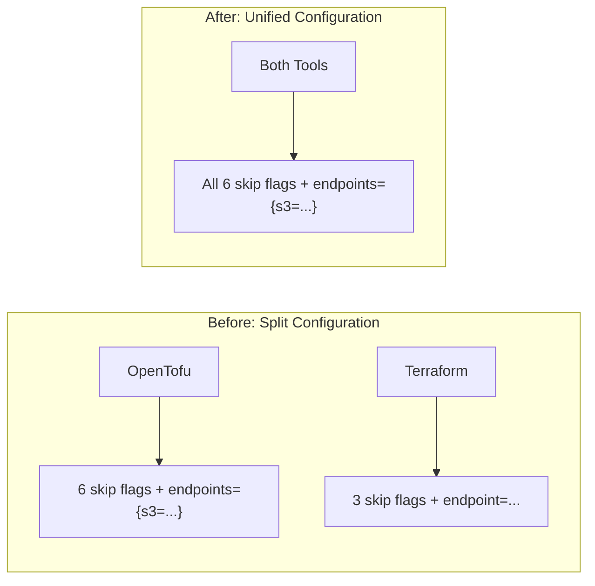
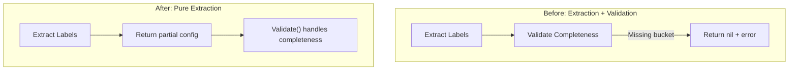

# S3-Compatible Backend Terraform Compatibility Fixes

**Date**: January 21, 2026
**Type**: Bug Fix
**Components**: Backend Configuration, IAC Stack Runner, User Experience, Error Handling

## Summary

Critical fixes for S3-compatible backend support with Terraform, resolving issues where Terraform couldn't use Cloudflare R2 or other S3-compatible storage. The fixes unify configuration between Terraform and OpenTofu, ensure manifest labels are properly extracted, and improve the user experience with always-visible backend configuration and environment variable hints in error messages.

## Problem Statement / Motivation

After the initial S3-compatible backend implementation, several issues emerged when using Terraform (as opposed to OpenTofu):

### Pain Points

- **Terraform rejected OpenTofu-only flags**: The initial implementation assumed certain flags were OpenTofu-only, but they're actually supported by both tools
- **Wrong endpoint format for Terraform**: Used `endpoint=...` (deprecated) instead of `endpoints={s3="..."}` for Terraform
- **Backend config not displayed for local backends**: When `BackendType` was empty or "local", the configuration summary was skipped entirely
- **Silent manifest label extraction failures**: When manifest had partial backend config (e.g., type but no bucket), extraction failed silently and showed defaults
- **No environment variable hints**: Validation error messages didn't show which environment variables could provide missing values

## Solution / What's New

### 1. Unified Configuration for Terraform and OpenTofu

Deep research revealed that **both Terraform and OpenTofu support the same S3 backend configuration format**. The flags previously thought to be OpenTofu-only are actually documented in Terraform as well.



**Unified flags applied to both tools:**
- `endpoints={s3="..."}`  (NOT `endpoint=...`)
- `skip_credentials_validation=true`
- `skip_region_validation=true`
- `skip_metadata_api_check=true`
- `skip_requesting_account_id=true`
- `skip_s3_checksum=true`
- `use_path_style=true`

### 2. Always Display Backend Configuration

The backend configuration summary is now displayed regardless of backend type, providing visibility into the resolved configuration before handoff.

**Before:**
```go
// Only displayed for remote backends
if backendCfg != nil && backendCfg.BackendType != "" && backendCfg.BackendType != "local" {
    ui.BackendConfigSummary(backendCfg)
}
```

**After:**
```go
// ALWAYS display backend configuration
if backendCfg != nil {
    ui.BackendConfigSummary(backendCfg)
}
```

When type is empty, it now shows `local (default)` instead of hiding the configuration.

### 3. Pure Manifest Label Extraction

Refactored `ExtractFromManifest` to be a pure extractor without validation. Previously, it would fail and return nil if the manifest had incomplete backend config (e.g., type=s3 but no bucket).



Now the function extracts whatever labels are present, and the later `Validate()` function provides user-friendly error messages with CLI flag hints.

### 4. Environment Variable Hints in Error Messages

Added `EnvVarName` field to `MissingField` struct and updated validation messages to show both CLI flags and environment variables.

**Updated output:**
```
✗  Incomplete Backend Configuration

   S3 backend requires the following configuration:

   • S3 bucket name for state storage
     Flag: --backend-bucket
     Env:  PROJECT_PLANTON_BACKEND_BUCKET
     Example: my-terraform-state-bucket
```

### 5. Incomplete Backend Config Warning

When manifest has backend fields (key, bucket, etc.) but no type specified, a warning is now displayed instead of silently using local backend.

```
⚠  Incomplete Backend Configuration
   Backend fields are set but --backend-type is not specified.
   Using local backend. Set --backend-type to use remote state.
```

## Implementation Details

### Files Changed

| File | Changes |
|------|---------|
| `pkg/iac/tofu/tofumodule/run_command.go` | Unified endpoint format and skip flags for both tools |
| `pkg/iac/tofu/backendconfig/backend_config.go` | Made `ExtractFromManifest` a pure extractor |
| `pkg/iac/tofu/backendconfig/validate.go` | Added `EnvVarName` field to `MissingField` |
| `internal/cli/ui/backend.go` | Handle empty type, add env var display, add incomplete warning |
| `internal/cli/iacrunner/run_tofu.go` | Always display backend config, add incomplete detection |

### Key Code Changes

**Unified endpoint format (run_command.go):**
```go
// S3-compatible endpoint (R2, MinIO, etc.)
// Both Terraform and OpenTofu use the same format
if config.BackendEndpoint != "" {
    args = append(args, fmt.Sprintf("endpoints={s3=\"%s\"}", config.BackendEndpoint))
}

// All flags supported by both tools
if config.S3Compatible {
    args = append(args, "skip_credentials_validation=true")
    args = append(args, "skip_region_validation=true")
    args = append(args, "skip_metadata_api_check=true")
    args = append(args, "skip_requesting_account_id=true")
    args = append(args, "skip_s3_checksum=true")
    args = append(args, "use_path_style=true")
}
```

**Pure extraction (backend_config.go):**
```go
// Return nil if no backend labels are present
if !hasType && !hasBucket && !hasKey {
    return nil, nil
}

// Extract whatever labels are present - validation happens later
config := &TofuBackendConfig{
    BackendType:     backendType,
    BackendBucket:   backendBucket,
    BackendKey:      backendKey,
    BackendRegion:   backendRegion,
    BackendEndpoint: backendEndpoint,
}
```

## Benefits

### For Users
- **Terraform now works with R2**: S3-compatible backends work correctly with both Terraform and OpenTofu
- **Better visibility**: Backend configuration always displayed, no hidden defaults
- **Actionable errors**: Validation messages include both CLI flags and environment variables
- **Early warnings**: Incomplete configuration detected and warned before Terraform handoff

### For Developers
- **Simplified code**: No more conditional logic splitting Terraform vs OpenTofu
- **Cleaner architecture**: Extraction and validation are now separate concerns
- **Easier debugging**: Always see what backend config was resolved

## Impact

This fix enables Terraform users to use Cloudflare R2 and other S3-compatible storage services, which was previously only working with OpenTofu. The unified configuration approach means the same manifest and environment variables work with both tools.

## Related Work

- **Predecessor**: [S3-Compatible Backend Support with CLI Flags and Environment Variables](2026-01-21-135804-s3-compatible-backend-support-with-cli-flags-and-env-vars.md)
- **Research**: Deep research on Terraform S3 backend configuration confirmed both tools support identical flags

## Research Reference

Key finding from deep research:

> "For your CLI, you can converge on a single backend-config shape that works in both: `endpoints={s3="https://..."}`"

Sources:
- [Terraform S3 Backend Documentation](https://developer.hashicorp.com/terraform/language/backend/s3)
- [Cloudflare R2 Terraform Backend Guide](https://developers.cloudflare.com/terraform/advanced-topics/remote-backend/)
- [OpenTofu S3 Backend Documentation](https://opentofu.org/docs/language/settings/backends/s3/)

---

**Status**: ✅ Production Ready
**Timeline**: ~2 hours debugging and fixing
