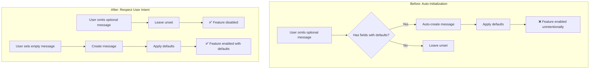

# Revert Auto-Initialization of Unset Nested Messages

**Date**: January 21, 2026
**Type**: Bug Fix
**Components**: Manifest Processing, Proto Defaults

## Summary

Reverted the auto-initialization behavior for unset nested messages that was introduced in the previous change. Unset nested messages now remain unset to preserve user intent, fixing regressions in components like AWS ECS Service where optional feature messages were being inadvertently enabled. This restores clear semantics: unset optional messages mean "I don't want this feature", while explicitly set empty messages mean "I want this feature with defaults".

## Problem Statement / Motivation

The previous implementation auto-initialized unset nested messages when they contained fields with default values. This caused semantic ambiguity and unexpected side effects.

### Pain Points

- **Semantic confusion**: System couldn't distinguish between "user wants feature with defaults" vs "user doesn't want feature"
- **Unexpected infrastructure changes**: Optional features like autoscaling were being enabled unintentionally
- **Regression in AWS ECS Service**: `autoscaling` and `alb` messages were auto-created even when users omitted them
- **Violation of user intent**: Omitting a message should mean "disable this feature", not "enable with defaults"

### The Regression Example

Using AWS ECS Service as a concrete example:

```protobuf
message AwsEcsServiceSpec {
  // autoscaling is OPTIONAL - user may not want it
  AwsEcsServiceAutoscaling autoscaling = 7;
}

message AwsEcsServiceAutoscaling {
  bool enabled = 1;
  optional int32 target_cpu_percent = 4 [(default) = "75"];  // Has a default!
}
```

**Before this fix:**
1. User provides manifest WITHOUT `autoscaling` (they don't want autoscaling)
2. System sees `target_cpu_percent` has a default
3. System auto-creates `autoscaling` message and sets `target_cpu_percent = 75`
4. IaC module sees `autoscaling` is set, may attempt to configure autoscaling
5. Unexpected infrastructure changes occur

**The core issue:** Auto-initialization conflated two different user intents:
- "I want this feature with defaults" → User sets empty message `autoscaling: {}`
- "I don't want this feature" → User omits the message entirely

## Solution / What's New

Reverted to the original behavior: **only apply defaults to messages that are explicitly set by the user**. This restores clear semantics where user intent is preserved.

### Behavior Flow



### Key Change

The `hasFieldsWithDefaults` check and auto-initialization logic were removed. Now the system only processes messages that users explicitly set:

```go
// In applyDefaultsToMessage
if field.Kind() == protoreflect.MessageKind {
    if msgReflect.Has(field) {
        // If the field is set, recurse into it to apply defaults
        nestedMsg := msgReflect.Get(field).Message()
        applyDefaultsToMessage(nestedMsg)
    }
    // If NOT set, leave it unset - respect user's choice
    continue
}
```

## Implementation Details

### Code Changes

**File**: `internal/manifest/protodefaults/applier.go`

1. **Removed `hasFieldsWithDefaults` helper function** (28 lines)
   - This function recursively checked if a message type had any fields with defaults
   - No longer needed since we don't auto-initialize unset messages

2. **Simplified `applyDefaultsToMessage` logic**
   - Removed the `else` block that checked `hasFieldsWithDefaults` and auto-created messages
   - Now only recurses into messages that are explicitly set via `msgReflect.Has(field)`

3. **Updated documentation**
   - Clarified that defaults only apply to explicitly set messages
   - Added guidance that users can set empty messages to trigger defaults

**File**: `internal/manifest/protodefaults/applier_test.go`

1. **Renamed test**: `TestApplyDefaults_UnsetNestedMessageWithDefaults` → `TestApplyDefaults_UnsetNestedMessageBehavior`

2. **Updated test cases**:
   - "unset nested messages remain unset to preserve user intent" - verifies the fix
   - "empty nested message triggers default application" - verifies users can opt-in to defaults
   - "unset messages without defaults also remain unset" - unchanged behavior

### Semantic Rules (Final Design)

| User Action | System Behavior |
|-------------|-----------------|
| Omits optional message | Message remains `nil` - feature disabled |
| Sets empty message `{}` | Message created, defaults applied - feature enabled with defaults |
| Sets partial message | User values preserved, defaults applied to unset fields |

## Files Changed

| File | Change |
|------|--------|
| `internal/manifest/protodefaults/applier.go` | Removed `hasFieldsWithDefaults` function and auto-init logic |
| `internal/manifest/protodefaults/applier_test.go` | Updated tests to verify unset messages remain unset |

## Benefits

### Clear Semantics

- **Unambiguous user intent**: Omitting a message clearly means "disable this feature"
- **Explicit opt-in**: Users must explicitly set a message (even empty) to enable features with defaults
- **Predictable behavior**: System behavior matches developer expectations

### Prevents Unexpected Side Effects

- **No surprise infrastructure changes**: Optional features won't be enabled unintentionally
- **Cost control**: Users won't accidentally provision resources they didn't request
- **Configuration safety**: Manifests behave exactly as written

### Better Developer Experience

- **Self-documenting**: Empty message `{}` clearly signals "I want defaults"
- **Explicit is better than implicit**: Follows Python's Zen principle
- **Easier debugging**: When a feature is enabled, it's because the user explicitly requested it

## Impact

### Fixed Regressions

- AWS ECS Service `autoscaling` no longer auto-enables
- AWS ECS Service `alb` no longer auto-enables  
- Any optional feature message with nested defaults now respects user intent

### User Experience

Users who want defaults on optional features simply set the message to empty:

```yaml
# I want autoscaling with defaults
spec:
  autoscaling: {}  # Triggers defaults

# After loading:
spec:
  autoscaling:
    target_cpu_percent: 75  # Default applied
```

Users who don't want optional features simply omit them:

```yaml
# I don't want autoscaling
spec:
  # autoscaling omitted - remains nil

# After loading:
spec:
  # autoscaling still omitted - no side effects
```

## Related Work

- `2026-01-14-154952-protodefaults-unset-nested-messages-and-load-alias.md` - Previous change that introduced the regression
- `2025-10-18-01.proto-field-defaults-support.md` - Original proto defaults implementation

---

**Status**: ✅ Production Ready
**Timeline**: ~15 minutes
