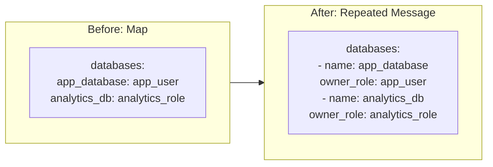

# KubernetesPostgres: Convert databases Field from Map to Repeated Message

**Date**: January 21, 2026
**Type**: Enhancement
**Components**: API Definitions, Kubernetes Provider, Pulumi CLI Integration, Terraform Module

## Summary

Refactored the `databases` field in `KubernetesPostgresSpec` from a confusing `map<string, string>` to a clearer `repeated KubernetesPostgresDatabase` message with explicit `name` and `owner_role` fields. This improves API clarity and self-documentation while maintaining full backward compatibility with the Zalando PostgreSQL Operator.

## Problem Statement / Motivation

The original `databases` field used a protobuf map type where the semantic meaning of keys and values was only documented in comments:

```proto
// Key: database name (e.g., "app_database", "analytics_db")
// Value: owner role name (e.g., "app_user", "analytics_role")
map<string, string> databases = 7;
```

### Pain Points

- **Poor self-documentation**: New users couldn't understand the field without reading comments
- **Ambiguous YAML**: `app_database: app_user` doesn't clearly indicate which is the database name vs owner role
- **IDE limitations**: No field-level autocomplete for database properties
- **Inconsistent with `users` field**: The `users` field already used a structured `KubernetesPostgresUser` message

## Solution / What's New

Introduced a new `KubernetesPostgresDatabase` message with named fields:

```proto
message KubernetesPostgresDatabase {
  string name = 1;       // Database name (required)
  string owner_role = 2; // Owner role name (optional)
}
```

### Before vs After



## Implementation Details

### Proto Schema Change

**File**: `apis/org/project_planton/provider/kubernetes/kubernetespostgres/v1/spec.proto`

Added new message type:

```proto
message KubernetesPostgresDatabase {
  // Database name (e.g., "app_database", "analytics_db")
  string name = 1 [(buf.validate.field).required = true];

  // Owner role name (e.g., "app_user", "analytics_role")
  // If not specified, the database will be owned by the default postgres user.
  string owner_role = 2;
}
```

Changed field type in `KubernetesPostgresSpec`:

```proto
// Before
map<string, string> databases = 7;

// After
repeated KubernetesPostgresDatabase databases = 7;
```

### Pulumi Module Update

**File**: `apis/.../kubernetespostgres/v1/iac/pulumi/module/main.go`

Updated conversion logic to transform the repeated message to Zalando's expected map format:

```go
// Convert databases list to map[string]string for Zalando operator
var databasesMap pulumi.StringMapInput
if len(locals.KubernetesPostgres.Spec.Databases) > 0 {
    databasesMapData := make(map[string]string)
    for _, db := range locals.KubernetesPostgres.Spec.Databases {
        databasesMapData[db.Name] = db.OwnerRole
    }
    databasesMap = pulumi.ToStringMap(databasesMapData)
}
```

### Terraform Module Update

**File**: `apis/.../kubernetespostgres/v1/iac/tf/variables.tf`

```hcl
databases = optional(list(object({
  name       = string
  owner_role = optional(string, "")
})), [])
```

**File**: `apis/.../kubernetespostgres/v1/iac/tf/database.tf`

```hcl
databases = { for db in var.spec.databases : db.name => db.owner_role }
```

## Benefits

- **Self-documenting API**: Field names clearly indicate their purpose
- **Better IDE support**: Autocomplete for `name` and `owner_role` fields
- **Consistent patterns**: Matches the existing `users` field structure
- **Clearer YAML manifests**: Easier to read and write database configurations
- **Validation support**: Can add `required` validation to `name` field

## Impact

### For API Users

YAML manifests need to use the new format:

```yaml
# Before
databases:
  app_database: app_user
  analytics_db: analytics_role

# After
databases:
  - name: app_database
    owner_role: app_user
  - name: analytics_db
    owner_role: analytics_role
```

### For IaC Modules

Both Pulumi and Terraform modules handle the conversion internally - the Zalando operator still receives the expected `map[string]string` format.

## Files Changed

| File | Change |
|------|--------|
| `spec.proto` | Added `KubernetesPostgresDatabase` message, changed field type |
| `iac/pulumi/module/main.go` | Updated conversion logic |
| `iac/tf/variables.tf` | Changed variable type definition |
| `iac/tf/database.tf` | Updated for-expression for conversion |
| `examples.md` | Updated YAML examples |

## Related Work

- Follows the same pattern as `KubernetesPostgresUser` message
- Part of ongoing API clarity improvements across deployment components

---

**Status**: ✅ Production Ready
**Timeline**: Single session
