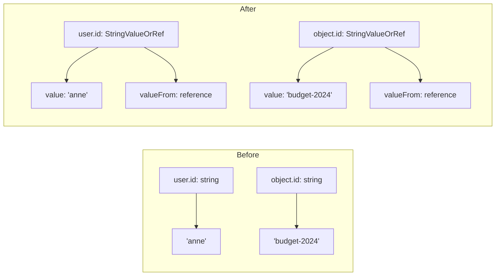

# OpenFGA Relationship Tuple: Foreign Key Support for User and Object ID Fields

**Date**: January 21, 2026
**Type**: Enhancement
**Components**: API Definitions, OpenFGA Provider, Terraform Integration, Pulumi Integration

## Summary

Enhanced the OpenFGA Relationship Tuple component to support foreign key references in `user.id` and `object.id` fields. Both fields now accept `StringValueOrRef` instead of plain strings, enabling dynamic ID resolution from other deployed resources while maintaining backward compatibility through direct value specification.

## Problem Statement / Motivation

The OpenFGA Relationship Tuple component required users to hardcode user and object IDs as plain strings. This was inconsistent with other fields in the same proto (`store_id` and `authorization_model_id`) which already supported `StringValueOrRef` for foreign key references.

### Pain Points

- **Hardcoded IDs**: Users couldn't reference dynamically-provisioned resource IDs
- **Inconsistent API**: `store_id` supported references while `user.id` and `object.id` did not
- **Limited flexibility**: No way to create tuples that reference other deployment component outputs
- **Manual coordination**: Required users to manually look up and paste IDs from other resources

## Solution / What's New

Changed the `id` field type in both `OpenFgaRelationshipTupleUser` and `OpenFgaRelationshipTupleObject` messages from `string` to `org.project_planton.shared.foreignkey.v1.StringValueOrRef`.

### Field Changes



### New YAML Format

**Direct Value:**
```yaml
user:
  type: user
  id:
    value: anne
object:
  type: document
  id:
    value: budget-2024
```

**Foreign Key Reference:**
```yaml
user:
  type: user
  id:
    valueFrom:
      name: my-user-resource
object:
  type: project
  id:
    valueFrom:
      name: my-project
      fieldPath: metadata.id
```

## Implementation Details

### Proto Schema Changes

Updated `spec.proto` to change field types:

```protobuf
message OpenFgaRelationshipTupleUser {
  string type = 1 [(buf.validate.field).required = true];
  // Changed from: string id = 2
  org.project_planton.shared.foreignkey.v1.StringValueOrRef id = 2 [(buf.validate.field).required = true];
  string relation = 3;
}

message OpenFgaRelationshipTupleObject {
  string type = 1 [(buf.validate.field).required = true];
  // Changed from: string id = 2
  org.project_planton.shared.foreignkey.v1.StringValueOrRef id = 2 [(buf.validate.field).required = true];
}
```

### Pulumi Module Updates

Updated `iac/pulumi/module/locals.go` to extract values using `GetValue()`:

```go
// Before
user = fmt.Sprintf("%s:%s", spec.User.Type, spec.User.Id)

// After
userId := ""
if spec.User.Id != nil {
    userId = spec.User.Id.GetValue()
}
user = fmt.Sprintf("%s:%s", spec.User.Type, userId)
```

### Terraform Module Updates

Updated `iac/tf/variables.tf` to use nested object type:

```hcl
# Before
user = object({
  type = string
  id   = string
})

# After
user = object({
  type = string
  id = object({
    value = string
  })
})
```

Updated `iac/tf/locals.tf` to extract nested value:

```hcl
# Before
user = "${var.spec.user.type}:${var.spec.user.id}"

# After
user = "${var.spec.user.type}:${var.spec.user.id.value}"
```

### Files Modified

| File | Change |
|------|--------|
| `spec.proto` | Changed `id` field types to `StringValueOrRef` |
| `iac/pulumi/module/locals.go` | Updated to use `GetValue()` for id extraction |
| `iac/tf/variables.tf` | Updated variable types to nested objects |
| `iac/tf/locals.tf` | Updated expressions to use `.value` accessor |
| `examples.md` | Updated all examples with new nested format |

## Benefits

- **Consistency**: All reference-capable fields now use the same `StringValueOrRef` pattern
- **Flexibility**: Users can reference IDs from other deployed resources
- **Dynamic workflows**: Enables fully declarative relationship tuples without manual ID lookup
- **Backward compatible**: Direct values still work via `{value: "..."}` syntax

## Impact

### API Users
- Must update YAML manifests to use new nested `id` format
- Existing manifests with plain string `id` values will fail validation

### Example Migration

```yaml
# Before
spec:
  user:
    type: user
    id: anne

# After
spec:
  user:
    type: user
    id:
      value: anne
```

## Related Work

- Consistent with existing `store_id` and `authorization_model_id` fields which already use `StringValueOrRef`
- Follows the foreign key pattern established in `shared/foreignkey/v1/foreign_key.proto`

---

**Status**: ✅ Production Ready
**Validation**: `go build`, `go vet`, `go test` all passing
