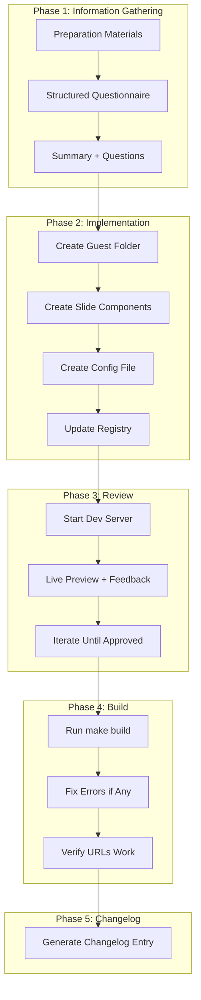

# Meeting Deck Cursor Rules and Build System Workflow

**Date**: January 22, 2026
**Type**: Feature
**Components**: Cursor Rules, Meets Micro-App, Build System, Developer Experience

## Summary

Created comprehensive Cursor rules for creating and updating meeting presentation decks, plus a complete build system workflow with dev server awareness and cyclic regression detection. This establishes a repeatable, AI-assisted workflow for preparing meeting presentations.

## Problem Statement / Motivation

Creating meeting decks manually is time-consuming and error-prone. With the Meets micro-app foundation in place, we needed:

### Pain Points

- No structured process for converting preparation materials into decks
- Risk of missing slides, presenter notes, or registry entries
- No iterative workflow for refining decks with live preview
- Build conflicts when running dev server and build commands simultaneously
- No way to detect when fix attempts create cyclic regressions
- Changelog generation was manual and often forgotten

## Solution / What's New

### Meeting Deck Rules

Two comprehensive rules for deck lifecycle management:

#### Create Rule (`create-planton-ai-meeting-deck.mdc`)

A 5-phase workflow for new deck creation:



**Key Features:**
- Structured information gathering with questionnaire template
- Complete file structure and naming conventions
- Shared primitives reference with code examples
- Presenter notes guidelines
- Quality checklist

#### Update Rule (`update-planton-ai-meeting-deck.mdc`)

An iterative workflow for deck refinements:

- Feedback-driven development with hot reload
- No build commands during iteration (dev server aware)
- Session-based tracking of all changes
- Automatic changelog generation at completion

### Build System Rules

Three rules for managing local development:

| Rule | Purpose | Always Applied |
|------|---------|----------------|
| `planton-ai-local-build-system.mdc` | Documents `make build` and `yarn` | Yes |
| `do-not-build-planton-ai-project.mdc` | Prevents builds when dev server running | No (attach when needed) |
| `iterate-until-planton-ai-build-succeeds.mdc` | Build iteration with regression detection | No (attach when needed) |

#### Cyclic Regression Detection

The iterate rule includes sophisticated regression detection:

```
Build 1: Error in src/foo.ts - TS2339
Build 2: Error in src/bar.ts - TS2345 (different, proceed)
Build 3: Error in src/foo.ts - TS2339 (CYCLE DETECTED - stop)
```

**Detection Process:**
1. Log each build to timestamped file in `tools/local-dev/_rules/_workspace/`
2. Compare error signatures against previous 2-3 builds
3. Stop and report if same errors reappear
4. Prevents infinite fix loops

## Implementation Details

### File Structure

```
src/app/(micro-apps)/meets/_rules/
├── create-planton-ai-meeting-deck.mdc    # 500+ lines, comprehensive
└── update-planton-ai-meeting-deck.mdc    # 200+ lines, iterative

tools/local-dev/_rules/
├── _workspace/
│   └── .gitignore                        # Ignores build logs
├── planton-ai-local-build-system.mdc     # Always applied
├── do-not-build-planton-ai-project.mdc   # Dev server mode
└── iterate-until-planton-ai-build-succeeds.mdc  # Build iteration
```

### Create Rule Structure

```markdown
# Phase 1: Information Gathering
- Guest Profile (slug, name, type, context)
- Meeting Details (date, location, presenter, objectives)
- Presentation Content (narrative arc, pain points, demo sections)
- Questionnaire Template

# Phase 2: Implementation
- File structure creation
- Slide component templates
- Config file format
- Registry update instructions

# Phase 3: Review and Iteration
- Dev server instructions (make run)
- Keyboard shortcuts reference
- Feedback loop workflow

# Phase 4: Build Verification
- Stop dev server
- Run make build iteratively
- Verify URLs

# Phase 5: Generate Changelog
- Changelog template with all details
```

### Build Log Management

```bash
# Timestamped log files
tools/local-dev/_rules/_workspace/build.20260122.104223.log
tools/local-dev/_rules/_workspace/build.20260122.104512.log
tools/local-dev/_rules/_workspace/build.20260122.104801.log

# Gitignored - safe for experimentation
# User cleans up when desired
```

## Benefits

### For Deck Creation
- **Consistency**: Every deck follows same structure and patterns
- **Completeness**: Checklists ensure nothing is missed
- **Speed**: AI assistance with clear templates accelerates creation
- **Quality**: Presenter notes, primitives, and patterns built-in

### For Development Workflow
- **No conflicts**: Dev server and build commands don't interfere
- **Visibility**: Timestamped logs track all build attempts
- **Safety**: Regression detection prevents infinite loops
- **Documentation**: Changelogs generated automatically

### For Knowledge Transfer
- **Self-documenting**: Rules explain the entire process
- **Referenceable**: Patterns and examples in one place
- **Maintainable**: Single source of truth for workflows

## Impact

### Files Created

| File | Lines | Purpose |
|------|-------|---------|
| `create-planton-ai-meeting-deck.mdc` | ~530 | New deck creation workflow |
| `update-planton-ai-meeting-deck.mdc` | ~200 | Deck update workflow |
| `planton-ai-local-build-system.mdc` | ~55 | Build commands reference |
| `do-not-build-planton-ai-project.mdc` | ~50 | Dev server mode |
| `iterate-until-planton-ai-build-succeeds.mdc` | ~150 | Build iteration |
| `_workspace/.gitignore` | 3 | Ignore build logs |
| **Total** | ~990 | |

### Workflows Enabled

1. **New Meeting Deck**: `@create-planton-ai-meeting-deck` with prep folder
2. **Update Deck**: `@update-planton-ai-meeting-deck` with guest slug and changes
3. **Dev Mode**: `@do-not-build-planton-ai-project` when running dev server
4. **Build Verification**: `@iterate-until-planton-ai-build-succeeds` for production checks

## Related Work

- **Meets Micro-App Foundation**: `2026-01-21-224947-meets-micro-app-presentation-framework.md`
- **Prospect to Guest Refactor**: `2026-01-22-112306-meets-prospect-to-guest-refactor.md`

## Future Enhancements

- Template system for common deck types (sales, investor, partner)
- Slide library for reusable content blocks
- Automated screenshot capture for changelog entries
- Integration with meeting scheduling systems

---

**Status**: ✅ Live
**Timeline**: Single session implementation
**Rules Location**: `src/app/(micro-apps)/meets/_rules/` and `tools/local-dev/_rules/`
