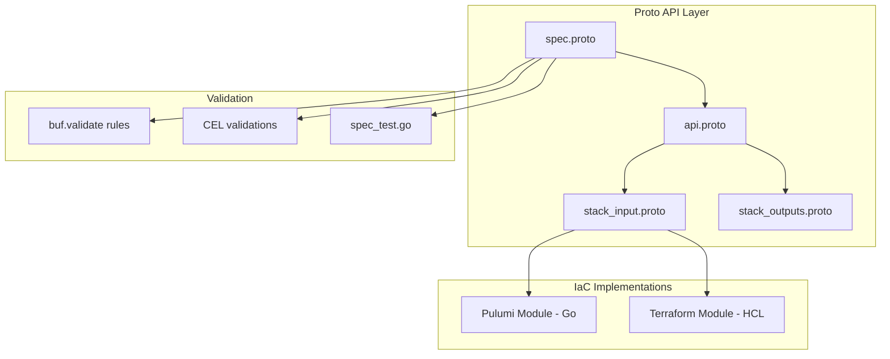
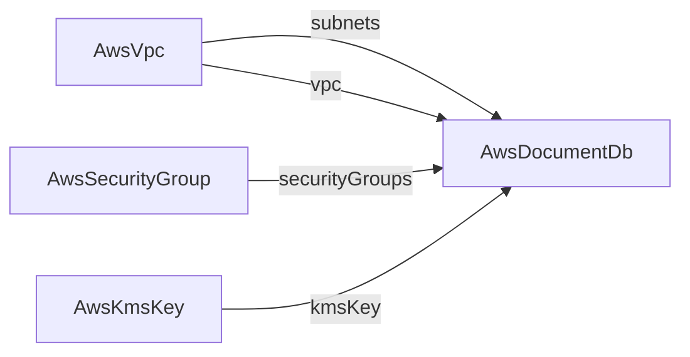

# AWS DocumentDB Deployment Component

**Date**: January 23, 2026
**Type**: Feature
**Components**: API Definitions, Provider Framework, Pulumi CLI Integration, Terraform Integration

## Summary

Added a complete deployment component for AWS DocumentDB, a fully managed MongoDB-compatible document database service. This component follows the Project Planton ideal state checklist with comprehensive Proto API definitions, both Pulumi (Go) and Terraform (HCL) IaC implementations, detailed documentation, and validation tests.

## Problem Statement / Motivation

Organizations using MongoDB workloads on AWS need a declarative, production-ready way to deploy DocumentDB clusters through Project Planton. Without this component, users would need to manually configure DocumentDB through the AWS Console or write custom IaC code, missing out on Project Planton's cross-referencing capabilities and standardized deployment patterns.

### Pain Points

- No existing Project Planton component for MongoDB-compatible databases on AWS
- Manual DocumentDB deployments require extensive configuration knowledge
- Lack of cross-referencing between VPC, subnets, security groups, and database resources
- No standardized validation for DocumentDB configuration parameters

## Solution / What's New

A complete `AwsDocumentDb` deployment component that enables declarative provisioning of DocumentDB clusters with:

- Full networking integration via cross-references to VPCs, subnets, and security groups
- Encryption at rest with KMS key support
- Automated backup configuration
- Multi-instance cluster support for high availability
- CloudWatch logs export (audit and profiler)
- Custom parameter groups

### Component Architecture



### Cross-Reference Support

The component uses `StringValueOrRef` for seamless integration with other Project Planton resources:



## Implementation Details

### Proto API Files

**File**: `apis/org/project_planton/provider/aws/awsdocumentdb/v1/spec.proto`

Key fields with cross-reference support:
- `subnets` - References `AwsVpc.status.outputs.private_subnets.[*].id`
- `securityGroups` - References `AwsSecurityGroup.status.outputs.security_group_id`
- `vpc` - References `AwsVpc.status.outputs.vpc_id`
- `kmsKey` - References `AwsKmsKey.status.outputs.key_arn`

### Validation Rules

Field-level validations using `buf.validate`:
- CIDR block pattern matching
- Port range validation (1-65535)
- Backup retention period bounds (1-35 days)
- Backup/maintenance window format validation
- Unique values for repeated fields

Message-level CEL validations:
- `subnets_or_group`: Require either 2+ subnets or existing subnet group
- `final_snapshot_id_required_when_not_skipping`: Enforce snapshot ID when not skipping
- `logs_exports_valid_values`: Only allow "audit" and "profiler" log types

### Pulumi Module Structure

```
iac/pulumi/module/
├── main.go              # Controller/orchestrator
├── locals.go            # Local values and labels
├── outputs.go           # Output constants
├── cluster.go           # DocumentDB cluster resource
├── instances.go         # Cluster instance creation
├── subnet_group.go      # DB subnet group
├── security_group.go    # VPC security group
└── parameter_group.go   # Cluster parameter group
```

### Terraform Module Structure

```
iac/tf/
├── variables.tf         # Input variables matching spec.proto
├── provider.tf          # AWS provider configuration
├── locals.tf            # Computed locals
├── main.tf              # Cluster and instances
├── outputs.tf           # Stack outputs
├── subnet_group.tf      # Conditional subnet group
├── security_group.tf    # Conditional security group
└── parameter_group.tf   # Conditional parameter group
```

### Registry Entry

Added to `cloud_resource_kind.proto`:
```protobuf
AwsDocumentDb = 222 [(kind_meta) = {
  provider: aws
  version: v1
  id_prefix: "docdb"
}];
```

## Benefits

### For Platform Teams
- **Declarative Configuration**: Define DocumentDB clusters in YAML manifests
- **Cross-Reference Support**: Automatically resolve VPC, subnet, and security group IDs from other resources
- **Validation at Definition Time**: Catch configuration errors before deployment

### For Developers
- **Consistent Patterns**: Same deployment workflow as other AWS components
- **Multiple IaC Options**: Choose between Pulumi or Terraform based on team preference
- **Comprehensive Documentation**: Examples for minimal, production, HA, and dev scenarios

### For Operations
- **Production-Ready Defaults**: Encryption enabled, 7-day backup retention
- **High Availability**: Multi-AZ support with configurable instance count
- **Audit Logging**: CloudWatch logs export for compliance

## Impact

### Users Affected
- Platform engineers deploying MongoDB workloads on AWS
- Teams migrating from self-managed MongoDB to managed DocumentDB
- Organizations requiring MongoDB-compatible databases with enterprise features

### Workflow Changes
Users can now deploy DocumentDB clusters with:

```bash
# Validate manifest
project-planton validate --manifest docdb.yaml

# Deploy with Pulumi
project-planton pulumi up --manifest docdb.yaml --stack org/proj/stack

# Or deploy with Terraform
project-planton tofu apply --manifest docdb.yaml --auto-approve
```

## Files Changed

### New Files (38 files)
- Proto definitions: `spec.proto`, `api.proto`, `stack_input.proto`, `stack_outputs.proto`
- Generated stubs: `.pb.go` files
- Pulumi module: 8 Go files
- Terraform module: 8 HCL files
- Documentation: `README.md`, `examples.md`, `docs/README.md`, `overview.md`
- Supporting: `hack/manifest.yaml`, `Pulumi.yaml`, `Makefile`, `debug.sh`

### Modified Files (5 files)
- `cloud_resource_kind.proto` - Added AwsDocumentDb enum
- `cloud_resource_kind.pb.go` - Generated code
- `cloud_resource_kind_pb.ts` - TypeScript stubs
- `kind_map_gen.go` - Resource kind map
- `pkg/crkreflect/BUILD.bazel` - Build dependencies

## Related Work

- Similar pattern to `AwsRdsCluster` component for Aurora/RDS
- Uses same cross-reference patterns as `AwsEcsService`
- Follows forge rule: `@forge-project-planton-component`

---

**Status**: ✅ Production Ready
**Timeline**: Single session implementation
