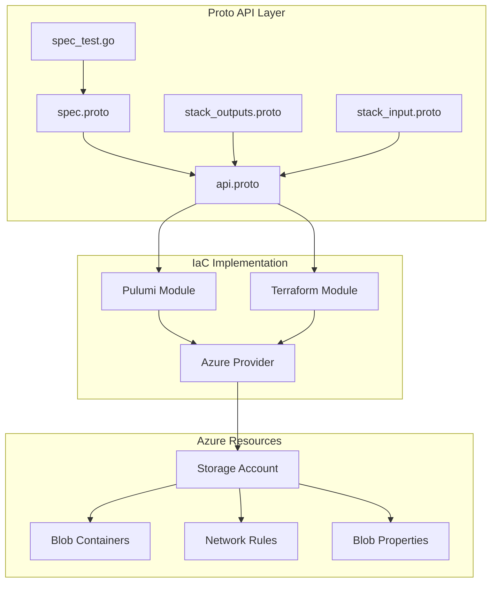
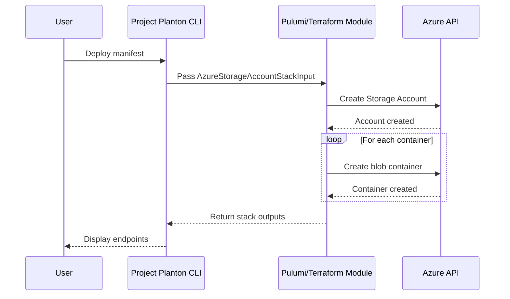

# Azure Storage Account Deployment Component

**Date**: January 23, 2026
**Type**: Feature
**Components**: API Definitions, Provider Framework, Pulumi CLI Integration, Terraform Module

## Summary

Added a complete deployment component for Azure Storage Account, enabling declarative provisioning of Azure storage resources with blob containers, network security controls, and data protection features. The component includes both Pulumi (Go) and Terraform (HCL) implementations with full feature parity.

## Problem Statement / Motivation

Organizations deploying to Azure frequently need to provision Storage Accounts for various workloads including application data, static website hosting, data lakes, and backup storage. Without a standardized deployment component, teams face:

### Pain Points

- **Manual configuration complexity**: Azure Storage has dozens of configuration options across account types, replication strategies, access tiers, and network rules
- **Inconsistent deployments**: Different teams configure storage differently, leading to security gaps and cost inefficiencies
- **No IaC standardization**: Teams build custom Terraform/Pulumi modules that vary in quality and completeness
- **Missing validation**: Easy to misconfigure storage accounts without schema validation

## Solution / What's New

Created a production-ready `AzureStorageAccount` deployment component following the Project Planton deployment component architecture.

### Component Architecture



### Key Features

| Feature | Description |
|---------|-------------|
| **Multiple Account Types** | StorageV2, BlobStorage, BlockBlobStorage, FileStorage |
| **Replication Options** | LRS, ZRS, GRS, GZRS, RA-GRS, RA-GZRS |
| **Access Tier Control** | Hot and Cool tiers for cost optimization |
| **Network Security** | IP rules, VNet rules, Azure Services bypass |
| **Data Protection** | Blob versioning, soft delete for blobs and containers |
| **Container Management** | Create multiple containers with access level control |

## Implementation Details

### Proto Schema Design

The spec follows the 80/20 principle, exposing essential configuration options:

```protobuf
message AzureStorageAccountSpec {
  string region = 1;                              // Required
  string resource_group = 2;                      // Required
  optional AzureStorageAccountKind account_kind = 3;    // Default: STORAGE_V2
  optional AzureStorageAccountTier account_tier = 4;    // Default: STANDARD
  optional AzureStorageReplicationType replication_type = 5; // Default: LRS
  optional AzureStorageAccessTier access_tier = 6;      // Default: HOT
  optional bool enable_https_traffic_only = 7;          // Default: true
  optional AzureTlsVersion min_tls_version = 8;         // Default: TLS1_2
  AzureStorageNetworkRules network_rules = 9;
  AzureStorageBlobProperties blob_properties = 10;
  repeated AzureStorageContainer containers = 11;
}
```

### Validation Rules

Comprehensive buf.validate rules ensure configuration correctness:

- Required fields: `region`, `resource_group`
- Enum validation: `defined_only = true` for all enums
- Container name: 3-63 characters (Azure requirement)
- Soft delete retention: 0-365 days
- Max items limits: 100 containers, 200 IP rules, 100 VNet rules

### IaC Module Flow



### Files Created

**Proto Definitions** (4 files + tests):
- `apis/org/project_planton/provider/azure/azurestorageaccount/v1/spec.proto`
- `apis/org/project_planton/provider/azure/azurestorageaccount/v1/api.proto`
- `apis/org/project_planton/provider/azure/azurestorageaccount/v1/stack_input.proto`
- `apis/org/project_planton/provider/azure/azurestorageaccount/v1/stack_outputs.proto`
- `apis/org/project_planton/provider/azure/azurestorageaccount/v1/spec_test.go`

**Pulumi Module** (6 files):
- `iac/pulumi/main.go` - Entrypoint
- `iac/pulumi/module/main.go` - Resource creation
- `iac/pulumi/module/locals.go` - Name generation, enum conversion
- `iac/pulumi/module/outputs.go` - Output constants
- `iac/pulumi/Pulumi.yaml`, `Makefile`

**Terraform Module** (6 files):
- `iac/tf/main.tf` - Resource definitions
- `iac/tf/variables.tf` - Input variables matching spec.proto
- `iac/tf/locals.tf` - Local computations
- `iac/tf/outputs.tf` - Output definitions
- `iac/tf/provider.tf` - Azure provider configuration
- `iac/tf/README.md`

**Documentation** (4 files):
- `v1/README.md` - User-facing overview
- `v1/examples.md` - 6 comprehensive examples
- `v1/docs/README.md` - Research documentation
- `iac/hack/manifest.yaml` - Test manifest

**Registry Entry**:
- Added `AzureStorageAccount = 408` to `cloud_resource_kind.proto` with id_prefix `azsa`

## Benefits

### For Platform Engineers

- **Standardized deployments**: Consistent storage configuration across all environments
- **Built-in security**: Secure defaults (HTTPS-only, TLS 1.2, network deny)
- **Validation at deploy time**: Proto validations catch misconfigurations early
- **Dual IaC support**: Choose Pulumi or Terraform based on team preference

### For Developers

- **Simple manifests**: Declarative YAML instead of complex IaC code
- **Sensible defaults**: Works out-of-box with minimal configuration
- **Clear documentation**: Examples for common scenarios

### For Operations

- **Consistent outputs**: Predictable stack outputs for integration
- **Cost control**: Access tier and replication choices documented
- **Network security**: Default deny with explicit allow rules

## Impact

### New Capability

Azure users can now deploy Storage Accounts with:

```yaml
apiVersion: azure.project-planton.org/v1
kind: AzureStorageAccount
metadata:
  name: myapp-storage
spec:
  region: eastus
  resourceGroup: myapp-rg
  replicationType: GRS
  containers:
    - name: data
      accessType: PRIVATE
```

### Component Coverage

This brings the Azure provider to **9 deployment components**:
- AzureAksCluster
- AzureAksNodePool
- AzureContainerRegistry
- AzureDnsZone
- AzureKeyVault
- AzureVpc
- AzureNatGateway
- AzureVirtualMachine
- **AzureStorageAccount** (new)

## Test Results

All validation tests pass:

```
=== RUN   TestAzureStorageAccountSpec
Running Suite: AzureStorageAccountSpec Custom Validation Tests
Will run 23 of 23 specs
SUCCESS! -- 23 Passed | 0 Failed | 0 Pending | 0 Skipped
--- PASS: TestAzureStorageAccountSpec (0.02s)
```

## Related Work

- Similar pattern to `AzureKeyVault` component for Azure secrets management
- Follows the same structure as `AwsS3Bucket` for AWS storage
- Uses shared Azure provider configuration (`AzureProviderConfig`)

---

**Status**: ✅ Production Ready
**Timeline**: Single session implementation
