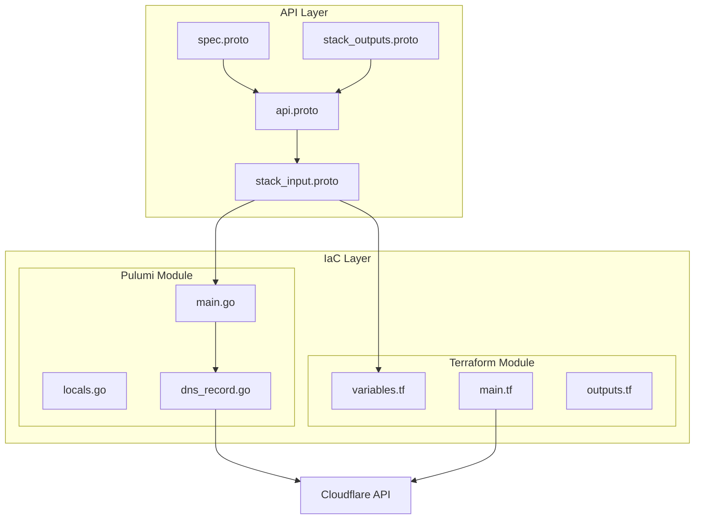

# CloudflareDnsRecord Deployment Component

**Date**: January 23, 2026
**Type**: Feature
**Components**: API Definitions, Provider Framework, Pulumi CLI Integration, Terraform Module

## Summary

Added a complete `CloudflareDnsRecord` deployment component enabling declarative management of individual DNS records within Cloudflare zones. The component supports all major DNS record types (A, AAAA, CNAME, MX, TXT, SRV, NS, CAA) with built-in validation, orange/grey cloud proxy support, and both Pulumi and Terraform IaC implementations.

## Problem Statement / Motivation

Cloudflare DNS zone management was already possible with `CloudflareDnsZone`, but users needed to manage individual DNS records within those zones. While zones establish authoritative DNS for a domain, records are the fundamental building blocks that:
- Map hostnames to IP addresses (A/AAAA)
- Create aliases (CNAME)
- Route email (MX)
- Store verification and authentication data (TXT, SPF, DKIM)

### Pain Points

- No declarative way to manage individual Cloudflare DNS records via OpenMCF
- Users had to fall back to manual dashboard operations or raw Terraform/Pulumi
- Inconsistent patterns between DNS zone and record management
- No validation for record-specific constraints (proxied types, MX priority requirements)

## Solution / What's New

Created a complete deployment component following the OpenMCF 80/20 principle—exposing only the essential fields most users need while maintaining feature parity between Pulumi and Terraform implementations.

### Component Architecture



### Key Features

1. **8 DNS Record Types**: A, AAAA, CNAME, MX, TXT, SRV, NS, CAA
2. **Orange Cloud Support**: Proxy toggle for A/AAAA/CNAME records
3. **TTL Control**: Automatic (1) or custom (60-86400 seconds)
4. **MX Priority**: Required validation for mail exchange records
5. **Comment Field**: Up to 100 characters for documentation
6. **Cross-field Validation**: CEL rules enforce record-type-specific constraints

## Implementation Details

### Proto Schema (spec.proto)

```protobuf
message CloudflareDnsRecordSpec {
  string zone_id = 1 [(buf.validate.field).required = true];
  string name = 2 [(buf.validate.field).required = true];
  CloudflareDnsRecordType type = 3 [(buf.validate.field).required = true];
  string value = 4 [(buf.validate.field).required = true];
  bool proxied = 5;
  int32 ttl = 6;      // 1=auto, 60-86400
  int32 priority = 7; // For MX/SRV
  string comment = 8; // Max 100 chars
}
```

### Validation Rules

Cross-field CEL validations ensure:
- `proxied` only applies to A/AAAA/CNAME records
- `priority` is required for MX records
- TTL is in valid range
- Comment doesn't exceed 100 characters

### Pulumi Implementation

Uses `cloudflare.DnsRecord` (v6 API, as `Record` is deprecated):

```go
createdRecord, err := cloudflare.NewDnsRecord(
    ctx,
    strings.ToLower(locals.CloudflareDnsRecord.Metadata.Name),
    &cloudflare.DnsRecordArgs{
        ZoneId:   pulumi.String(spec.ZoneId),
        Name:     pulumi.String(spec.Name),
        Type:     pulumi.String(recordTypeStr),
        Content:  pulumi.String(spec.Value),
        Proxied:  pulumi.Bool(spec.Proxied),
        Ttl:      pulumi.Float64(ttl),
        Priority: pulumi.Float64(float64(spec.Priority)),
    },
    pulumi.Provider(cloudflareProvider),
)
```

### Terraform Implementation

```hcl
resource "cloudflare_record" "main" {
  zone_id  = var.spec.zone_id
  name     = var.spec.name
  type     = local.record_type
  content  = var.spec.value
  proxied  = local.proxied
  ttl      = var.spec.ttl
  priority = local.requires_priority ? var.spec.priority : null
  comment  = var.spec.comment != "" ? var.spec.comment : null
}
```

### Registry Entry

Added to `cloud_resource_kind.proto`:
```protobuf
CloudflareDnsRecord = 1807 [(kind_meta) = {
  provider: cloudflare
  version: v1
  id_prefix: "cfrec"
}];
```

## Files Created

```
apis/org/openmcf/provider/cloudflare/cloudflarednsrecord/v1/
├── api.proto                    # KRM wiring
├── api.pb.go                    # Generated stub
├── spec.proto                   # Configuration schema
├── spec.pb.go                   # Generated stub
├── spec_test.go                 # 22 validation tests
├── stack_input.proto            # IaC inputs
├── stack_input.pb.go            # Generated stub
├── stack_outputs.proto          # Deployment outputs
├── stack_outputs.pb.go          # Generated stub
├── README.md                    # User documentation
├── examples.md                  # Copy-paste examples
├── docs/
│   └── README.md                # Technical research (~400 lines)
└── iac/
    ├── hack/
    │   └── manifest.yaml        # Test manifest
    ├── pulumi/
    │   ├── main.go              # Entry point
    │   ├── Pulumi.yaml          # Project config
    │   ├── Makefile             # Build targets
    │   ├── README.md            # Module docs
    │   ├── overview.md          # Architecture
    │   ├── debug.sh             # Debug helper
    │   └── module/
    │       ├── main.go          # Orchestration
    │       ├── locals.go        # Data transforms
    │       ├── outputs.go       # Output constants
    │       └── dns_record.go    # Resource creation
    └── tf/
        ├── provider.tf          # Provider config
        ├── variables.tf         # Input variables
        ├── locals.tf            # Computed values
        ├── main.tf              # Record resource
        ├── outputs.tf           # Output values
        └── README.md            # Module docs
```

## Benefits

### For Users
- **Declarative DNS Management**: Define records in YAML, deploy consistently
- **Built-in Validation**: Catch errors before deployment (wrong proxy types, missing MX priority)
- **IaC Choice**: Use Pulumi or Terraform based on team preference
- **Consistent API**: Same manifest format as all other OpenMCF components

### For Developers
- **Complete Test Coverage**: 22 validation tests ensure schema correctness
- **Comprehensive Documentation**: Research docs explain design decisions
- **Feature Parity**: Both IaC implementations produce identical results

## Testing

### Validation Tests (22 tests, all passing)

```
=== RUN   TestCloudflareDnsRecordSpec
Running Suite: CloudflareDnsRecordSpec Custom Validation Tests
Will run 22 of 22 specs
••••••••••••••••••••••

Ran 22 of 22 Specs in 0.006 seconds
SUCCESS! -- 22 Passed | 0 Failed | 0 Pending | 0 Skipped
```

### Build Validation
- Go build: ✅ Passes
- Terraform validate: ✅ Passes

## Usage Example

```yaml
apiVersion: cloudflare.openmcf.org/v1
kind: CloudflareDnsRecord
metadata:
  name: www-a-record
spec:
  zone_id: "your-zone-id"
  name: "www"
  type: A
  value: "192.0.2.1"
  proxied: true
  comment: "Primary web server"
```

Deploy:
```bash
planton apply -f record.yaml
```

## Impact

### Components Affected
- **API Layer**: New proto definitions and generated stubs
- **Registry**: New enum entry in `cloud_resource_kind.proto`
- **Cloudflare Provider**: New component alongside existing `CloudflareDnsZone`

### Who Benefits
- Platform engineers managing DNS across multiple domains
- DevOps teams automating DNS record provisioning
- Organizations using Cloudflare for DNS + CDN/WAF

## Related Work

- **CloudflareDnsZone** (`cloudflarednszone`): Parent zone component - creates zones where records live
- **Other Cloudflare components**: `CloudflareWorker`, `CloudflareR2Bucket`, `CloudflareLoadBalancer`

---

**Status**: ✅ Production Ready
**Timeline**: Single session forge execution
