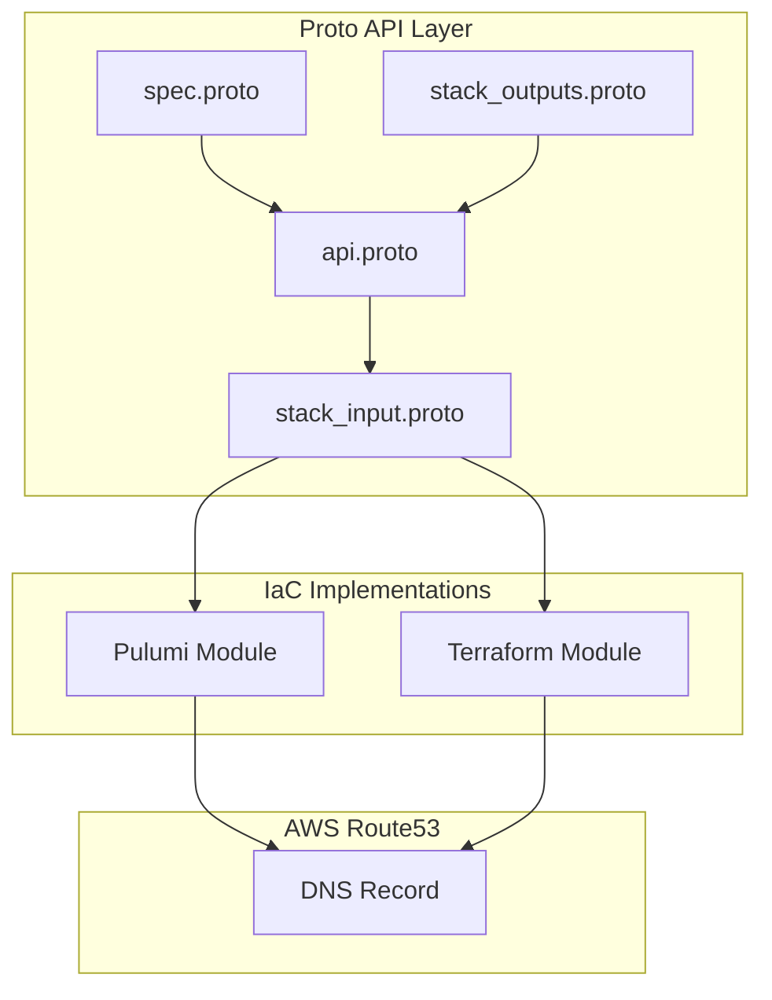
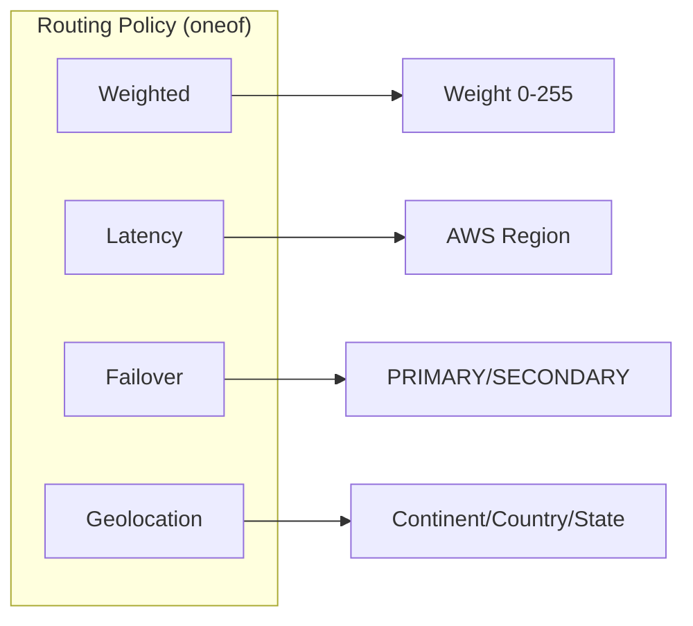

# AWS Route53 DNS Record Deployment Component

**Date**: January 23, 2026
**Type**: Feature
**Components**: API Definitions, Pulumi CLI Integration, Terraform Module, Provider Framework

## Summary

Added a new `AwsRoute53DnsRecord` deployment component for declarative management of individual DNS records in AWS Route53 hosted zones. The component supports standard DNS record types, Route53 alias records (the "killer feature" for AWS resources), and advanced routing policies including weighted, latency-based, failover, and geolocation routing.

## Problem Statement / Motivation

Users needed the ability to manage individual DNS records separately from Route53 hosted zones. While the existing `AwsRoute53Zone` component supports inline record creation, a standalone record component provides:

### Pain Points

- **Granular Control**: Application teams often need to manage their DNS records without access to the zone itself
- **Cross-Account Records**: Records may need to be created in zones owned by different AWS accounts
- **Modular Pipelines**: Combining DNS records with other resources (ALB, CloudFront) in deployment pipelines
- **Team Autonomy**: Platform teams manage zones, application teams manage their records

## Solution / What's New

Created a complete deployment component following the OpenMCF forge process with full Pulumi and Terraform implementations.

### Component Architecture



### Key Features

| Feature | Description |
|---------|-------------|
| **Standard Records** | A, AAAA, CNAME, MX, TXT, NS, SRV, CAA |
| **Alias Records** | CloudFront, ALB/NLB, S3 website, API Gateway targets |
| **Weighted Routing** | Traffic splitting for blue/green, canary deployments |
| **Latency Routing** | Route to lowest-latency endpoint |
| **Failover Routing** | Active-passive with health check integration |
| **Geolocation Routing** | Route by continent, country, or US state |
| **Wildcard Support** | `*.example.com` catch-all records |

## Implementation Details

### Proto Schema Design

The spec.proto uses CEL validations for cross-field constraints:

```protobuf
// Cross-field validation: values and alias_target are mutually exclusive
option (buf.validate.message).cel = {
  id: "spec.values_or_alias_exclusive"
  message: "values and alias_target are mutually exclusive"
  expression: "size(this.values) == 0 || !has(this.alias_target)"
};
```

### Routing Policy Implementation



### Files Created

```
apis/org/openmcf/provider/aws/awsroute53dnsrecord/v1/
├── api.proto, api.pb.go          # KRM wrapper
├── spec.proto, spec.pb.go        # Configuration schema
├── stack_input.proto, .pb.go     # IaC inputs
├── stack_outputs.proto, .pb.go   # Deployment outputs
├── spec_test.go                  # 20+ validation tests
├── README.md                     # User documentation
├── examples.md                   # 15+ working examples
├── docs/README.md                # Research documentation
└── iac/
    ├── hack/manifest.yaml        # Test manifest
    ├── pulumi/
    │   ├── main.go, Pulumi.yaml  # Entrypoint
    │   ├── module/               # Resource logic
    │   └── *.md                  # Documentation
    └── tf/
        ├── variables.tf          # Input variables
        ├── main.tf               # Resource definition
        ├── outputs.tf            # Output values
        └── README.md             # Terraform docs
```

### Registry Entry

Added to `cloud_resource_kind.proto`:

```protobuf
AwsRoute53DnsRecord = 223 [(kind_meta) = {
  provider: aws
  version: v1
  id_prefix: "r53rec"
}];
```

## Benefits

### For Platform Engineers
- **Declarative DNS**: Manage DNS records as code with full validation
- **Dual IaC Support**: Choose Pulumi or Terraform based on team preference
- **Advanced Routing**: Built-in support for sophisticated traffic management

### For Application Teams
- **Self-Service DNS**: Create records without zone-level access
- **Type Safety**: Proto-based validation catches errors before deployment
- **Copy-Paste Examples**: 15+ ready-to-use manifest examples

### For Operations
- **Alias Records**: Free queries to AWS resources, automatic IP updates
- **Health Integration**: Built-in failover with Route53 health checks
- **Cost Efficiency**: Alias records have no query charges

## Impact

### Users Affected
- Platform engineers managing AWS DNS infrastructure
- Application teams requiring DNS record management
- DevOps teams implementing blue/green or canary deployments

### Integration Points
- Works with `AwsRoute53Zone` for zone creation
- Complements `AwsAlb`, `AwsCloudFront` for alias targets
- Supports `AwsCertManagerCert` workflows

## Related Work

- **AwsRoute53Zone** (`cloud_resource_kind.proto:212`): Parent zone management
- **CloudflareDnsRecord** (`cloud_resource_kind.proto:1807`): Similar pattern for Cloudflare
- Follows the same forge process established for all deployment components

## Usage Examples

### Basic A Record

```yaml
apiVersion: aws.openmcf.org/v1
kind: AwsRoute53DnsRecord
metadata:
  name: www-example
spec:
  hosted_zone_id: Z1234567890ABC
  name: www.example.com
  type: A
  ttl: 300
  values:
    - 192.0.2.1
```

### Alias to CloudFront

```yaml
apiVersion: aws.openmcf.org/v1
kind: AwsRoute53DnsRecord
metadata:
  name: apex-cloudfront
spec:
  hosted_zone_id: Z1234567890ABC
  name: example.com
  type: A
  alias_target:
    dns_name: d1234abcd.cloudfront.net
    hosted_zone_id: Z2FDTNDATAQYW2
```

### Deploy Commands

```bash
# Pulumi
openmcf pulumi up --manifest dns-record.yaml

# Terraform/OpenTofu
openmcf tofu apply --manifest dns-record.yaml
```

---

**Status**: ✅ Production Ready
**Validation**: Build passed, all tests passed, Terraform validated
