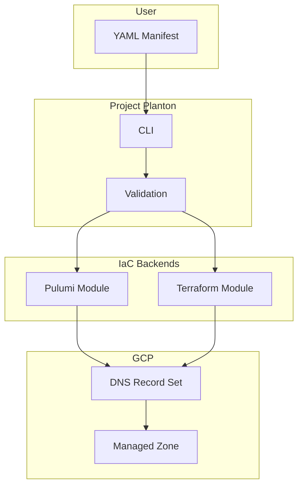
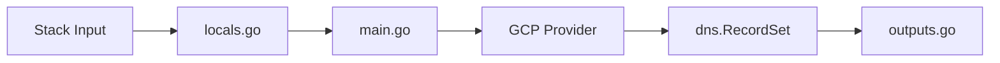

# Forge GcpDnsRecord Deployment Component

**Date**: January 23, 2026
**Type**: Feature
**Components**: API Definitions, Pulumi CLI Integration, Provider Framework, Terraform Module

## Summary

Forged a complete `GcpDnsRecord` deployment component for managing individual DNS records in Google Cloud DNS Managed Zones. The component includes all 4 proto files with validations, both Pulumi and Terraform IaC modules, comprehensive documentation, and 14 passing validation tests.

## Problem Statement / Motivation

While `GcpDnsZone` supports inline DNS records, there was no way to manage individual DNS records as independent resources. This limitation made it difficult to:

### Pain Points

- Manage DNS records independently from zones (different teams, different lifecycles)
- Apply fine-grained access control per record
- Create records in zones managed by external systems
- Support dynamic DNS record creation without modifying zone definitions

## Solution / What's New

Created a standalone `GcpDnsRecord` component that creates DNS records within existing Managed Zones, following the established deployment component pattern.

### Component Architecture



### Supported DNS Record Types

| Type | Description | Example Value |
|------|-------------|---------------|
| A | IPv4 address | 192.0.2.1 |
| AAAA | IPv6 address | 2001:db8::1 |
| CNAME | Alias/canonical name | target.example.com. |
| MX | Mail exchange | 10 mail.example.com. |
| TXT | Text record | v=spf1 include:... |
| SRV | Service location | 10 5 5269 xmpp... |
| NS | Nameserver | ns1.example.com. |
| PTR | Reverse DNS | host.example.com. |
| CAA | Certificate Authority | 0 issue "letsencrypt.org" |
| SOA | Start of Authority | ns.example.com... |

## Implementation Details

### Proto API Definitions

**spec.proto** - Configuration schema with validations:
- `project_id` - GCP project (StringValueOrRef with GcpProject default)
- `managed_zone` - Existing zone name (validated format)
- `record_type` - DNS record type (validated enum)
- `name` - FQDN with trailing dot (CEL validation)
- `values` - Record data (min 1 item required)
- `ttl_seconds` - TTL 1-86400 seconds (default: 300)

**Validation Rules**:
```protobuf
string name = 4 [
  (buf.validate.field).required = true,
  (buf.validate.field).cel = {
    id: "name.valid_fqdn"
    message: "name must end with a trailing dot (e.g., www.example.com.)"
    expression: "this.endsWith('.') && this.matches('^(?:[*][.])?(?:[_a-z0-9](?:[_a-z0-9-]{0,61}[a-z0-9])?[.])+$')"
  }
];
```

### Registry Entry

Added to `cloud_resource_kind.proto`:
```protobuf
GcpDnsRecord = 618 [(kind_meta) = {
  provider: gcp
  version: v1
  id_prefix: "gcpdrec"
}];
```

### Pulumi Module



**Files created**:
- `module/main.go` - Resource creation with `dns.NewRecordSet`
- `module/locals.go` - Input transformation and defaults
- `module/outputs.go` - Output constants mapping to stack_outputs.proto

### Terraform Module

**Files created**:
- `variables.tf` - Mirrors spec.proto fields exactly
- `provider.tf` - Google provider v6.19.0
- `locals.tf` - Input transformations
- `main.tf` - `google_dns_record_set` resource
- `outputs.tf` - All 5 outputs matching stack_outputs.proto

### Test Coverage

14 validation tests in `spec_test.go`:
- 5 valid configuration tests (A, CNAME, round-robin, TTL, wildcard)
- 5 missing required field tests
- 4 invalid format tests (zone name, FQDN without dot, TTL range)

## Files Created

```
apis/org/project_planton/provider/gcp/gcpdnsrecord/v1/
├── api.proto                    # KRM-style resource definition
├── spec.proto                   # Configuration schema with validations
├── spec_test.go                 # 14 validation tests
├── stack_input.proto            # IaC module input
├── stack_outputs.proto          # Deployment outputs
├── README.md                    # User-facing documentation
├── examples.md                  # 12 copy-paste examples
├── docs/
│   └── README.md                # Technical research document
└── iac/
    ├── hack/
    │   └── manifest.yaml        # Test manifest
    ├── pulumi/
    │   ├── main.go              # Entrypoint
    │   ├── Pulumi.yaml          # Project config
    │   ├── Makefile             # Build automation
    │   ├── debug.sh             # Local debugging
    │   ├── README.md            # Usage guide
    │   ├── overview.md          # Architecture
    │   └── module/
    │       ├── main.go          # Resource creation
    │       ├── locals.go        # Input transformation
    │       └── outputs.go       # Output constants
    └── tf/
        ├── variables.tf         # Terraform variables
        ├── provider.tf          # Provider config
        ├── locals.tf            # Local values
        ├── main.tf              # Resource definitions
        ├── outputs.tf           # Terraform outputs
        └── README.md            # Terraform guide
```

## Benefits

### For Users
- **Independent Record Management**: Manage DNS records without modifying zone definitions
- **Team Autonomy**: Different teams can manage different records
- **Declarative DNS**: Define records as code with full validation
- **Flexible TTL**: Configure caching from 1 second to 24 hours

### For Platform Engineers
- **Dual IaC Support**: Both Pulumi and Terraform with feature parity
- **Type Safety**: Strong validation prevents invalid configurations
- **Familiar Patterns**: Follows established Project Planton conventions

## Impact

### Component Registry
- New enum value: `GcpDnsRecord = 618`
- ID prefix: `gcpdrec`

### CLI Integration
- Works with existing `project-planton pulumi up/down` commands
- Works with existing `project-planton terraform apply/destroy` commands

### Example Usage

```yaml
apiVersion: gcp.project-planton.org/v1
kind: GcpDnsRecord
metadata:
  name: www-example-com
spec:
  projectId: my-gcp-project
  managedZone: example-zone
  recordType: A
  name: www.example.com.
  values:
    - 192.0.2.1
  ttlSeconds: 300
```

```bash
# Deploy with Pulumi
project-planton pulumi up --manifest dns-record.yaml

# Deploy with Terraform
project-planton terraform apply --manifest dns-record.yaml
```

## Related Work

- **GcpDnsZone**: Parent component for managing DNS zones (supports inline records)
- **CloudflareDnsRecord**: Similar component for Cloudflare provider
- **AwsRoute53DnsRecord**: Similar component for AWS Route 53

---

**Status**: ✅ Production Ready
**Tests**: 14/14 passing
**Build**: ✅ Verified
