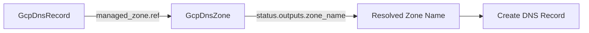

# GcpDnsRecord managed_zone Value-From Support

**Date**: January 23, 2026
**Type**: Enhancement
**Components**: API Definitions, Pulumi CLI Integration, Terraform Module

## Summary

Enhanced the `GcpDnsRecord` component's `managed_zone` field to support the `StringValueOrRef` pattern, enabling declarative references to `GcpDnsZone` resources. This allows users to compose DNS records that automatically reference zone outputs, eliminating hardcoded zone names and enabling dependency tracking between resources.

## Problem Statement / Motivation

The original `GcpDnsRecord` component required users to hardcode the managed zone name as a plain string. This created several issues:

### Pain Points

- **Hardcoded values**: Users had to manually copy zone names between resources
- **No dependency tracking**: Changes to zone names required manual updates across all DNS records
- **Inconsistent with project_id**: The `project_id` field already supported value-from references, but `managed_zone` did not
- **Prone to drift**: Zone renames or recreations could leave records pointing to non-existent zones

## Solution / What's New

Changed the `managed_zone` field from a plain `string` to `StringValueOrRef` with sensible defaults for `GcpDnsZone` references.

### Before

```yaml
apiVersion: gcp.openmcf.org/v1
kind: GcpDnsRecord
spec:
  project_id:
    value: my-project
  managed_zone: example-zone  # Hardcoded string
  name: www.example.com.
  record_type: A
  values:
    - 192.0.2.1
```

### After

```yaml
apiVersion: gcp.openmcf.org/v1
kind: GcpDnsRecord
spec:
  project_id:
    ref: my-gcp-project  # Reference to GcpProject
  managed_zone:
    ref: my-dns-zone     # Reference to GcpDnsZone
  name: www.example.com.
  record_type: A
  values:
    - 192.0.2.1
```

Or with direct values (backward compatible pattern):

```yaml
spec:
  managed_zone:
    value: example-zone  # Still works with direct values
```

## Implementation Details

### Proto Schema Change

```protobuf
// Before
string managed_zone = 2 [
  (buf.validate.field).required = true,
  (buf.validate.field).cel = {
    id: "managed_zone.valid_name"
    message: "managed_zone must be a valid Cloud DNS zone name"
    expression: "this.matches('^[a-z][a-z0-9-]{0,62}$')"
  }
];

// After
org.openmcf.shared.foreignkey.v1.StringValueOrRef managed_zone = 2 [
  (buf.validate.field).required = true,
  (org.openmcf.shared.foreignkey.v1.default_kind) = GcpDnsZone,
  (org.openmcf.shared.foreignkey.v1.default_kind_field_path) = "status.outputs.zone_name"
];
```

### Files Modified

| File | Change |
|------|--------|
| `spec.proto` | Changed field type to `StringValueOrRef` with defaults |
| `iac/pulumi/module/locals.go` | Updated to use `.GetValue()` accessor |
| `iac/tf/variables.tf` | Changed to `object({ value = string })` type |
| `iac/tf/locals.tf` | Updated to use `.value` accessor |
| `spec_test.go` | Updated all test cases to use `StringValueOrRef` |

### Reference Resolution Flow



## Benefits

- **Declarative composition**: DNS records can reference zones by resource name
- **Automatic dependency tracking**: Changes propagate through the reference chain
- **Consistency**: Both `project_id` and `managed_zone` now use the same pattern
- **Type safety**: References validated at plan time, not apply time
- **Backward compatible**: Direct values still work via `{ value: "zone-name" }`

## Impact

- **API**: `managed_zone` field type changed from `string` to `StringValueOrRef`
- **Users**: Existing manifests need minor update to wrap zone names in `value:`
- **IaC modules**: Both Pulumi and Terraform updated to extract value from wrapper

## Related Work

- Prior `GcpDnsRecord` forging (created the component)
- `StringValueOrRef` pattern established in other components
- `GcpDnsZone` stack outputs provide the referenced field

---

**Status**: ✅ Production Ready
