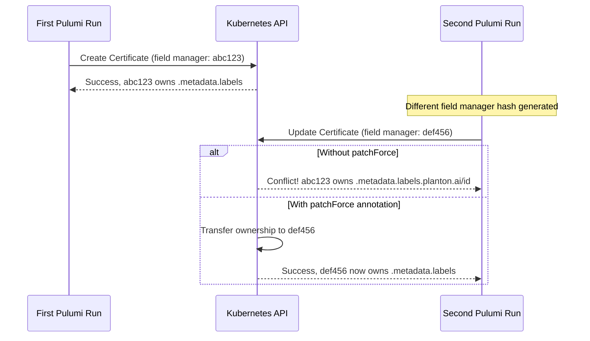
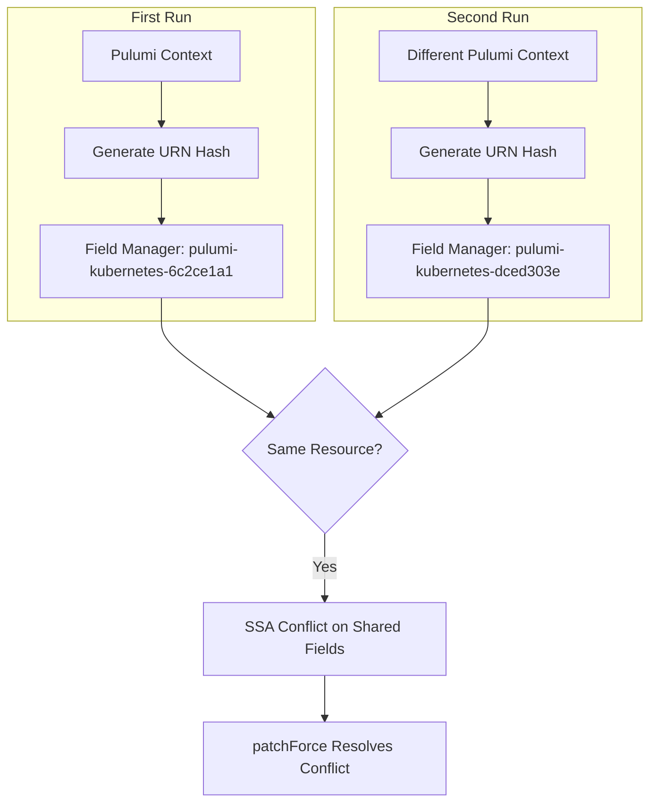

# KubernetesOpenFga Server-Side Apply Field Conflict Fix

**Date**: January 23, 2026
**Type**: Bug Fix
**Components**: Kubernetes Provider, Pulumi CLI Integration, IAC Stack Runner

## Summary

Fixed a Server-Side Apply (SSA) field conflict that caused the KubernetesOpenFga Pulumi module to fail on subsequent executions. The issue occurred because different Pulumi field managers were generated between runs, causing ownership conflicts on resource metadata labels. Added `pulumi.com/patchForce` annotation to all ingress resources to force field ownership transfer.

## Problem Statement / Motivation

When running the KubernetesOpenFga Pulumi module, the first execution succeeded, but subsequent executions failed with a Server-Side Apply field conflict error on the Certificate resource.

### Pain Points

- Second Pulumi execution fails with exit code 255
- Error message: `conflict with "pulumi-kubernetes-6c2ce1a1": .metadata.labels.planton.ai/id`
- Resources in shared namespaces (like `istio-ingress`) are particularly affected
- No workaround without manual intervention or state manipulation
- Blocks iterative development and CI/CD pipelines

### Error Details

```
Server-Side Apply field conflict detected
The resource managed by field manager "pulumi-kubernetes-dced303e" had an apply conflict: 
Apply failed with 1 conflict: conflict with "pulumi-kubernetes-6c2ce1a1": .metadata.labels.planton.ai/id
```

## Solution / What's New

Added the `pulumi.com/patchForce: "true"` annotation to all Kubernetes resources created by the ingress function. This annotation instructs the Kubernetes API server to force-apply changes and transfer field ownership to the current Pulumi field manager.

### SSA Conflict Resolution Flow



### Why Field Managers Change



## Implementation Details

Modified `apis/org/project_planton/provider/kubernetes/kubernetesopenfga/v1/iac/pulumi/module/ingress.go` to add the `pulumi.com/patchForce` annotation to all four Kubernetes resources:

### 1. Certificate Resource (istio-ingress namespace)

```go
Metadata: metav1.ObjectMetaArgs{
    Name:      pulumi.String(locals.IngressCertificateName),
    Namespace: pulumi.String(vars.IstioIngressNamespace),
    Labels:    pulumi.ToStringMap(locals.Labels),
    Annotations: pulumi.StringMap{
        "pulumi.com/patchForce": pulumi.String("true"),
    },
},
```

### 2. Gateway Resource (istio-ingress namespace)

```go
Metadata: metav1.ObjectMetaArgs{
    Name:      pulumi.String(locals.IngressGatewayName),
    Namespace: pulumi.String(vars.IstioIngressNamespace),
    Labels:    pulumi.ToStringMap(locals.Labels),
    Annotations: pulumi.StringMap{
        "pulumi.com/patchForce": pulumi.String("true"),
    },
},
```

### 3. HTTP Redirect Route (component namespace)

```go
Metadata: metav1.ObjectMetaArgs{
    Name:      pulumi.String(locals.IngressHttpRedirectRouteName),
    Namespace: pulumi.String(locals.Namespace),
    Labels:    pulumi.ToStringMap(locals.Labels),
    Annotations: pulumi.StringMap{
        "pulumi.com/patchForce": pulumi.String("true"),
    },
},
```

### 4. HTTPS Route (component namespace)

```go
Metadata: metav1.ObjectMetaArgs{
    Name:      pulumi.String(locals.IngressHttpsRouteName),
    Namespace: pulumi.String(locals.Namespace),
    Labels:    pulumi.ToStringMap(locals.Labels),
    Annotations: pulumi.StringMap{
        "pulumi.com/patchForce": pulumi.String("true"),
    },
},
```

### Resource Impact Summary

| Resource | Namespace | Annotation Added |
|----------|-----------|------------------|
| Certificate | istio-ingress (shared) | `pulumi.com/patchForce: "true"` |
| Gateway | istio-ingress (shared) | `pulumi.com/patchForce: "true"` |
| HTTPRoute (redirect) | component namespace | `pulumi.com/patchForce: "true"` |
| HTTPRoute (https) | component namespace | `pulumi.com/patchForce: "true"` |

## Benefits

- **Idempotent Deployments**: Pulumi module can now be executed multiple times without SSA conflicts
- **CI/CD Compatibility**: Pipelines can run repeatedly without manual intervention
- **Consistent Behavior**: All ingress resources behave uniformly with forced field ownership
- **No State Manipulation**: Fix doesn't require manual Pulumi state or Kubernetes resource cleanup

## Impact

### Users Affected

- All users deploying KubernetesOpenFga with ingress enabled
- CI/CD pipelines running repeated deployments
- Development workflows with iterative `pulumi up` executions

### Behavioral Change

Before: Second and subsequent Pulumi runs fail with SSA conflict error
After: All Pulumi runs succeed, with field ownership automatically transferred

### Shared Namespace Considerations

Resources in the `istio-ingress` namespace are particularly susceptible to this issue because:
1. Multiple deployment components may create resources in this shared namespace
2. Each component's Pulumi runs generate different field manager hashes
3. Without `patchForce`, resources created by one run cannot be updated by another

## Related Work

This pattern should be applied to other deployment components that create resources in shared namespaces:
- KubernetesSolr ingress resources
- KubernetesTektonOperator ingress resources
- Any other component using the istio-ingress namespace

### Reference Documentation

- [Pulumi: Managing Resources with Server-Side Apply](https://www.pulumi.com/registry/packages/kubernetes/how-to-guides/managing-resources-with-server-side-apply/)
- [Kubernetes: Server-Side Apply](https://kubernetes.io/docs/reference/using-api/server-side-apply)

---

**Status**: ✅ Production Ready
**Files Changed**: 1 (`ingress.go`)
