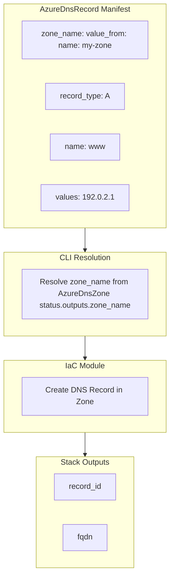

# Azure DNS Record Component with Zone Reference Support

**Date**: January 23, 2026

## Summary

Added the **AzureDnsRecord** deployment component to Project Planton, enabling declarative management of individual DNS records in Azure DNS Zones. The component uses `StringValueOrRef` for the `zone_name` field, allowing records to reference `AzureDnsZone` resources via `value_from` for seamless infrastructure wiring.

## Problem Statement

Users needed a way to create individual DNS records in Azure DNS Zones as standalone, declarative resources. While `AzureDnsZone` supports embedded records, many scenarios require:

- Independent lifecycle management for each DNS record
- Cross-stack references where records depend on zones created elsewhere
- Fine-grained access control at the record level

### Pain Points

- No standalone Azure DNS record component existed
- Users had to embed all records in the zone spec or use raw Terraform/Pulumi
- No `value_from` support for wiring zone references between resources

## Solution

Created a complete `AzureDnsRecord` deployment component following the Project Planton forge pattern with:

- `zone_name` as `StringValueOrRef` with default kind `AzureDnsZone`
- Support for all major DNS record types (A, AAAA, CNAME, MX, TXT, NS, SRV, CAA, PTR)
- Both Pulumi and Terraform implementations with feature parity

### Architecture



## Implementation Details

### Proto API

**spec.proto** - Key field with zone reference:

```protobuf
org.project_planton.shared.foreignkey.v1.StringValueOrRef zone_name = 2 [
  (buf.validate.field).required = true,
  (org.project_planton.shared.foreignkey.v1.default_kind) = AzureDnsZone,
  (org.project_planton.shared.foreignkey.v1.default_kind_field_path) = "status.outputs.zone_name"
];
```

### Registry Entry

```protobuf
AzureDnsRecord = 409 [(kind_meta) = {
  provider: azure
  version: v1
  id_prefix: "azdrec"
}];
```

### Files Created

| Category | Files |
|----------|-------|
| Proto definitions | `api.proto`, `spec.proto`, `stack_input.proto`, `stack_outputs.proto` |
| Generated stubs | `*.pb.go` files |
| Pulumi module | `main.go`, `locals.go`, `outputs.go` + entrypoint |
| Terraform module | `variables.tf`, `main.tf`, `locals.tf`, `outputs.tf`, `provider.tf` |
| Documentation | `README.md`, `examples.md`, `docs/README.md` |
| Tests | `spec_test.go` (15 validation tests) |
| Supporting | `iac/hack/manifest.yaml`, READMEs for IaC modules |

## Benefits

- **Zone References**: Use `value_from` to wire records to `AzureDnsZone` resources
- **All Record Types**: A, AAAA, CNAME, MX, TXT, NS, SRV, CAA, PTR supported
- **Validation**: Comprehensive buf.validate rules with 15 passing tests
- **Dual IaC**: Both Pulumi and Terraform implementations
- **Documentation**: Full user-facing docs, examples, and technical research

## Example Usage

```yaml
apiVersion: azure.project-planton.org/v1
kind: AzureDnsRecord
metadata:
  name: api-record
spec:
  resource_group: my-dns-rg
  zone_name:
    value_from:
      name: production-zone  # References AzureDnsZone
  record_type: A
  name: api
  values:
    - "192.0.2.50"
```

## Impact

- **New Component**: `AzureDnsRecord` added to Azure provider (enum 409)
- **Pattern Consistency**: Follows same `StringValueOrRef` pattern as `AwsRoute53DnsRecord` and `GcpDnsRecord`
- **Multi-Cloud Parity**: Azure now has standalone DNS record component like AWS and GCP

## Related Work

- `AzureDnsZone` - Parent zone component that outputs `zone_name`
- `AwsRoute53DnsRecord` - AWS equivalent with `zone_id` reference
- `GcpDnsRecord` - GCP equivalent with `managed_zone` reference

---

**Status**: ✅ Production Ready
**Tests**: 15/15 passing
