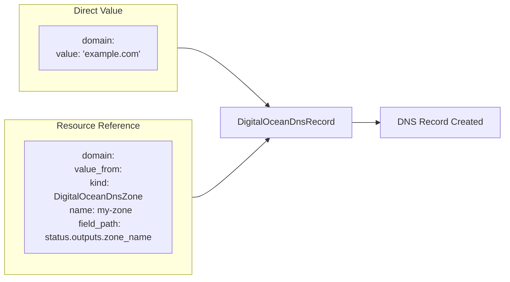
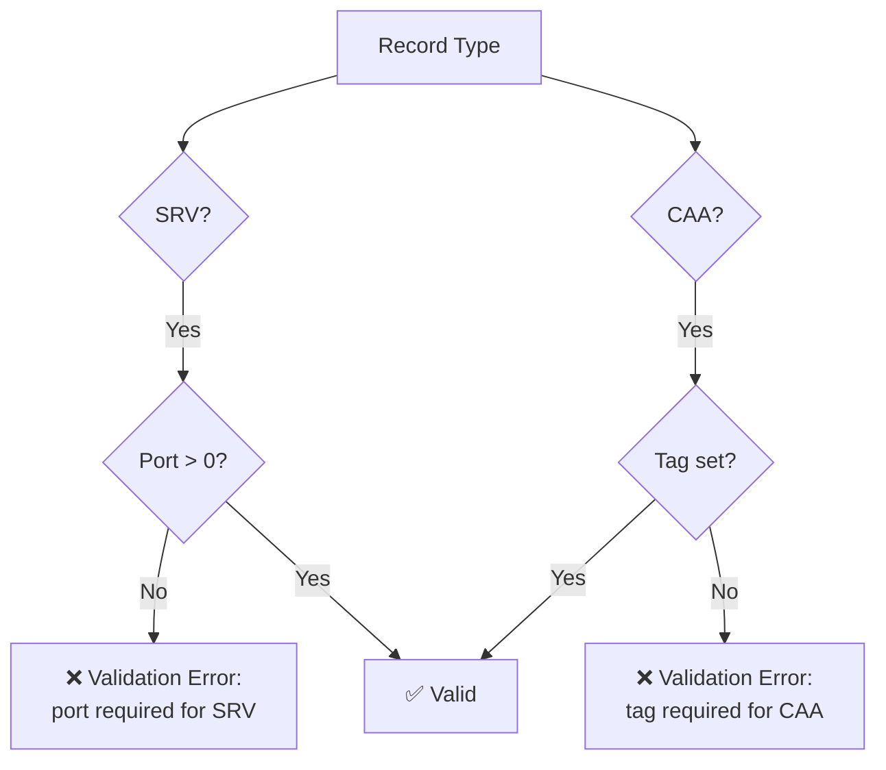

# DigitalOcean DNS Record Component with StringValueOrRef Support

**Date**: January 23, 2026
**Type**: Feature
**Components**: API Definitions, Provider Framework, Pulumi CLI Integration, Terraform Integration

## Summary

Forged a complete `DigitalOceanDnsRecord` deployment component enabling declarative DNS record management in DigitalOcean. The component uses `StringValueOrRef` for both `domain` and `value` fields, enabling inter-resource composition by referencing outputs from other deployed resources like `DigitalOceanDnsZone`.

## Problem Statement / Motivation

Managing DNS records in DigitalOcean required either manual configuration through the console or writing custom Infrastructure-as-Code from scratch. There was no unified, declarative way to manage DNS records that:

- Integrates with the Project Planton ecosystem
- Provides strong validation and type safety
- Enables referencing outputs from other deployed resources
- Supports both Pulumi and Terraform as IaC backends

### Pain Points

- No consistent API for DigitalOcean DNS record management
- Hard-coded domain names require manual updates when zones change
- No validation for record type-specific requirements (SRV needs port, CAA needs tag)
- Duplicate IaC code across projects

## Solution / What's New

### Complete Deployment Component

A fully-featured `DigitalOceanDnsRecord` component with:

- **Proto API Definitions**: `spec.proto`, `api.proto`, `stack_input.proto`, `stack_outputs.proto`
- **Validation Rules**: Field-level and cross-field validation using `buf.validate` and CEL
- **Dual IaC Support**: Complete Pulumi (Go) and Terraform (HCL) implementations
- **Comprehensive Documentation**: README, examples, and technical research docs

### StringValueOrRef for Resource Composition



Both `domain` and `value` fields now accept either:
1. **Direct value**: A literal string
2. **Resource reference**: Output from another deployed resource

## Implementation Details

### API Schema (`spec.proto`)

```protobuf
message DigitalOceanDnsRecordSpec {
  // Domain supports direct value or reference to DigitalOceanDnsZone
  org.project_planton.shared.foreignkey.v1.StringValueOrRef domain = 1 [
    (buf.validate.field).required = true,
    (org.project_planton.shared.foreignkey.v1.default_kind) = DigitalOceanDnsZone,
    (org.project_planton.shared.foreignkey.v1.default_kind_field_path) = "status.outputs.zone_name"
  ];
  
  string name = 2;
  DnsRecordType type = 3;
  
  // Value also supports StringValueOrRef for dynamic composition
  org.project_planton.shared.foreignkey.v1.StringValueOrRef value = 4;
  
  optional int32 ttl_seconds = 5;  // Default: 1800
  int32 priority = 6;              // For MX/SRV
  int32 weight = 7;                // For SRV
  int32 port = 8;                  // For SRV
  int32 flags = 9;                 // For CAA
  string tag = 10;                 // For CAA
}
```

### Cross-Field Validations



### File Structure

```
apis/org/project_planton/provider/digitalocean/digitaloceandnsrecord/v1/
├── api.proto              # KRM envelope definition
├── spec.proto             # Configuration schema with validations
├── spec_test.go           # Validation unit tests
├── stack_input.proto      # IaC module input structure
├── stack_outputs.proto    # Deployment outputs
├── README.md              # User documentation
├── examples.md            # YAML examples for all record types
├── docs/
│   └── README.md          # Technical research documentation
└── iac/
    ├── hack/
    │   └── manifest.yaml  # Test manifest
    ├── pulumi/
    │   ├── main.go        # Pulumi entrypoint
    │   ├── Pulumi.yaml
    │   ├── Makefile
    │   └── module/
    │       ├── main.go
    │       ├── dns_record.go
    │       ├── locals.go
    │       └── outputs.go
    └── tf/
        ├── provider.tf
        ├── variables.tf
        ├── locals.tf
        ├── main.tf
        ├── outputs.tf
        └── README.md
```

## Usage Examples

### Direct Value

```yaml
apiVersion: digitalocean.project-planton.org/v1
kind: DigitalOceanDnsRecord
metadata:
  name: www-a-record
spec:
  domain:
    value: "example.com"
  name: "www"
  type: A
  value:
    value: "192.0.2.1"
  ttl_seconds: 3600
```

### Reference to DNS Zone

```yaml
apiVersion: digitalocean.project-planton.org/v1
kind: DigitalOceanDnsRecord
metadata:
  name: www-a-record
spec:
  domain:
    value_from:
      kind: DigitalOceanDnsZone
      name: my-dns-zone
      field_path: "status.outputs.zone_name"
  name: "www"
  type: A
  value:
    value: "192.0.2.1"
```

## Benefits

### Developer Experience
- **Type Safety**: Strong validation prevents misconfiguration
- **Resource Composition**: Reference outputs from other resources
- **Dual IaC Support**: Use Pulumi or Terraform based on preference

### Operations
- **Consistent API**: Same manifest format regardless of IaC backend
- **Built-in Validation**: Catch errors before deployment
- **Comprehensive Examples**: Ready-to-use configurations for all DNS record types

### Maintainability
- **Single Source of Truth**: Proto definitions generate all types
- **Cross-Field Validation**: CEL expressions enforce business rules
- **Complete Documentation**: Technical docs, examples, and README

## Impact

| Area | Impact |
|------|--------|
| API | New `DigitalOceanDnsRecord` resource type with `StringValueOrRef` fields |
| Pulumi | New module at `digitaloceandnsrecord/v1/iac/pulumi/` |
| Terraform | New module at `digitaloceandnsrecord/v1/iac/tf/` |
| Registry | Added `DigitalOceanDnsRecord = 1214` to `CloudResourceKind` enum |

## Related Work

- GcpDnsRecord component (pattern reference for `StringValueOrRef` usage)
- DigitalOceanDnsZone component (potential reference target)
- AWS Route53 DNS Record component (parallel implementation)

---

**Status**: ✅ Production Ready
**Files Changed**: 20+ new files, 5 modified files
