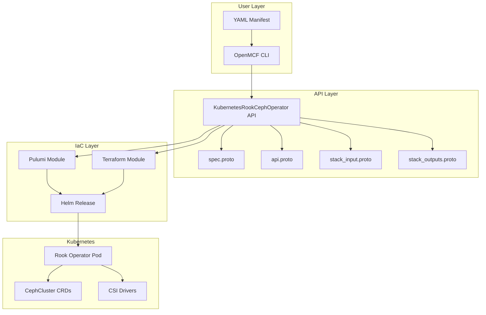

# KubernetesRookCephOperator Deployment Component

**Date**: January 23, 2026
**Type**: Feature
**Components**: API Definitions, Kubernetes Provider, Pulumi CLI Integration, Provider Framework

## Summary

Added a new deployment component `KubernetesRookCephOperator` for deploying the Rook Ceph Operator on Kubernetes clusters. This component enables declarative management of Ceph distributed storage through OpenMCF, providing block, file, and object storage capabilities via Kubernetes custom resources.

## Problem Statement / Motivation

Organizations running Kubernetes need reliable, scalable storage solutions. Ceph is one of the most battle-tested distributed storage systems, but deploying and managing it on Kubernetes requires significant expertise. The Rook project solves this by providing a Kubernetes operator that automates Ceph lifecycle management.

### Pain Points

- No existing OpenMCF component for Rook Ceph storage infrastructure
- Manual Rook deployment requires understanding of complex Helm values
- CSI driver configuration is error-prone without proper abstractions
- Lack of standardized, validated API for storage operator deployment

## Solution / What's New

Created a complete deployment component following the OpenMCF forge process, implementing all 21 steps of the ideal state checklist.

### Component Architecture



### Key Features

1. **Complete Proto API**
   - `KubernetesRookCephOperatorSpec` with CSI configuration options
   - Required/optional field validations
   - Default values for common settings (operator version, CSI options)

2. **CSI Driver Configuration**
   - RBD (block storage) driver toggle
   - CephFS (file storage) driver toggle
   - NFS driver support
   - CSI Addons for advanced features
   - Host network configuration

3. **Dual IaC Implementation**
   - Pulumi module using Go and Helm provider
   - Terraform module with HCL

4. **Comprehensive Documentation**
   - User-facing README with API reference
   - 7 practical deployment examples
   - Research documentation on storage landscape

## Implementation Details

### Proto Schema Design

The spec follows the 80/20 principle, exposing essential configuration while providing sensible defaults:

```protobuf
message KubernetesRookCephOperatorSpec {
  // Target cluster and namespace (standard fields)
  KubernetesClusterSelector target_cluster = 1;
  StringValueOrRef namespace = 2;
  bool create_namespace = 3;
  
  // Operator configuration
  optional string operator_version = 4 [(default) = "v1.16.6"];
  optional bool crds_enabled = 5 [(default) = "true"];
  
  // Container resources
  KubernetesRookCephOperatorSpecContainer container = 6;
  
  // CSI driver configuration
  KubernetesRookCephOperatorCsiSpec csi = 7;
}
```

### Pulumi Module Structure

```
iac/pulumi/
├── main.go           # Entry point
├── module/
│   ├── main.go       # Namespace + Helm release creation
│   ├── locals.go     # Computed values, Helm values mapping
│   ├── outputs.go    # Output constants
│   └── vars.go       # Chart name/repo configuration
├── Pulumi.yaml
├── Makefile
└── README.md
```

### Helm Values Mapping

The module translates proto spec to Helm values:

| Spec Field | Helm Value |
|------------|------------|
| `crds_enabled` | `crds.enabled` |
| `container.resources` | `resources` |
| `csi.enable_rbd_driver` | `csi.enableRbdDriver` |
| `csi.enable_cephfs_driver` | `csi.enableCephfsDriver` |
| `csi.provisioner_replicas` | `csi.provisionerReplicas` |

### CloudResourceKind Registration

Added entry #847 in the Kubernetes range (800-999):

```protobuf
KubernetesRookCephOperator = 847 [(kind_meta) = {
  provider: kubernetes
  version: v1
  id_prefix: "k8srookop"
}];
```

## Benefits

### For Platform Engineers
- **Declarative Storage**: Define Rook operator configuration in YAML
- **Validated API**: Proto validations catch configuration errors early
- **Dual IaC**: Choose Pulumi or Terraform based on team preference

### For DevOps Teams
- **Quick Deployment**: 5-minute operator setup instead of hours
- **Consistent Configuration**: Same API across environments
- **CSI Flexibility**: Easy toggle between storage drivers

### For Organizations
- **Enterprise Storage**: Ceph's proven reliability on Kubernetes
- **Cost Savings**: Use commodity hardware for distributed storage
- **Vendor Independence**: Open source stack with no lock-in

## Impact

### Files Created

| Category | Count | Description |
|----------|-------|-------------|
| Proto files | 4 | API definitions (.proto) |
| Generated stubs | 4 | Go code (.pb.go) |
| Pulumi module | 5 | Go implementation |
| Terraform module | 6 | HCL implementation |
| Documentation | 4 | README, examples, research |
| Supporting | 2 | Makefile, manifest |

### Registry Update

Modified `cloud_resource_kind.proto` to include the new component at enum value 847.

## Usage Examples

### Basic Deployment

```yaml
apiVersion: kubernetes.openmcf.org/v1
kind: KubernetesRookCephOperator
metadata:
  name: rook-ceph-operator
spec:
  namespace:
    value: "rook-ceph"
  create_namespace: true
  container: {}
```

### Production with CSI Configuration

```yaml
apiVersion: kubernetes.openmcf.org/v1
kind: KubernetesRookCephOperator
metadata:
  name: rook-ceph-prod
spec:
  namespace:
    value: "rook-ceph"
  create_namespace: true
  operator_version: "v1.16.6"
  container:
    resources:
      requests:
        cpu: 250m
        memory: 256Mi
      limits:
        cpu: 1000m
        memory: 1Gi
  csi:
    enable_rbd_driver: true
    enable_cephfs_driver: true
    provisioner_replicas: 3
    enable_csi_addons: true
```

## Validation Results

All validation checks passed:

- ✅ `make build` - Full project builds successfully
- ✅ `go test ./...` - 11 component tests pass
- ✅ `terraform validate` - Terraform module validates
- ✅ `go build` - Pulumi module compiles

## Related Work

- Similar pattern to existing operators: `KubernetesSolrOperator`, `KubernetesElasticOperator`
- Follows forge flow rules in `_rules/deployment-component/forge/flow/`
- Reuses shared Kubernetes provider patterns from `pkg/iac/pulumi/pulumimodule/provider/kubernetes/`

---

**Status**: ✅ Production Ready
**Timeline**: Single session implementation following forge process
