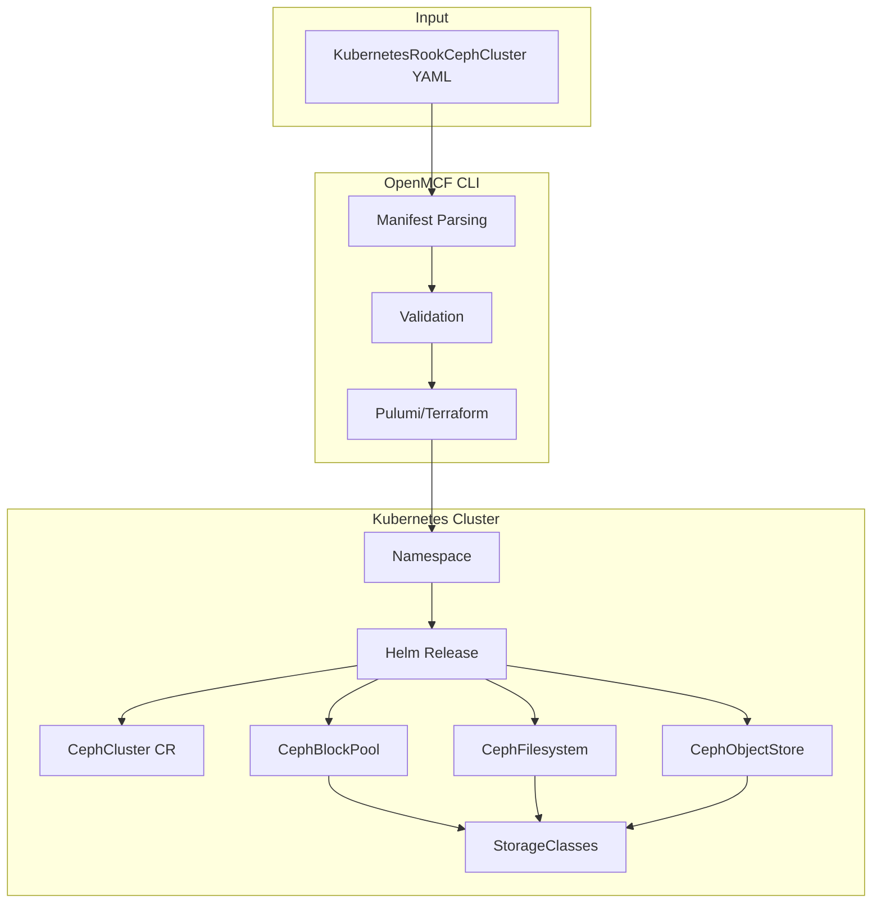
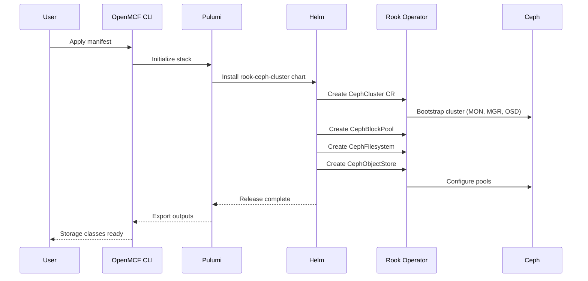

# Add KubernetesRookCephCluster Deployment Component

**Date**: January 23, 2026
**Type**: Feature
**Components**: Kubernetes Provider, API Definitions, Pulumi CLI Integration, Provider Framework

## Summary

Added a new `KubernetesRookCephCluster` deployment component that enables declarative deployment of Ceph storage clusters on Kubernetes using the Rook operator. This component provides block, file, and object storage capabilities through a unified API, with support for automatic StorageClass creation and comprehensive configuration options.

## Problem Statement / Motivation

Kubernetes workloads often require persistent storage, but deploying a full-featured storage solution like Ceph is complex and error-prone. The existing `KubernetesRookCephOperator` component deploys the Rook operator, but users still need a way to deploy actual Ceph clusters with configured storage pools.

### Pain Points

- No declarative way to deploy Ceph clusters on Kubernetes via OpenMCF
- Manual Helm chart configuration is verbose and error-prone
- No unified interface for configuring block, file, and object storage
- Missing validation for common misconfigurations
- Lack of standardized outputs for downstream automation

## Solution / What's New

A complete deployment component following the OpenMCF KRM (Kubernetes Resource Model) pattern:



### Key Features

1. **Block Storage (RBD)**: Configure replicated block pools with automatic StorageClass creation
2. **File Storage (CephFS)**: Deploy shared filesystems with configurable MDS instances
3. **Object Storage (RGW)**: S3-compatible object storage with erasure coding support
4. **Dashboard & Toolbox**: Optional web UI and debugging tools
5. **Monitoring Integration**: Prometheus ServiceMonitor support

## Implementation Details

### Proto API Structure

```
kubernetesrookcephcluster/v1/
├── api.proto           # KRM envelope
├── spec.proto          # Configuration schema (13 message types)
├── stack_input.proto   # IaC module inputs
└── stack_outputs.proto # Deployment outputs
```

### Key Proto Messages

```protobuf
message KubernetesRookCephClusterSpec {
  KubernetesClusterSelector target_cluster = 1;
  StringValueOrRef namespace = 2;
  optional bool create_namespace = 3;
  optional string operator_namespace = 4;
  optional string helm_chart_version = 5;
  CephImageSpec ceph_image = 6;
  CephClusterConfig cluster = 7;
  repeated CephBlockPoolSpec block_pools = 8;
  repeated CephFilesystemSpec filesystems = 9;
  repeated CephObjectStoreSpec object_stores = 10;
  optional bool enable_toolbox = 11;
  optional bool enable_monitoring = 12;
  optional bool enable_dashboard = 13;
}
```

### Validation Rules

- Required fields: `namespace`
- Range validations: mon count (1-9), replicated size (1-7), port (1-65535)
- Pattern validations: data_dir_host_path must be absolute path
- Enum validations: reclaim policy, volume binding mode

### IaC Modules

**Pulumi Module** (`iac/pulumi/module/`):
- `main.go`: Resource orchestration with namespace and Helm release
- `locals.go`: Transforms spec proto to Helm values map (~500 lines)
- `outputs.go`: 13 output keys for storage classes, dashboard commands, etc.
- `vars.go`: Helm chart repository configuration

**Terraform Module** (`iac/tf/`):
- `variables.tf`: Input variables matching spec.proto structure
- `locals.tf`: Computed values for Helm chart
- `main.tf`: kubernetes_namespace_v1 + helm_release resources
- `outputs.tf`: 13 outputs matching Pulumi

### Storage Configuration Flow



## Benefits

### For Platform Teams
- **Declarative storage**: Version-controlled Ceph cluster configuration
- **Consistent deployments**: Same manifest works across environments
- **Validation upfront**: Catch misconfigurations before deployment

### For Developers
- **Pre-configured StorageClasses**: Just reference in PVCs
- **Multiple storage types**: Block, file, and object from single component
- **Dashboard access**: Built-in commands for monitoring

### Metrics
- **29 validation tests** covering spec edge cases
- **13 structured outputs** for automation integration
- **8 deployment examples** in documentation

## Impact

### Users Affected
- Platform engineers deploying storage on Kubernetes
- DevOps teams managing stateful workloads
- Organizations using OpenMCF for infrastructure

### Integration Points
- Requires `KubernetesRookCephOperator` deployed first
- StorageClasses can be used by any Kubernetes workload
- Outputs enable downstream automation

## Related Work

- **KubernetesRookCephOperator**: Deploys the Rook operator (prerequisite)
- **Rook Ceph Helm Charts**: Upstream charts used by this component
- **KubernetesStorageClass**: Generic storage class component

## Files Created

```
apis/org/openmcf/provider/kubernetes/kubernetesrookcephcluster/v1/
├── api.proto
├── spec.proto
├── spec_test.go (29 tests)
├── stack_input.proto
├── stack_outputs.proto
├── README.md
├── examples.md
├── docs/
│   └── README.md (research documentation)
└── iac/
    ├── hack/
    │   └── manifest.yaml
    ├── pulumi/
    │   ├── main.go
    │   ├── Pulumi.yaml
    │   ├── Makefile
    │   ├── README.md
    │   ├── overview.md
    │   └── module/
    │       ├── main.go
    │       ├── locals.go
    │       ├── outputs.go
    │       └── vars.go
    └── tf/
        ├── provider.tf
        ├── variables.tf
        ├── locals.tf
        ├── main.tf
        ├── outputs.tf
        └── README.md
```

---

**Status**: ✅ Production Ready
**Cloud Resource Kind ID**: 848
**ID Prefix**: k8srookcl
