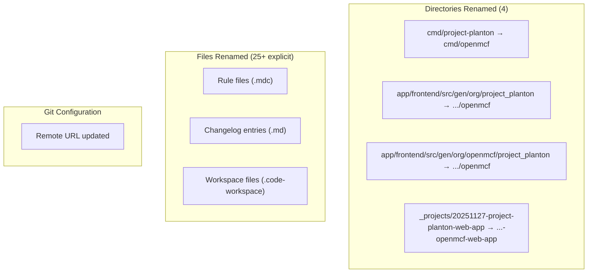

# Rename Project from project-planton to OpenMCF

**Date**: January 28, 2026
**Type**: Refactoring
**Components**: Repository, CLI, APIs, Documentation, Build System

## Summary

Completed the comprehensive rename of the open source project from "project-planton" to "OpenMCF" (Open Multi-Cloud Framework). This involved renaming 760+ files and directories, updating the git remote URL, and ensuring all references use the new naming conventions.

## Problem Statement / Motivation

The project needed a new identity as "OpenMCF" to better reflect its purpose as an open multi-cloud framework. This required a systematic rename across the entire codebase to maintain consistency and avoid confusion.

### Pain Points

- Old naming (`project-planton`, `project_planton`, `ProjectPlanton`) scattered across files and directories
- Git remote URL still pointing to old repository name
- Documentation and release notes referencing old project name

## Solution / What's New

Performed a comprehensive rename operation:

1. **String replacements** (done by user):
   - `project-planton` → `openmcf`
   - `project_planton` → `openmcf`
   - `ProjectPlanton` → `OpenMCF`
   - `Project Planton` → `OpenMCF`

2. **File and directory renames** (done via git mv):
   - All files containing old naming patterns
   - All directories containing old naming patterns

3. **Git remote URL update**:
   - Updated from `plantonhq/project-planton` to `plantonhq/openmcf`

### Rename Scope



## Implementation Details

### Directories Renamed

| Original Path | New Path |
|--------------|----------|
| `cmd/project-planton` | `cmd/openmcf` |
| `app/frontend/src/gen/org/project_planton` | `app/frontend/src/gen/org/openmcf` |
| `app/frontend/src/gen/org/openmcf/project_planton` | `app/frontend/src/gen/org/openmcf/openmcf` |
| `_projects/20251127-project-planton-web-app` | `_projects/20251127-openmcf-web-app` |

### Files Renamed (25 explicit files)

**Rule Files:**
- API rules (2 files)
- Changelog rules (3 files)
- Coding guidelines (2 files)
- Issue rules (2 files)
- PR rules (3 files)
- Git rules (3 files)
- Deployment component rules (7 files)
- CLI UX standards (1 file)

**Other Files:**
- Changelog entry (1 file)
- VS Code workspace file (1 file)

### Git Remote Update

```bash
# Before
origin  git@github.com:plantonhq/project-planton.git

# After
origin  git@github.com:plantonhq/openmcf.git
```

## Benefits

- **Consistent branding**: All references now use "OpenMCF" or "openmcf"
- **Git history preserved**: Used `git mv` for all renames to maintain history
- **Clean repository state**: 760 files tracked as renames, not delete+add
- **Updated domain**: References now use `openmcf.org` instead of `project-planton.org`

## Impact

### What Changed
- CLI binary path: `cmd/openmcf/`
- Frontend generated code: `app/frontend/src/gen/org/openmcf/`
- All rule files use new naming convention
- Git remote points to renamed GitHub repository

### What Stayed the Same
- File contents (string replacements were done separately)
- Project structure and architecture
- All functionality remains unchanged

## Related Work

- GitHub repository renamed from `project-planton` to `openmcf`
- Domain updated from `project-planton.org` to `openmcf.org`
- GitHub workflows already updated to reference new names

---

**Status**: ✅ Production Ready
**Timeline**: Single session rename operation
