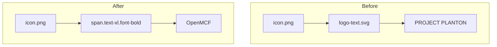

# Remove Text Logo SVG and Update Branding to Styled Text

**Date**: January 28, 2026
**Type**: Refactoring
**Components**: Site, Branding, UI Components

## Summary

Removed the old PROJECT PLANTON text logo SVG (`logo-text.svg`) and replaced it with styled "OpenMCF" text across all site headers and footer. This completes the branding transition following the recent project rename from openmcf to OpenMCF.

## Problem Statement / Motivation

After renaming the project to OpenMCF, the text logo SVG still contained the old "PROJECT PLANTON" branding. Since no OpenMCF text logo exists yet, the SVG needed to be removed and replaced with a simpler text-based solution.

### Pain Points

- The `logo-text.svg` displayed the old "PROJECT PLANTON" name
- No OpenMCF text logo was available to replace it
- Branding inconsistency between the icon (updated) and text logo (outdated)

## Solution / What's New

Replaced the SVG-based text logo with styled HTML text "OpenMCF" using Tailwind CSS classes. The approach maintains visual consistency while eliminating the need for a custom text logo asset.

### Component Changes



## Implementation Details

### Files Modified

| File | Change |
|------|--------|
| `site/src/components/pages/HomePage.tsx` | Nav header: Image → styled span |
| `site/src/app/docs/components/DocsHeader.tsx` | Docs header: Image → styled span |
| `site/src/app/docs/components/DocsLayout.tsx` | Mobile drawer: Image → styled span |
| `site/src/components/sections/Footer.tsx` | Footer: Image → styled span |
| `site/README.md` | Removed logo-text.svg from static assets list |

### File Deleted

- `site/public/logo-text.svg` (10.9 KB) - Old PROJECT PLANTON text logo

### Code Pattern

**Before:**
```tsx
<Image src="/logo-text.svg" alt="OpenMCF" width={160} height={40} 
       className="h-10 w-auto object-contain hidden sm:block" />
```

**After:**
```tsx
<span className="text-xl font-bold text-white hidden sm:block">OpenMCF</span>
```

### Styling Applied

- `text-xl` - Appropriate text size matching previous logo height
- `font-bold` - Strong visual weight for brand name
- `text-white` - Consistent with site color scheme
- `hidden sm:block` - Preserved responsive behavior (text hidden on mobile in headers)

## Benefits

- **Simplified assets**: Removed 122-line SVG file dependency
- **Consistent branding**: "OpenMCF" text now matches project name everywhere
- **Easier updates**: Text can be styled/changed without creating new SVG assets
- **Reduced bundle size**: ~11 KB smaller public assets

## Impact

### What Changed
- Site header displays "OpenMCF" text instead of SVG logo
- Docs header displays "OpenMCF" text instead of SVG logo
- Mobile drawer displays "OpenMCF" text instead of SVG logo
- Footer displays "OpenMCF" text instead of SVG logo

### What Stayed the Same
- Icon (`icon.png`) remains unchanged
- Responsive behavior preserved (text hidden on mobile in headers)
- Overall visual layout unchanged
- Link behavior unchanged

## Related Work

- Follows from: `2026-01-28-093934-rename-project-to-openmcf.md` - Main project rename
- Part of: OpenMCF branding consolidation effort

---

**Status**: ✅ Production Ready
**Timeline**: Single session update
