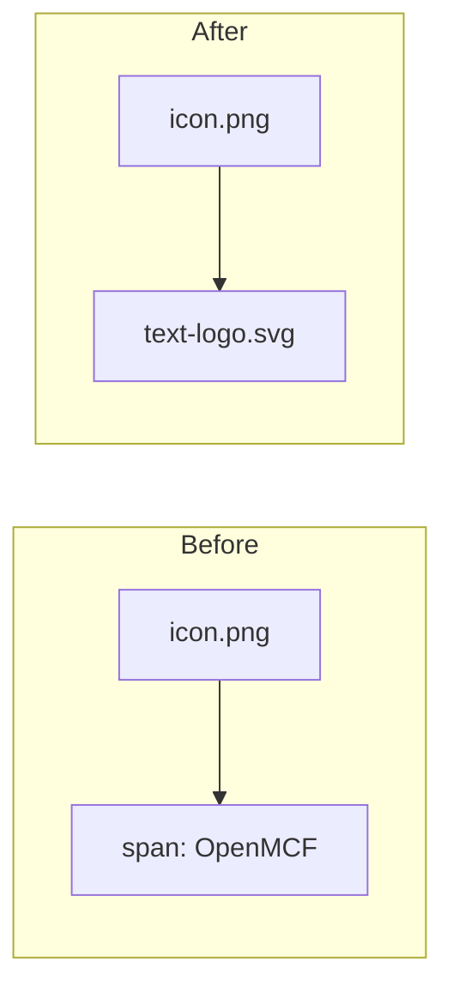

# Text Logo SVG Integration and Hero Brand Styling

**Date**: January 28, 2026
**Type**: Enhancement
**Components**: Site, Branding, UI Components, Hero Section

## Summary

Integrated a new OpenMCF text logo SVG across all site headers and footer, replacing the plain text spans. Applied optical sizing adjustments for visual balance between icon and text logo, and updated the hero section to highlight "Open", "M", "C", "F" in the brand color (#7a4183) to subtly reinforce the OpenMCF brand name.

## Problem Statement / Motivation

Following the project rename to OpenMCF, a proper text logo SVG was created but not yet integrated into the site. The hero section also needed brand reinforcement through typography.

### Pain Points

- Text spans lacked the visual polish of a proper logo asset
- No visual connection between the product name and the hero headline
- Plain "OpenMCF" text didn't leverage the brand color palette

## Solution / What's New

### 1. Text Logo SVG Integration

Added the new `text-logo.svg` (purple #7a4183) to headers and footer, replacing plain text spans.



### 2. Optical Sizing Adjustments

Applied professional design principles - text logos appear larger than icons at the same pixel height due to visual weight differences. Reduced text logo height by ~11% for optical balance.

| Location | Icon | Text Logo Before | Text Logo After |
|----------|------|------------------|-----------------|
| HomePage nav | h-9 (36px) | h-9 (36px) | h-8 (32px) |
| DocsHeader | h-9 (36px) | h-9 (36px) | h-8 (32px) |
| DocsLayout mobile | h-8 (32px) | h-8 (32px) | h-7 (28px) |
| Footer | h-9 (36px) | h-9 (36px) | h-8 (32px) |

### 3. Spacing Refinement

Reduced gap between icon and text logo from `gap-3` (12px) to `gap-2` (8px) for tighter pairing.

### 4. Hero Brand Typography

Updated hero headline to highlight letters spelling "OpenMCF" in brand color:

```
An Open Source
Multi-Cloud Framework
   ^^^^       ^     ^              ^

Purple (#7a4183): Open, M, C, F
White: everything else
```

## Implementation Details

### Files Modified

| File | Change |
|------|--------|
| `site/src/components/pages/HomePage.tsx` | Text logo SVG, optical sizing, gap adjustment |
| `site/src/app/docs/components/DocsHeader.tsx` | Text logo SVG, optical sizing, gap adjustment |
| `site/src/app/docs/components/DocsLayout.tsx` | Text logo SVG, optical sizing for mobile drawer |
| `site/src/components/sections/Footer.tsx` | Text logo SVG, optical sizing, gap adjustment |
| `site/src/components/sections/Hero.tsx` | Brand color highlighting for Open, M, C, F |

### Files Added

| File | Description |
|------|-------------|
| `site/public/text-logo.svg` | OpenMCF text logo in brand purple (#7a4183) |
| `site/public/text-logo.png` | PNG version of text logo |

### Hero Section Code Pattern

**Before:**
```tsx
<h1>
    <span className="text-white block">Open‑Source Multi‑Cloud</span>
    <span className="bg-gradient-to-r ... block">Infrastructure Framework</span>
</h1>
```

**After:**
```tsx
<h1>
    <span className="block">
        <span className="text-white">An </span>
        <span className="text-[#7a4183]">Open</span>
        <span className="text-white"> Source</span>
    </span>
    <span className="block">
        <span className="text-[#7a4183]">M</span>
        <span className="text-white">ulti-</span>
        <span className="text-[#7a4183]">C</span>
        <span className="text-white">loud </span>
        <span className="text-[#7a4183]">F</span>
        <span className="text-white">ramework</span>
    </span>
</h1>
```

## Benefits

- **Professional branding**: Proper SVG logo asset vs plain text
- **Visual balance**: Optical sizing creates harmonious icon/text pairing
- **Brand reinforcement**: Hero headline subtly spells "OpenMCF" through color
- **Color consistency**: Uses exact brand color (#7a4183) from text logo throughout
- **Improved UX**: Tighter spacing creates cohesive logo lockup

## Impact

### Visual Design
- Headers and footer now display polished logo lockup (icon + text logo SVG)
- Hero section creates subliminal brand recognition through typography
- Consistent brand color usage across all brand touchpoints

### What Stayed the Same
- Icon (`icon.png`) unchanged
- Responsive behavior preserved
- Link behavior unchanged
- Overall layout unchanged

## Related Work

- Follows from: `2026-01-28-110855-remove-text-logo-svg-branding-update.md` - Initial text span approach
- Part of: OpenMCF branding consolidation effort

---

**Status**: ✅ Production Ready
**Timeline**: Single session update
