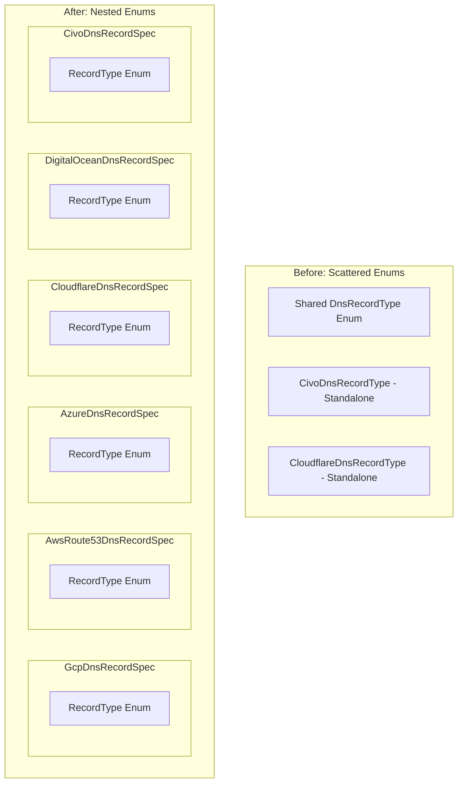
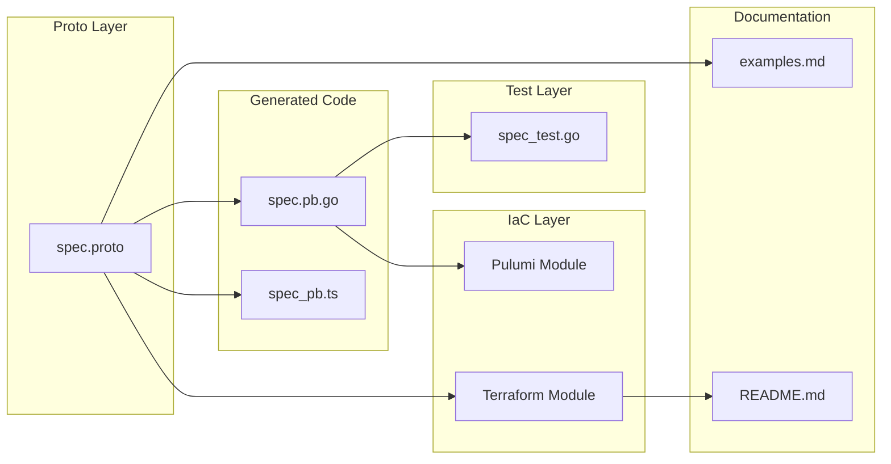

# DNS Record Components Standardization: Nested Enums and StringValueOrRef

**Date**: January 28, 2026
**Type**: Refactoring
**Components**: API Definitions, Provider Framework, Pulumi CLI Integration, Terraform Modules

## Summary

Standardized all DNS record components across 6 cloud providers (Cloudflare, GCP, AWS Route53, Azure, DigitalOcean, Civo) to use nested `RecordType` enums inside their spec messages and the `StringValueOrRef` pattern for zone ID fields. This refactoring improves API consistency, enhances type safety, and enables better resource referencing across OpenMCF manifests.

## Problem Statement / Motivation

The DNS record components across different cloud providers had inconsistent implementations:

### Pain Points

- **Inconsistent enum definitions**: Some providers used shared global enums (`org.openmcf.shared.networking.enums.dnsrecordtype.DnsRecordType`), while others had standalone provider-specific enums outside the spec message
- **Field naming inconsistencies**: GCP and Azure used `record_type` while other providers used `type`
- **Zone ID as plain string**: Cloudflare's `zone_id` field was a plain string, preventing resource referencing with `valueFrom` pattern
- **Different supported record types**: Each provider supports different DNS record types, but using a shared enum forced unnecessary values

## Solution / What's New

Standardized all DNS record components with the following patterns:

### Nested RecordType Enums

Each DNS record spec now contains its own nested `RecordType` enum:



### StringValueOrRef for Zone IDs

Cloudflare DNS records now support resource referencing:

```yaml
# Before: Only literal values
spec:
  zoneId: "abc123def456"

# After: Both patterns supported
spec:
  zoneId: "abc123def456"  # Literal value (simplified syntax)
  # OR
  zoneId:
    valueFrom:
      name: my-dns-zone  # Reference to CloudflareDnsZone resource
```

### Field Naming Consistency

Standardized field names across providers:
- GCP: `recordType` → `type`
- Azure: `record_type` → `type`

## Implementation Details

### Proto Schema Changes

**54 files modified** across 7 components:

| Component | Proto Changes | Test Updates | Pulumi Module | Terraform Module |
|-----------|--------------|--------------|---------------|------------------|
| CloudflareDnsRecord | Nested enum, StringValueOrRef for zone_id | ✅ | ✅ | ✅ |
| GcpDnsRecord | Nested enum, field rename | ✅ | ✅ | ✅ |
| AwsRoute53DnsRecord | Nested enum | ✅ | ✅ | N/A |
| AzureDnsRecord | Nested enum, field rename | ✅ | ✅ | ✅ |
| DigitalOceanDnsRecord | Nested enum | ✅ | ✅ | N/A |
| CivoDnsRecord | Nested enum (was standalone) | ✅ | ✅ | N/A |
| CloudflareDnsZone | Added RecordType enum | ✅ | ✅ | ✅ |

### Code Changes by Layer



### Enum Naming Convention

Generated Go enum constants follow the pattern `{SpecMessage}_{EnumValue}`:

```go
// Before
cloudflarednsrecordv1.CloudflareDnsRecordType_A

// After
cloudflarednsrecordv1.CloudflareDnsRecordSpec_A
```

### Terraform Variable Updates

GCP and Azure Terraform modules updated to use new field name:

```hcl
# Before
type = string
record_type = var.spec.record_type

# After  
type = string
type = var.spec.type
```

## Benefits

### For API Consumers

- **Cleaner namespace**: Enums scoped within their spec messages
- **Type safety**: Each provider has its own valid record types
- **Resource referencing**: Zone IDs can reference other OpenMCF resources
- **Consistency**: Uniform `type` field name across all providers

### For Developers

- **Reduced coupling**: No more shared enum imports across providers
- **Easier maintenance**: Each provider's enum can evolve independently
- **Clear ownership**: Record types are defined where they're used

### For IaC

- **Pulumi**: Updated to handle nested enum references
- **Terraform**: Variables and locals updated for field renames
- **Documentation**: Examples updated with new syntax

## Impact

### Breaking Changes

**Proto field renames (GCP, Azure)**:
- `recordType` → `type` (GCP)
- `record_type` → `type` (Azure)

**Enum references in code**:
```go
// Update required
- cloudflarednsrecordv1.CloudflareDnsRecordType_A
+ cloudflarednsrecordv1.CloudflareDnsRecordSpec_A

// Similar for all providers
- dnsrecordtype.DnsRecordType_A  // shared enum removed
+ gcpdnsrecordv1.GcpDnsRecordSpec_A
```

### Backward Compatibility

- YAML manifests using the old field names will need updates
- Existing Terraform configurations need field name changes
- Go code using the enum constants needs updates

## Files Changed

```
54 files changed, 2258 insertions(+), 669 deletions(-)
```

### By Provider

| Provider | Files | Insertions | Deletions |
|----------|-------|------------|-----------|
| Cloudflare DNS Record | 9 | ~400 | ~150 |
| Cloudflare DNS Zone | 7 | ~700 | ~100 |
| GCP DNS Record | 8 | ~200 | ~100 |
| AWS Route53 DNS Record | 4 | ~200 | ~80 |
| Azure DNS Record | 10 | ~300 | ~120 |
| DigitalOcean DNS Record | 4 | ~200 | ~60 |
| Civo DNS Record | 5 | ~150 | ~60 |
| Generated TypeScript | 7 | ~600 | ~100 |

## Related Work

- This change enables the broader DNS zone support feature (`feat/all-dns-zone-kinds-to-support-records` branch)
- Follows the `StringValueOrRef` pattern established in other components
- Aligns with the nested enum pattern used in newer OpenMCF components

## Additional Fixes

Fixed a pre-existing type mismatch in `cloudflarednszone` Pulumi module:
- `pulumi.Int` → `pulumi.Float64` for TTL field
- `pulumi.Int` → `pulumi.Float64Ptr` for Priority field

---

**Status**: ✅ Production Ready
**Validation**: `make protos`, `make build`, `make test` all pass
