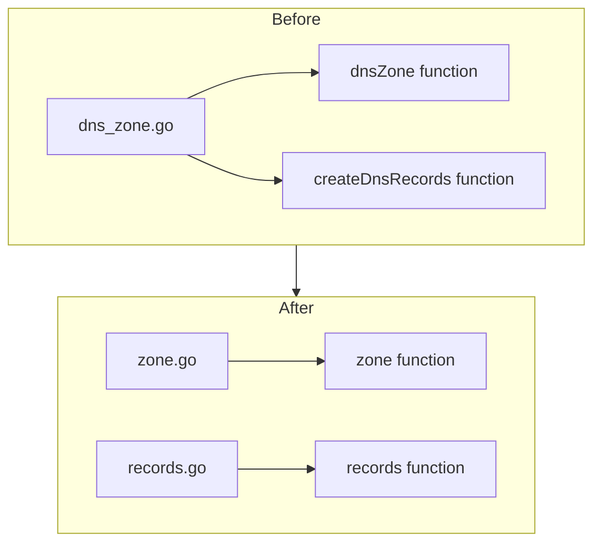
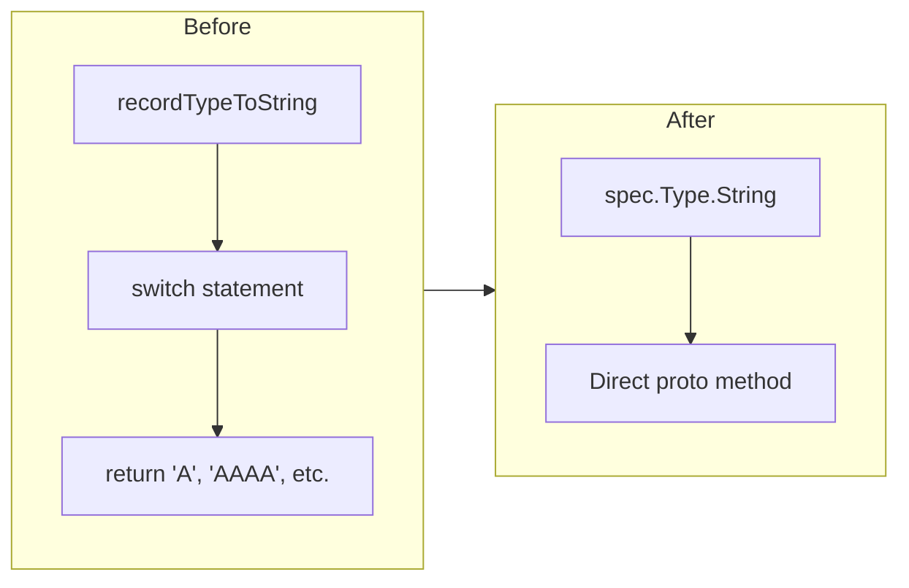

# Cloudflare DNS Zone Records Refactor and Enum Cleanup

**Date**: January 28, 2026
**Type**: Refactoring
**Components**: Cloudflare Provider, Civo Provider, IAC Pulumi Module, Terraform Module

## Summary

Refactored the Cloudflare DNS Zone Pulumi and Terraform modules to separate zone and records logic into dedicated files (`zone.go`/`records.go` and `main.tf`/`records.tf`). Additionally, removed unnecessary enum-to-string conversion functions across Civo and Cloudflare DNS Record modules, replacing them with direct `.String()` calls on proto enums.

## Problem Statement / Motivation

The Cloudflare DNS Zone module had all logic in a single `dns_zone.go` file, making it harder to maintain and inconsistent with code organization best practices. Additionally, several DNS Record modules contained redundant `recordTypeToString()` functions that duplicated what the proto-generated `.String()` method already provides.

### Pain Points

- Single file (`dns_zone.go`) contained both zone creation and DNS records logic
- Terraform module had zone and records resources mixed in `main.tf`
- Redundant enum conversion functions in Civo and Cloudflare DNS Record modules
- Inconsistent code patterns across providers (some used `.String()`, others used switch statements)

## Solution / What's New

### File Structure Improvements

Reorganized the Cloudflare DNS Zone module with clear separation of concerns:

### Enum Conversion Cleanup

Removed unnecessary `recordTypeToString()` switch functions:

## Implementation Details

### Pulumi Module Changes (Cloudflare DNS Zone)

**New `zone.go`**:
- Contains `zone()` function (renamed from `dnsZone()`)
- Handles zone creation and exports
- Calls `records()` function for DNS records

**New `records.go`**:
- Contains `records()` function (extracted from `createDnsRecords()`)
- Handles creation of all DNS records within the zone

**Updated `main.go`**:
- Updated to call `zone()` instead of `dnsZone()`

### Terraform Module Changes (Cloudflare DNS Zone)

**Updated `main.tf`**:
- Kept `cloudflare_zone` and `cloudflare_zone_settings_override` resources

**New `records.tf`**:
- Moved `cloudflare_record` resource for DNS records

### Enum Conversion Cleanup

**Civo DNS Record** (`civodnsrecord/v1/iac/pulumi/module/dns_record.go`):
- Removed `recordTypeToString()` function (21 lines)
- Now uses `spec.Type.String()` directly

**Cloudflare DNS Record** (`cloudflarednsrecord/v1/iac/pulumi/module/dns_record.go`):
- Removed `recordTypeToString()` function (23 lines)
- Now uses `spec.Type.String()` directly

## Benefits

- **Cleaner Code Organization**: Separate files for zone and records logic
- **Reduced Code Duplication**: Removed ~44 lines of redundant enum conversion code
- **Consistent Patterns**: All DNS modules now use `.String()` for enum conversion
- **Easier Maintenance**: Each file has a single responsibility
- **Better Readability**: Smaller, focused files are easier to understand

## Impact

### Files Changed

| File | Change Type |
|------|-------------|
| `cloudflarednszone/v1/iac/pulumi/module/dns_zone.go` | Deleted |
| `cloudflarednszone/v1/iac/pulumi/module/zone.go` | Created |
| `cloudflarednszone/v1/iac/pulumi/module/records.go` | Created |
| `cloudflarednszone/v1/iac/pulumi/module/main.go` | Modified |
| `cloudflarednszone/v1/iac/tf/main.tf` | Modified |
| `cloudflarednszone/v1/iac/tf/records.tf` | Created |
| `civodnsrecord/v1/iac/pulumi/module/dns_record.go` | Simplified |
| `cloudflarednsrecord/v1/iac/pulumi/module/dns_record.go` | Simplified |

### Providers Affected

- Cloudflare DNS Zone
- Cloudflare DNS Record
- Civo DNS Record

## Related Work

This refactoring is part of ongoing work to ensure all DNS Zone components support inline records. Cross-provider analysis confirmed:

- All 6 DNS Zone specs (AWS, Azure, GCP, Civo, Cloudflare, DigitalOcean) have `repeated records` field
- Azure and Civo zone records have minor field gaps compared to standalone record specs

---

**Status**: ✅ Production Ready
**Timeline**: Single session refactoring
