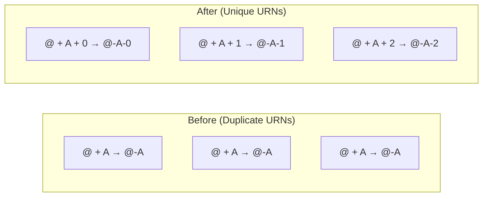

# Fix Duplicate Resource URN Errors for Cloudflare DNS Zone Records

**Date**: January 29, 2026
**Type**: Bug Fix
**Components**: Cloudflare Provider, Pulumi Module, Terraform Module

## Summary

Fixed a critical bug in the Cloudflare DNS Zone component where multiple DNS records with the same name and type (e.g., multiple A records for `@`) caused duplicate resource URN errors during Pulumi deployments. The fix adds an index to resource names to ensure uniqueness.

## Problem Statement / Motivation

When deploying a Cloudflare DNS Zone with multiple records sharing the same name and type, Pulumi would fail with a duplicate resource URN error:

```
error: urn:pulumi:shared.CloudflareDnsZone.openmcf-org::planton::cloudflare:index/record:Record::@-A: 
Duplicate resource URN 'urn:pulumi:shared.CloudflareDnsZone.openmcf-org::planton::cloudflare:index/record:Record::@-A'; 
try giving it a unique name
```

### Pain Points

- **GitHub Pages deployments blocked**: GitHub Pages requires multiple A records pointing to different IPs for the same domain (`@`), a common and valid DNS configuration
- **No workaround**: Users couldn't deploy zones with multiple records of the same type for the same subdomain
- **Both IaC backends affected**: The issue existed in both Pulumi and Terraform implementations

### Example Failing Manifest

```yaml
spec:
  zone_name: openmcf.org
  records:
    - name: "@"
      type: A
      value: 185.199.108.153  # GitHub Pages IP 1
    - name: "@"
      type: A
      value: 185.199.109.153  # GitHub Pages IP 2
    - name: "@"
      type: A
      value: 185.199.110.153  # GitHub Pages IP 3
```

All three records generated the same resource name `@-A`, causing the conflict.

## Solution / What's New

Added an index to the resource name generation to ensure each record gets a unique identifier, even when name and type are identical.

### Resource Naming Change



## Implementation Details

### Pulumi Changes (`records.go`)

```go
// Before
for _, record := range recordsList {
    resourceName := fmt.Sprintf("%s-%s", record.Name, record.Type.String())

// After
for idx, record := range recordsList {
    // Include index to ensure uniqueness when multiple records have same name and type
    resourceName := fmt.Sprintf("%s-%s-%d", record.Name, record.Type.String(), idx)
```

### Terraform Changes (`records.tf`)

```hcl
# Before
for_each = { for idx, record in var.spec.records : "${record.name}-${record.type}" => record }

# After - Include index to ensure uniqueness
for_each = { for idx, record in var.spec.records : "${record.name}-${record.type}-${idx}" => record }
```

## Benefits

- **Unblocks GitHub Pages**: Users can now deploy zones with multiple A records for apex domains
- **Supports round-robin DNS**: Any configuration requiring multiple records of the same type is now supported
- **Consistent behavior**: Both Pulumi and Terraform use the same naming scheme
- **Backward compatible**: Existing single-record configurations continue to work (just with `-0` suffix)

## Impact

### Files Changed

| File | Change |
|------|--------|
| `apis/org/openmcf/provider/cloudflare/cloudflarednszone/v1/iac/pulumi/module/records.go` | Added index to resource name |
| `apis/org/openmcf/provider/cloudflare/cloudflarednszone/v1/iac/tf/records.tf` | Added index to for_each key |

### Who Is Affected

- **Users deploying Cloudflare DNS zones with duplicate name+type records**: Now works correctly
- **Existing deployments**: Will see resource replacement on next deployment due to name change (one-time migration)

### Migration Note

Existing deployments will experience a resource replacement for DNS records on the next `pulumi up` or `terraform apply` because the resource names changed. This is a one-time operation with no downtime impact since the DNS records themselves don't change—only the IaC resource identifiers.

## Related Work

- Part of the broader DNS Zone records standardization effort
- Related changelog: `2026-01-28-151154-cloudflare-dns-zone-records-refactor.md`

---

**Status**: ✅ Production Ready
**Timeline**: Quick fix (~15 minutes)
