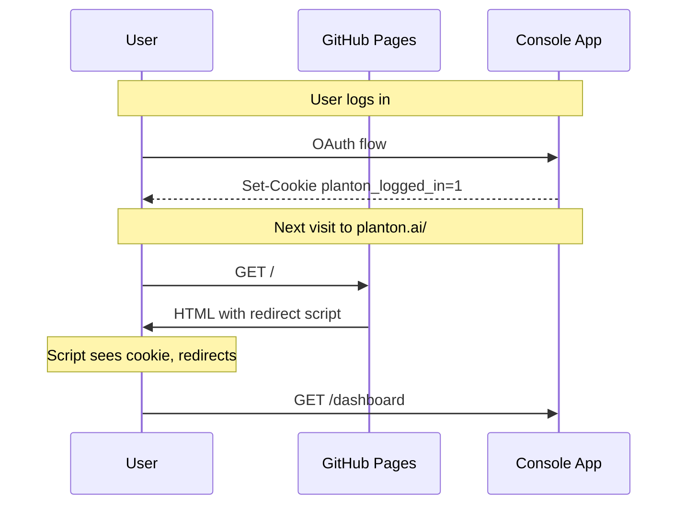

# Session-Aware Root Redirect and Nav Toggle

**Date**: March 28, 2026
**Type**: Feature
**Components**: Navigation, Build System

## Summary

Added GitHub-style auto-redirect for logged-in users visiting planton.ai root, and a Stripe-style nav toggle that swaps "Sign in / Sign up" for a "Dashboard" button when a session indicator cookie is present. Together these deliver a seamless unified-domain UX where logged-in users never see the marketing page unless they want to.

## Problem Statement

With the unified domain migration complete, planton.ai root (`/`) serves the marketing site from GitHub Pages. Logged-in users visiting `planton.ai` had to manually click through to the console -- there was no GitHub-style automatic redirect to `/dashboard`. The header also showed "Sign in / Sign up" with `target="_blank"` (a leftover from the two-domain era) regardless of login state.

### Pain Points

- Logged-in users landing on the marketing page instead of their dashboard
- No visual indication in the nav that the user is already authenticated
- `target="_blank"` on auth links opened new tabs unnecessarily on the unified domain

## Solution

Two cooperating mechanisms:

1. **Inline redirect script** in `<head>` -- checks for a `planton_logged_in` cookie (set by the console app's NextAuth handler) and redirects to `/dashboard` before the page paints
2. **Nav toggle** -- `useLoggedIn` hook reads the same cookie via `useSyncExternalStore` and conditionally renders "Dashboard" instead of "Sign in / Sign up"

The `planton_logged_in` cookie is a non-HttpOnly indicator set by the console app on every session access and cleared on signout. It holds only the value `1` -- no sensitive data. The NextAuth session cookie itself is HttpOnly and invisible to client-side JavaScript on the static site.

### Architecture



## Implementation Details

### Redirect script (`layout.tsx`)

Added as the first child of `<head>` so it runs before any rendering:

```tsx
<script dangerouslySetInnerHTML={{
  __html: 'try{if(/planton_logged_in=/.test(document.cookie))window.location.replace("/dashboard")}catch(e){}'
}} />
```

Wrapped in try/catch for bulletproof graceful degradation.

### Nav toggle (`header.tsx`)

Uses `useSyncExternalStore` (React 19 idiomatic pattern) to read cookie state without triggering the React Compiler's `set-state-in-effect` lint rule:

```tsx
const noop = () => () => {};
const getCookieSnapshot = () => /planton_logged_in=/.test(document.cookie);
const getServerSnapshot = () => false;

function useLoggedIn(): boolean {
  return useSyncExternalStore(noop, getCookieSnapshot, getServerSnapshot);
}
```

Separate `DesktopAuthButtons` and `MobileAuthButtons` components handle the two layouts. All `target="_blank"` attributes removed; auth links are now same-tab relative paths (`/login`, `/signup`, `/dashboard`).

## Benefits

- Logged-in users are redirected to `/dashboard` instantly on visiting planton.ai
- Nav clearly shows "Dashboard" when logged in, "Sign in / Sign up" when logged out
- No `target="_blank"` -- auth navigation stays in the same tab
- Graceful degradation: if cookie is absent or JS disabled, marketing page renders normally with auth buttons

## Impact

- **Logged-in users**: GitHub-style auto-redirect to dashboard
- **Logged-out users**: No change -- see marketing page with sign in/up buttons
- **Mobile users**: Same behavior via `MobileAuthButtons` component

## Related Work

- Unified domain migration project: `planton/_projects/20260314.01.unified-domain-migration/`
- Console-side cookie changes: `planton/client-apps/web/console/src/pages/api/auth/[...nextauth].ts`
- Console-side route fix: `planton/client-apps/web/console/src/routes/index.ts` (Dashboard path `/` -> `/dashboard`)

---

**Status**: Live (pending console app redeploy for cookie-setting logic)
**Timeline**: 30 minutes
