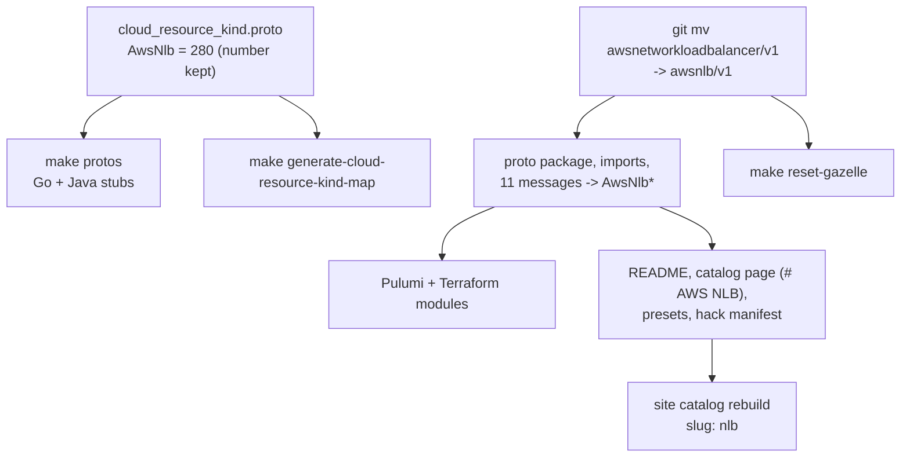

# Rename AwsNetworkLoadBalancer to AwsNlb

**Date**: July 2, 2026
**Type**: Refactoring
**Components**: API Definitions, AWS Provider, Resource Management, Build System

## Summary

The AWS Network Load Balancer kind is renamed from `AwsNetworkLoadBalancer` to `AwsNlb`,
matching the naming format of its sibling `AwsAlb` and AWS's own ALB/NLB vocabulary. The
rename covers the enum value (number 280 unchanged), the component directory, the proto
package and all eleven messages, both IaC modules, manifests, presets, docs, and every
cross-reference — with zero backward-compat residue. The update workflow rule gains a
dedicated kind-rename scenario so future renames follow the same complete checklist.

## Problem Statement / Motivation

AWS practitioners say "ALB" and "NLB" — the console, the CLI, and the ELBv2 API all use
the acronyms. The catalog already models the application load balancer as `AwsAlb`, so
`AwsNetworkLoadBalancer` was an inconsistency inside the same family: two sibling kinds
for the two ELBv2 load balancer types, named on different conventions. Since nobody uses
the system yet, the name is corrected outright — no aliases, no deprecation path.

### Pain Points

- Inconsistent naming within the load-balancing family (`AwsAlb` vs `AwsNetworkLoadBalancer`)
- Longer kind name than the vocabulary AWS users actually search for
- Every artifact derived from the kind name (manifest `kind:`, catalog slug, module
  directory, identity tags) carried the inconsistency

## Solution / What's New

A complete, residue-free rename across every surface the kind name touches:

- **Enum**: `AwsNetworkLoadBalancer = 280` → `AwsNlb = 280`. A rename never renumbers;
  `kind_meta` (id_prefix `awsnlb`) was already aligned.
- **Component**: directory moved to `apis/dev/planton/provider/aws/awsnlb/v1/`; proto
  package is now `dev.planton.provider.aws.awsnlb.v1`; all messages follow the sibling
  convention (`AwsNlbSpec`, `AwsNlbListener`, `AwsNlbTargetGroup`, ...).
- **Cross-engine identity-tag parity preserved**: the Pulumi module derives the
  `planton.dev/resource-kind` tag from the enum and renamed itself; the Terraform module
  hardcodes the string in `locals.tf` and was updated in the same change, keeping both
  engines emitting the identical `AwsNlb` tag value.
- **Cross-references updated**: the Elastic IP and Global Accelerator catalog pages,
  presets, and a stack-outputs comment that named the old kind.
- **Public catalog**: the page heading is now `# AWS NLB` (matching `# AWS ALB`), which
  yields the site slug `nlb`; the old `network-load-balancer` built output is gone.

## Implementation Details

- Tracked-file sweep: `git grep -i awsnetworkloadbalancer` returns zero hits outside
  dated `_changelog/` history records.
- Regeneration pipeline: `make protos` (clean stub regen + Java compile gate) →
  `make generate-cloud-resource-kind-map` → `make reset-gazelle` → site
  `yarn copy-docs && yarn generate-structure`.
- The site rebuild also materialized catalog pages for the recently added
  `AwsIamPolicy` and `AwsIamInstanceProfile` kinds, bringing the committed built
  output back in sync with the component sources.
- Repo hygiene: an accidentally committed `go build .` artifact (a Mach-O binary named
  `main` at the repo root) was removed and `.gitignore` now blocks it.

### Workflow rule uplift

`_rules/deployment-component/update/update-planton-component.mdc` gains **Scenario 9:
Rename a Kind** (flag `rename-kind`): the complete rename surface — enum value (number
kept), directory move in lockstep with the kind name (module-dir resolution derives from
it), proto package/imports/messages, manifest `kind:` lines, both IaC modules with an
explicit callout of the identity-tag asymmetry (Pulumi derives the tag from the enum;
Terraform hardcodes it in `locals.tf`), docs and display headings, cross-component
references, the regeneration pipeline, and the validation gate.

## Validation

All offline gates green after the rename:

- `go test ./apis/dev/planton/provider/aws/awsnlb/v1/` — spec/CEL tests pass
- `go build ./...` and the Pulumi module entrypoint build — clean
- `make protos` — Go + Java stub regeneration and the Bazel Java compile gate pass
- `planton validate-refs --check` — all foreign-key references resolve
- `planton secret-coverage --check` — gate passes
- `go test ./pkg/outputs/... ./pkg/refcheck/...` — registry-driven conformance passes
  with the renamed kind
- `tofu init -backend=false && tofu validate` in `iac/tf/` — configuration valid
- Site catalog: `nlb` slug present, `network-load-balancer` absent,
  `docs-structure.json` regenerated

Live E2E was not run: the modules' provisioning logic is untouched (the only behavioral
delta is the intended `resource-kind` tag value), and the kind has no E2E harness wiring
yet — its live coverage lands with the load-balancing family work.

## Impact

- Manifests now declare `kind: AwsNlb`; the catalog URL is `/docs/catalog/aws/nlb`.
- Deployed resources are tagged `planton.dev/resource-kind: AwsNlb` on both engines.
- No consumer-facing migration: the platform picks the rename up at its next
  dependency upgrade, and no released artifact carries the old name.

## Related Work

- `2026-07-02-090507-aws-iam-decomposition-into-composable-kinds.md` — the same
  catalog-quality push; its IAM catalog pages are materialized in this change's site
  rebuild.
- `2026-02-15-123126-aws-network-load-balancer-resource-kind.md` — the kind's original
  introduction under the old name.

---

**Status**: ✅ Production Ready
