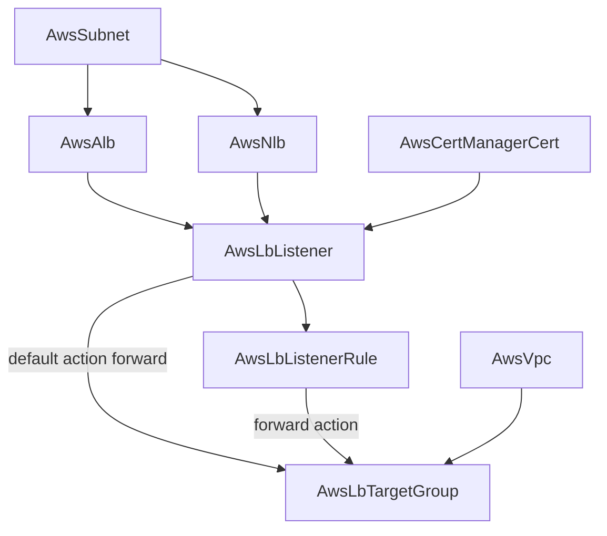

# AWS Load Balancing Decomposed into First-Class Routing Kinds

**Date**: July 2, 2026
**Type**: Feature | Breaking Change
**Components**: API Definitions, AWS Provider, Pulumi CLI Integration, Testing Framework, Resource Management

## Summary

AWS load balancing is now modeled the way AWS itself models ELBv2: the load
balancer, the target group, the listener, and the listener rule are each
first-class, independently referenceable resources. Three new kinds --
`AwsLbTargetGroup` (214), `AwsLbListener` (232), and `AwsLbListenerRule` (233)
-- carry the full routing surface, and `AwsAlb`/`AwsNlb` were rebuilt as pure
load balancers enriched to the complete `aws_lb` attribute set. The E2E
dependency framework gained multi-instance prerequisites and name-aware
reference resolution, which is what makes a two-availability-zone load
balancer chain testable end to end.

## Problem Statement / Motivation

The ALB component modeled no target groups and no listeners at all -- its
modules hardcoded an HTTP-redirect/fixed-response listener pair behind an
`ssl.enabled` toggle, so the load balancer literally could not route traffic
to targets through its own API. The NLB bundled listeners and target groups
inline, which worked for NLB's forward-only world but produced two different
routing models in one family and made the routing pieces unreachable from
other resources.

### Pain Points

- ECS services attached routing by side effect (looking up a listener by port
  and injecting rules), with nothing in the resource graph representing that
  dependency.
- Blue/green and canary patterns need weighted forwards across TWO target
  groups -- unrepresentable when the group lives inside one load balancer.
- Per-service routing rules had no independent lifecycle: every routing change
  meant editing the shared load balancer.
- Certificates, authentication (Cognito/OIDC/JWT), and mutual TLS are
  listener-scoped in AWS but had nowhere to live.

## Solution / What's New

### AwsLbTargetGroup (enum 214)

The routing destination, serving BOTH families exactly as AWS does: protocol
decides ALB (HTTP/HTTPS) vs NLB (TCP/UDP/TCP_UDP/TLS), and family-specific
tuning is validated contextually via CEL (slow start and cookie stickiness are
ALB-only; proxy protocol, client-IP preservation, and connection termination
are NLB-only; port/protocol/VPC are forbidden for `lambda` targets). Static
target registrations fold into the spec (`aws_lb_target_group_attachment` is
pure glue); health checks, group-level health policy, and unhealthy-state
connection handling are fully modeled. GWLB/GENEVE is deliberately out of
scope until a gateway-load-balancer kind exists.

### AwsLbListener (enum 232)

The port/protocol entry point, attaching to an ALB (default reference) or NLB
(explicit `valueFrom`). Carries the default certificate plus SNI certificates
(folding `aws_lb_listener_certificate`), the complete default-action set --
weighted `forward` with stickiness, `redirect`, `fixed-response`,
`authenticate-cognito`, `authenticate-oidc` (client secret marked
`sensitive`), and `jwt-validation` -- mutual TLS, NLB TCP idle timeout, and
the ALB HTTP header controls (mTLS/TLS request-header injection, CORS and
security response headers). Action configurations are a CEL-enforced
discriminated union: exactly one config message, matching the action type.

### AwsLbListenerRule (enum 233)

The unit of per-service routing: conditions (host, path, header, method,
query string, source IP -- wildcard and regex forms), the same action set as
the listener, explicit priorities, and host/URL rewrite transforms. A service
ships its own rule and removes it when it goes away; the shared listener
stays untouched.

### AwsAlb / AwsNlb rebuilt as pure load balancers

Both specs now own only what is load-balancer-wide. The ALB gained the full
`aws_lb` application surface (client keep-alive, HTTP/2 toggle, WAF fail-open,
zonal shift, XFF handling, desync mitigation, invalid-header dropping,
host-header preservation, TLS-fingerprint headers, and access/connection/
health-check log delivery to S3); the NLB gained zonal shift, PrivateLink
security-group enforcement, and TLS access logs, keeping its subnet-mapping
static-IP model. Three latent cross-engine parity defects died in the
rewrite: the Route53 alias `evaluate_target_health` mismatch, the Pulumi-only
hardcoded `ssl_policy`, and the NLB Terraform module's `planton.dev/*` tag
prefix diverging from the Pulumi engine's `planton.ai/*`.

### E2E framework: multi-instance prerequisites

A prerequisite install profile may now carry multiple `---`-separated
documents of one kind -- the two-AZ subnet pair an ALB requires -- with each
document deployed as its own stack and outputs keyed by kind + manifest name.
Reference resolution honors the reference's own `kind`/`fieldPath` before the
field's `default_kind` annotations, selects instances by name (with a
sole-instance fallback and a loud ambiguity error), and now recurses into
nested spec messages, so a listener's forward-action target-group reference
resolves in composed scenarios.

### Charts on first-class listeners

`ecs-environment` and `microservices-backend` now create explicit
`AwsLbListener` nodes (an HTTPS terminator plus an HTTP-to-HTTPS redirect
when TLS is on; a plain HTTP listener otherwise) with fixed-response 404
defaults -- unmatched traffic means "no such service", not a fake 200. The
ECS service template declares a `depends_on` relationship on the listener so
its by-port listener lookup always finds one.

## Implementation Details

- Engine parity is structural: both modules translate the same discriminated
  union, both prefer the simple `target_group_arn` form for single unweighted
  forwards (avoiding spurious diffs), and both enforce the two constraints the
  proto cannot (VPC required for non-lambda groups; certificate required for
  HTTPS/TLS listeners) as fail-fast preconditions, because message-level CEL
  on `StringValueOrRef` fields breaks protovalidate-java.
- `pulumi-aws/sdk/v7` moved from v7.3.0 to v7.35.0, closing every field gap
  against the Terraform provider (listener-rule transforms, JWT validation,
  health-check logs); the ELBv2 AWS SDK backs five new harness verifiers
  keyed on ARNs with typed not-found codes as the absent signal.
- Live E2E paid for itself three times: the NLB Pulumi entrypoint had shipped
  without a `Pulumi.yaml` (no offline check can catch it; `pulumi stack init`
  fails with a misleading error), the ALB Terraform module's DNS `for_each`
  used a bare `[]` (a tuple) in its false arm, and the internet-facing ALB
  scenario surfaced the harness VPC's lack of an internet gateway (scenarios
  now deploy internal load balancers on purpose).

## Validation

- Spec/CEL tests for all five kinds; `pkg/outputs` conformance cases for all
  five; `planton validate-refs --check` and `planton secret-coverage --check`
  green; `tofu validate` green on all five Terraform modules against
  hashicorp/aws v6.53; release-equivalent Pulumi builds green; 28
  presets/hack-manifests/scenarios validated against the specs; E2E framework
  unit tests green.
- Live dual-engine E2E: 8/10 green -- target group, ALB, listener, and
  listener rule on BOTH engines, including the deepest chain (VPC -> two-AZ
  subnets -> ALB -> target group -> listener -> rule) with nested reference
  resolution proven live. The two NLB runs are deferred: the shared test
  account rejects network-type `CreateLoadBalancer` with an account-level
  `OperationNotPermitted` restriction that only AWS Support can lift
  (application-type creates succeed in the same account and window); both
  engines reach the AWS API cleanly through the full prerequisite chain, and
  the deferral is recorded in the NLB E2E profile. Zero orphaned resources
  after all runs.

## Breaking Changes

- `AwsAlb.spec.ssl` is gone; certificates live on `AwsLbListener`. The ALB
  modules no longer create listeners.
- `AwsNlb.spec.listeners` (with inline target groups) is gone, along with the
  `listener_arns`/`target_group_arns` map outputs; NLB routing composes
  through the same first-class kinds.
- Nobody consumes the removed surfaces: both charts and `AwsEcsService`
  reference only `load_balancer_arn`, which is unchanged.

## Impact

Traffic routing is now a composable design surface: services deploy their own
rules, canaries shift weight between two groups without touching a listener,
and edge authentication is a listener/rule concern -- while the environment's
load balancer stays a stable, rarely-edited foundation node.

## Related Work

Follows the AWS IAM decomposition (`2026-07-02-090507`) and the AwsNlb rename
(`2026-07-02-103505`); the compute wave (EKS depth, launch templates,
auto-scaling groups) composes onto these target groups next.

---

**Status**: ✅ Production Ready
