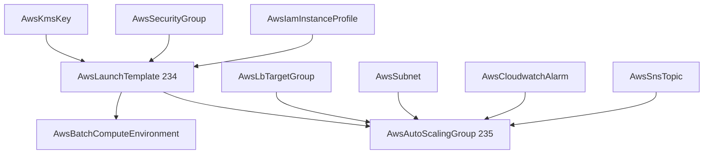

# AWS Launch Template and Auto Scaling Group Kinds

**Date**: July 2, 2026
**Type**: Feature
**Components**: AWS Provider, API Definitions, Provider Framework, Testing Framework, Build System

## Summary

Adds two first-class AWS compute kinds — `AwsLaunchTemplate` (enum 234) and
`AwsAutoScalingGroup` (enum 235) — with full four-proto anatomy, dual-engine
IaC modules at behavioral parity, presets, docs, and live E2E coverage on
both provisioners. `AwsBatchComputeEnvironment`'s launch-template field is
converted to a `StringValueOrRef` so Batch composes onto the new template
kind. A latent tri-state bug in the Terraform variable-contract generator
(proto3 `optional` scalars collapsing to zero defaults) was found and fixed
along the way, correcting the contract of every generator-owned AWS module.

## Problem Statement / Motivation

Self-managed EC2 fleet compute was unrepresentable: no kind modeled a
launch template or an EC2 Auto Scaling group, so ASG-backed architectures
(web fleets behind ALBs, Spot worker pools, scheduled batch capacity) had
no composable nodes. The only launch-template surface was a raw id/name
pass-through inside `AwsBatchComputeEnvironment`.

### Pain Points

- No blueprint node: AMI/storage/IMDS posture had to be repeated wherever
  compute was launched, with no single hardened "golden template".
- No fleet node: nothing referenced `AwsLbTargetGroup` outputs as a
  deployment target for EC2 capacity.
- Batch referenced launch templates by opaque literals instead of a
  resolvable graph reference.

## Solution / What's New

### AwsLaunchTemplate (id_prefix `lt`)

The versioned launch blueprint, designed from the full `aws_launch_template`
surface: exact `instance_type` XOR attribute-based `instance_requirements`
(memory/vCPU ranges, CPU manufacturers, generations, accelerators, price
protection), block device mappings (gp3/IOPS/throughput/encryption with an
`AwsKmsKey` reference), explicit network interfaces (public-IP tri-state,
IPv6, prefix delegation, EFA), IMDSv2 enforcement, placement, CPU options,
Spot market options, enclaves/hibernation, protection flags, and private
DNS options. Versioning is declarative: every change creates a new immutable
version and promotes it to `$Default`; `latest_version`/`default_version`
are outputs. Identity tags are emitted on the template AND via
`tag_specifications` onto launched instances and volumes (template tags do
not propagate on their own).

### AwsAutoScalingGroup (id_prefix `asg`, prerequisites `[AwsSubnet, AwsLaunchTemplate]`)

The fleet orchestrator, designed from the full `aws_autoscaling_group`
surface: capacity bounds and units, subnet spread, single-template XOR
mixed-instances policy (On-Demand base + Spot majority with per-type or
attribute-based overrides), ELB health model with target-group references,
instance refresh (health bounds, surge, checkpoints, alarm watch,
auto-rollback), warm pools, instance maintenance policy, termination
policies, max instance lifetime, and process suspension. Four AWS
sub-resources fold INTO the spec as repeated messages — scaling policies
(target tracking incl. metric math, step, simple, predictive), scheduled
actions, lifecycle hooks, and SNS notifications — because each belongs to
exactly one group and is referenced by nothing else; both engines still
materialize each entry as its own provider resource, so edits never replace
the group. ASG tags use the native key/value/propagate-at-launch triple so
launched instances inherit identity tags.

### Batch composition

`AwsBatchLaunchTemplate` is restructured from an id-XOR-name literal pair to
a single `StringValueOrRef launch_template_id` (default kind
`AwsLaunchTemplate` → `status.outputs.launch_template_id`) plus `version`,
with both Batch modules updated.

## Implementation Details

- **Registry**: enum 234/235 with `kind_meta` (the ASG declares its
  registry prerequisites, driving composed E2E); crkreflect map, gazelle,
  and the site catalog regenerated (`launch-template`,
  `auto-scaling-group` slugs).
- **Terraform contracts are generator-owned**: both kinds' `variables.tf`
  are emitted by `ProtoToVariablesTF` and guarded by the drift test
  (`migratedKinds`), so the contract can never silently diverge from the
  proto.
- **Generator tri-state fix**: proto3 `optional` scalars without a platform
  default were rendered as `optional(bool, false)` / `optional(number, 0)`,
  silently collapsing "unset" into an explicit zero — e.g. an `AwsVpc` with
  `enable_dns_support` omitted deployed with DNS support DISABLED on
  Terraform while Pulumi kept the AWS default. `TFField` now carries
  presence and such attributes default to null; all guarded contracts were
  regenerated and the two `AwsEcsService` locals that compared
  possibly-null values were null-guarded. Timeless guidance added to the
  Terraform authoring flow rule.
- **Presence semantics modeled honestly**: explicit zero is expressible
  where AWS makes it meaningful (`on_demand_percentage_above_base_capacity:
  0` = all-Spot, scheduled-action `desiredCapacity: 0` = scale-to-zero,
  warm-pool `max_group_prepared_capacity: 0`, refresh
  `min_healthy_percentage: 0`).
- **E2E**: new `launch_template` (ec2 `DescribeLaunchTemplates`) and
  `autoscaling_group` (`DescribeAutoScalingGroups` — absence is an empty
  result, not a typed error) verifiers; the
  `aws-sdk-go-v2/service/autoscaling` module added; per-kind profiles,
  prerequisite install manifests (the launch-template prerequisite pins a
  current AL2023 AMI — AWS validates an ASG's template is "fully formed"
  at CreateAutoScalingGroup even with zero desired capacity), scenarios,
  and `Test<Kind>_Pulumi/_Terraform` entrypoints.

## Testing Strategy

- Spec/CEL suites for both kinds (happy + error path per rule) plus the
  updated Batch suite — all green.
- Offline gate: targeted + release-equivalent builds, `make build-go`,
  `tofu validate` ×3, `validate-refs`, `secret-coverage`,
  `validate-outputs` dry-runs (4/4 and 2/2 fields populated), all six
  presets + hack manifests + E2E manifests validated with the locally
  built CLI, mechanical spec-field parity sweep across both engines.
- **Live dual-engine E2E: 4/4 green** — launch template (create → verify →
  destroy → verify-clean, both engines) and auto-scaling group across the
  full VPC → two-AZ subnets → launch template → group chain (both
  engines), zero instances launched (min=0), zero orphaned resources
  verified afterwards.

## Impact

ASG-backed architectures become composable graph citizens: a hardened
launch template feeds many fleets; fleets register into first-class target
groups; refresh alarms and lifecycle notifications reference real
CloudWatch/SNS nodes. The generator fix corrects a silent
cross-engine-divergence class for every current and future
generator-owned module.

## Related Work

- Builds on the IAM leaf kinds (`AwsIamPolicy`/`AwsIamInstanceProfile`) and
  the load-balancing decomposition
  (`AwsLbTargetGroup`/`AwsLbListener`/`AwsLbListenerRule`).
- Sets up EKS self-managed node groups and ECS capacity providers to
  compose onto launch templates and auto-scaling groups.

---

**Status**: ✅ Production Ready
