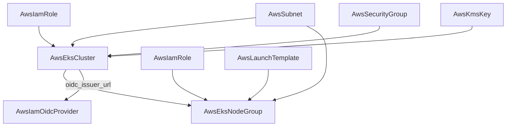

# AWS EKS Cluster and Node Group Brought to Full Provider Depth

**Date**: July 2, 2026
**Type**: Feature | Breaking Change
**Components**: API Definitions, AWS Provider, Pulumi CLI Integration, Terraform Modules, Testing Framework

## Summary

`AwsEksCluster` grew from an 8-field control-plane stub to the full
`aws_eks_cluster` surface -- endpoint exposure, access entries, envelope
encryption, granular logging, upgrade policy, zonal shift, deletion
protection, and EKS Auto Mode -- and `AwsEksNodeGroup` gained launch-template
composition, the full AMI-family and purchase-model set, taints, surge
rollouts, managed node auto-repair, and real stack outputs (three of its
four were hard-coded empty strings in both engines). Both kinds moved onto
the generator-owned Terraform variable contract, both gained live
dual-engine E2E, and the cluster module shed a composition-breaking side
effect: it no longer attaches IAM policies to the role it merely references.

## Problem Statement / Motivation

EKS is AWS's largest managed service, and the cluster spec modeled it with
eight fields. There was no way to express a private-endpoint cluster
correctly (the Pulumi module never enabled private access, so "disable
public" produced a cluster with NO reachable endpoint), no access-entry
authentication, no upgrade policy, no Auto Mode. The node group could not
compose onto `AwsLaunchTemplate` -- the whole point of having first-class
launch templates -- and its `asg_name`/`remote_access_sg_id`/
`instance_profile_arn` outputs were literal `""` stubs in both engines.

### Pain Points

- Two real cross-engine divergences on the cluster: Terraform attached
  `AmazonEKSClusterPolicy` to the referenced role (Pulumi did not), and
  Terraform enabled private endpoint access when public was disabled
  (Pulumi did not -- deploying an unreachable control plane).
- The node group's cluster reference pointed at `metadata.name`, a field
  path the reference-resolution machinery cannot resolve (it reads stack
  outputs), so a composed node-group-on-cluster scenario could never work.
- Both kinds carried the legacy hand-written `variables.tf` (object-shaped
  labels, un-substituted placeholder descriptions) that the tfvars pipeline
  cannot satisfy.
- Neither kind had E2E wiring: no verifiers, no scenarios, no registry
  prerequisites.

## Solution / What's New

### AwsEksCluster: the control plane, complete

- **Endpoint exposure as AWS models it**: independent
  `endpoint_public_access` (proto-optional, AWS-default-true) and
  `endpoint_private_access` toggles with `public_access_cidrs` scoping and
  `control_plane_egress_mode` for inspection/firewall routing topologies.
- **Access entries**: `access_config.authentication_mode`
  (API / API_AND_CONFIG_MAP / CONFIG_MAP) plus the create-only
  creator-admin toggle.
- **EKS Auto Mode as ONE honest toggle**: AWS requires its compute, block
  storage, and elastic load balancing capabilities to be enabled or
  disabled together; the spec models `auto_mode { enabled, node_pools,
  node_role_arn }` and both engines expand it into the three AWS blocks --
  a disagreeing trio is unrepresentable rather than merely validated.
- **Granular control-plane logs** (`enabled_cluster_log_types`) replacing
  the previous all-or-nothing boolean; `upgrade_support_type`
  (STANDARD/EXTENDED), `zonal_shift_enabled`, `deletion_protection`,
  `bootstrap_self_managed_addons`, `force_update_version`, `ip_family` +
  `service_ipv4_cidr`, and additional control-plane security groups.
- **Future-proof version validation**: `^1\.(2[4-9]|[3-9][0-9])$` accepts
  any 1.24+ minor so the rule never needs relaxing as Kubernetes advances.
- New `platform_version` stack output alongside the existing six.
- Recorded skips (in the component docs): `outpost_config` (hardware-locked
  niche), `remote_network_config` (hybrid on-prem nodes),
  `control_plane_scaling_config` (very-large-cluster tiers).

### AwsEksNodeGroup: composable worker fleets

- **Launch-template composition**: `launch_template` references an
  `AwsLaunchTemplate` (`$Default` version tracking turns a template-version
  promotion into a fleet rollout); AWS's mutual exclusions against the
  inline knobs (`instance_types`, `disk_size_gb`, `remote_access`) are
  CEL-enforced at validation time instead of failing mid-deploy.
- **Full instance surface**: multiple `instance_types` (the Spot pool-
  diversity practice), the complete `ami_type` family set (AL2023,
  Bottlerocket incl. FIPS/NVIDIA, Windows 2019-2025, legacy AL2, CUSTOM),
  `capacity_block` purchase model, scale-to-zero scaling bounds.
- **Rollouts and repair**: `update_config` (count XOR percentage, MINIMAL
  surge strategy) and `node_repair_config` (managed auto-repair with
  parallelism/threshold bounds and per-condition overrides);
  `version`/`release_version`/`force_update_version` for controlled AMI
  rollouts; up to 50 `taints`; scoped `remote_access`.
- **Real outputs**: `nodegroup_arn` (new), `asg_name` and
  `remote_access_sg_id` now read from the node group's `resources`
  attribute in both engines; the meaningless `instance_profile_arn` stub is
  gone.
- **The cluster reference now points at `status.outputs.name`** (the
  cluster exports its name), making the cluster -> node-group edge a real,
  resolvable dependency.

### Honest composition: modules never mutate referenced resources

The Terraform cluster module used to create an
`aws_iam_role_policy_attachment` on the role the cluster merely references
-- a side effect Pulumi never mirrored, invisible in the resource graph,
and a silent rewrite of a node the user owns. The attachment is gone from
the module; the cluster role carries `AmazonEKSClusterPolicy` on its own
`AwsIamRole` spec (as the `eks-environment` chart already did), and the
requirement is documented on the field. The principle is now durable
doctrine: a module never reaches into a resource it references.

## Implementation Details

- Both kinds regenerated onto the generator-owned `variables.tf` contract
  and added to the drift-guard allowlist, with proto-optional tri-states
  (`endpoint_public_access`, `bootstrap_self_managed_addons`,
  creator-admin) passing through null-aware in both engines.
- The node group's Terraform provider pin was a tilde constraint (`~> 5.0`)
  that silently froze the module on provider v5 -- `update_strategy` and
  `node_repair_config` do not exist there. The pin is now the family-wide
  floor (`>= 5.0.0`) and the lock resolves v6.53, matching the cluster.
- One parity exception, marked in both modules and the component docs:
  pulumi-aws v7.35.0 does not yet model `control_plane_egress_mode`, so
  only the Terraform module implements it (stack outputs unaffected).
- E2E: EKS verifiers (DescribeCluster; DescribeNodegroup keyed on the ARN,
  which encodes both names the API requires), registry prerequisites
  (`AwsEksCluster <- [AwsSubnet, AwsIamRole]`, `AwsEksNodeGroup <-
  [AwsEksCluster, AwsIamRole, AwsSubnet]`), and scenarios: a two-AZ
  control plane and a ZERO-CAPACITY node group -- AWS validates the full
  cluster/role/subnet wiring and creates the backing Auto Scaling group
  without launching an instance.
- The shared `AwsIamRole` E2E install profile became a multi-document
  fixture publishing the EKS control-plane role (eks trust +
  `AmazonEKSClusterPolicy`) and worker role (ec2 trust + the three worker
  policies) alongside the existing instance-profile role -- fixtures carry
  their own policies because modules never attach them.
- The `eks-environment` chart's cluster/node-group templates moved onto the
  enriched specs: always-on private endpoint access, access-entries
  authentication, granular log types, surge rollouts + auto-repair on the
  node group, and the output-backed cluster reference.

## Validation

- Spec/CEL tests for both kinds (happy path + every error path);
  `pkg/outputs` conformance across all registered kinds; `planton
  validate-refs --check` and `planton secret-coverage --check` green;
  `TestVariablesTFDrift` green with both kinds enrolled; `tofu validate`
  green on both modules against hashicorp/aws v6.53; release-equivalent
  Pulumi builds + `Pulumi.yaml` checks; `make build-go` green; all six
  presets, both hack manifests, and all E2E manifests CLI-validated;
  mechanical field-parity sweep across both engines clean.
- **Live dual-engine E2E: 4/4 green** -- cluster (Pulumi + Terraform,
  ephemeral create -> DescribeCluster verify -> destroy -> verify-clean)
  and node group (Pulumi + Terraform, each standing up the full VPC ->
  two-AZ subnets -> IAM roles -> EKS control plane prerequisite chain,
  ~13 min per run). Zero instances launched; the account was swept clean
  after the runs (no clusters, no test VPCs/subnets/roles remaining).
- Live E2E caught what offline checks cannot: HCL's non-short-circuiting
  `&&` made the null-guard `var.spec.auto_mode != null &&
  var.spec.auto_mode.enabled` error whenever `auto_mode` was pruned from
  the tfvars -- `terraform validate` passes on this class; only a run with
  the attribute absent trips it. Fixed with the ternary idiom and folded
  into the Terraform authoring guidance.
- Harness-robustness observation (recorded, not yet addressed): one re-run
  hit `pulumi destroy` failures of the form "no stack named ... found"
  during prerequisite teardown -- the run's temp file-backend state was
  gone by teardown time -- and the phase still reported PASS with only
  WARN lines, silently leaking the (free) prerequisite resources until a
  manual sweep. Prerequisite teardown should fail loudly, or fall back to
  tag-based cloud deletion, when its backend state disappears.

## Breaking Changes

- `AwsEksCluster.spec`: `disable_public_endpoint` is replaced by the
  `endpoint_public_access`/`endpoint_private_access` pair;
  `enable_control_plane_logs` (bool) is replaced by
  `enabled_cluster_log_types` (granular set).
- `AwsEksNodeGroup.spec`: `instance_type` (singular) becomes
  `instance_types`; `ssh_key_name` moves into `remote_access.ec2_ssh_key`;
  the cluster reference's default field path is `status.outputs.name`;
  `scaling` now permits zero minimum/desired.
- `AwsEksNodeGroup` stack outputs: `instance_profile_arn` removed (was
  always empty); `nodegroup_arn` added; `asg_name` and
  `remote_access_sg_id` now carry real values.
- The cluster's Terraform module no longer attaches
  `AmazonEKSClusterPolicy` to the referenced role -- attach it on the
  `AwsIamRole` itself (`managed_policy_arns`).

## Impact

An EKS platform is now fully expressible as a composed graph: a hardened
private control plane with access entries and encrypted secrets, worker
pools launched from versioned launch templates that roll with surge
budgets and self-repair, and IRSA wired by pointing an
`AwsIamOidcProvider` at the cluster's issuer output -- with identical
behavior on either IaC engine, proven live on both.

## Related Work

Follows the AWS IAM decomposition (`2026-07-02-090507`), the load-balancing
decomposition (`2026-07-02-150832`), and the launch-template/auto-scaling
pair (`2026-07-02-190541`) -- whose launch template this node group now
composes onto. The remaining EKS satellites (add-ons, Fargate profiles,
access entries) compose onto this enriched cluster next.

---

**Status**: ✅ Production Ready
