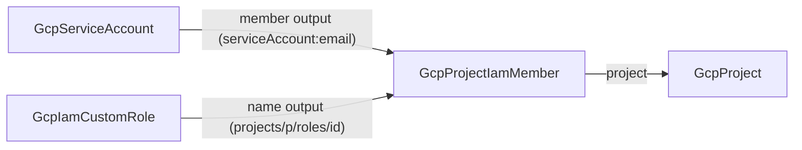
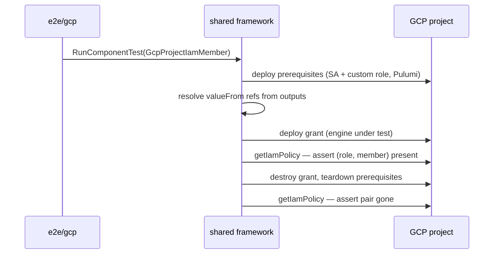

# GCP IAM Leaf: Custom Role + Project IAM Member Kinds, Service Account Depth, Secrets Manager Retirement, and the GCP E2E Harness

**Date**: July 2, 2026
**Type**: Feature
**Components**: GCP Provider, API Definitions, IAC Stack Runner, Testing Framework, CLI Flags

## Summary

The GCP catalog gains first-class, composable IAM: a new `GcpIamCustomRole` kind (least-privilege permission bundles), a new `GcpProjectIamMember` kind (additive one-role-one-member grants), and a `GcpServiceAccount` deepened to the full provider surface with identity-handle outputs. The redundant `GcpSecretsManager` kind is retired (Planton Config Manager is the single secrets system), and GCP gets its first live E2E harness — all six kind/engine combinations verified against a real GCP project with zero orphaned resources.

## Problem Statement / Motivation

GCP access control was nearly absent from the catalog: the only IAM surface was a flat role-list on the service account. That left three structural gaps:

- **No least-privilege story.** Users could only grant Google's broad predefined roles; there was no way to define a custom permission bundle, so every workload identity over-granted.
- **Grants were invisible.** A role granted through an embedded list is not a node in the resource graph — no independent lifecycle, no cross-chart ownership, no conditions, no non-service-account members.
- **No live verification.** GCP had no `aa_e2e` harness, so no GCP module had ever been proven with a real create → verify → destroy cycle.

Two smaller defects compounded this: every spec documents `project_id` as "optional, falls back to the provider default project," but the modules passed empty strings through verbatim (a guaranteed API error); and `GcpSecretsManager` duplicated a concern (secret storage) that the platform's Config Manager owns.

## Solution / What's New

### The composable IAM triangle

- **`GcpIamCustomRole` (new)** — a project-scoped custom role: `roleId`, `title`, `description`, `permissions` (min 1), `stage`. Models GCP's soft-delete/undelete lifecycle honestly; the `name` output is the grantable handle.
- **`GcpProjectIamMember` (new)** — one ADDITIVE grant: role (ref → custom role's `name`, or a literal predefined role), member (ref → service account's `member`, or any IAM member literal), optional IAM condition. Everything immutable, mirroring the API (grants have no update). Authoritative `_iam_binding`/`_iam_policy` modes are deliberately unmodeled — their clobber semantics are hostile to composition.
- **`GcpServiceAccount` (deepened)** — adds `displayName`, `description`, and the `disabled` kill switch; tightens `accountId` validation to the real RFC1035 rule; outputs gain `member`, `uniqueId`, and `name` so downstream references never assemble strings. Provider pin conformed from a hardcoded `6.19.0` to `~> 6.0` + a `google-beta` stanza. Spec test grew from 1 to 14 cases.
- **`GcpSecretsManager` (retired)** — kind directory, enum entry, and registry wiring removed; the `serverless-api-backend` chart dropped its secrets template and role grant (Config Manager owns secrets). The chart also gained the required fields its manifests were silently missing (`storageGb`, container `cpu`/`memory`/`replicas`) — it now renders and validates clean end to end.

### The GCP E2E harness (net-new)

`apis/dev/planton/provider/gcp/aa_e2e/` implements the shared framework's `Harness` interface: Setup resolves the test project (`E2E_GCP_PROJECT` → `GOOGLE_PROJECT` → ADC), exports `GOOGLE_PROJECT` for both engines' subprocesses, and validates reachability with a side-effect-free `projects.get`. Per-kind verifiers probe real cloud state through `google.golang.org/api` (IAM + Cloud Resource Manager), including compound-identity verification for grants (the exact role+member pair in the project policy) and soft-delete-aware destruction checks for custom roles. `e2e/gcp/gcp_test.go` + per-kind scenario/prerequisite YAMLs complete the wiring; `GcpProjectIamMember` is the first GCP kind to use registry-level `prerequisites`, driving the first composed GCP topology (role + service account deployed, references resolved, grant applied). New Makefile targets: `e2e-test-gcp`, `-pulumi`, `-terraform`.

### Cross-cutting fixes

- **Ambient-project contract honored**: the three touched kinds' modules now fall back to the provider's default project when `project_id` is empty (`null` guard where the provider computes the project; a client-config lookup in both engines for the grant, whose resource requires an explicit project). Identical behavior across engines.
- **CLI**: the `tofu` command group now registers the `stack-input` flag the shared manifest resolver reads on every path — previously any `planton tofu <cmd> --manifest ...` invocation failed before running.
- **Workflow rules**: the Terraform-module forge rule now warns that the proto→tfvars converter flattens `StringValueOrRef` to a plain string (so ref fields are typed `string`, never `object({value})`); the Pulumi-entrypoint rule now forbids `runtime.options.binary` in `Pulumi.yaml` (it breaks source-mode `pulumi up`). Both were stale-sibling traps hit and fixed this session.

## Validation

Offline gate (all green): `make protos`; per-kind spec tests (14 + 16 + 11 cases); release-equivalent Pulumi builds; `tofu validate` + `planton tofu plan` against every hack manifest; `secret-coverage --check`; `validate-refs --check`; `validate-outputs` per kind + the first GCP cases in the `pkg/outputs` conformance table; every preset, scenario, and hack manifest through `planton validate`; the reworked chart rendered against default values and every document validated.

Live gate (all green, ephemeral, zero orphans confirmed by post-run `gcloud` sweeps):

| Kind | Pulumi | Terraform |
|---|---|---|
| GcpServiceAccount | ✅ 35s | ✅ 35s |
| GcpIamCustomRole | ✅ 20s | ✅ 25s |
| GcpProjectIamMember (composed: 2 prerequisites) | ✅ 73s | ✅ 76s |

Per-kind audits (all three): **Fully Complete — PARITY ✅**, recorded in each kind's `docs/audit/`.

## Impact

- GCP users can now express least-privilege access as first-class, composable graph nodes — define a permission bundle once, grant it per identity, see every grant as a visible edge.
- Every future GCP component session inherits a working live E2E harness and two proven new-kind patterns (leaf kind, composed kind with prerequisites).
- The `GcpSecretsManager` removal eliminates a dead-end kind and points users at the platform's single secrets system.

## Related Work

- Builds on the shared provider-agnostic E2E framework (`e2e/framework/*`) and mirrors the AWS harness shape.
- Provider-version conformance (`~> 6.0` + google-beta) continues kind-by-kind as sessions touch modules.

---

**Status**: ✅ Production Ready
