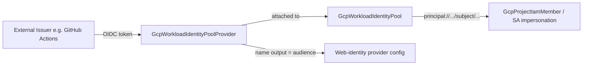

# GCP Workload Identity Federation: Pool and Provider Kinds

**Date**: July 3, 2026
**Type**: Feature
**Components**: GCP Provider, API Definitions, IAC Stack Runner, Testing Framework

## Summary

Adds two new GCP resource kinds — `GcpWorkloadIdentityPool` (enum 701) and `GcpWorkloadIdentityPoolProvider` (enum 702) — completing the composable keyless-authentication path into Google Cloud: external identities (GitHub Actions, GitLab CI, AWS workloads, SAML IdPs, X.509 estates) federate through a pool + provider pair instead of holding long-lived service-account keys. Alongside the kinds, the shared E2E runner gains per-run unique-ID substitution (`${E2E_RUN_ID}`) so resources whose identifiers are reserved across soft-delete windows can be exercised live, and the pulumi-gcp SDK moves from v9.4.0 to v9.29.0.

## Problem Statement / Motivation

The catalog modeled the *consumption* side of workload identity federation (the provider config accepts web-identity credentials, and `GcpGkeWorkloadIdentityBinding` covers the GKE-specific case) but not the *provisioning* side: there was no way to declare the trust boundary and issuer configuration that keyless auth depends on. Anyone adopting keyless CI/CD had to hand-create pools and providers in the console — the exact anti-pattern a composable catalog exists to remove.

### Pain Points

- No first-class way to provision the trust boundary (pool) or issuer trust (provider) for keyless federation
- Service-account JSON keys remained the practical default for CI/CD — long-lived bearer credentials that leak
- The web-identity audience string had to be assembled by hand instead of composed from resource outputs

## Solution / What's New

### `GcpWorkloadIdentityPool` (701, `gcpwip`)

The trust boundary and principal namespace. Spec models the full released provider surface: pool ID (with the API's exact validation, including the reserved `gcp-` prefix), project reference, display name/description, the `disabled` kill switch, `mode` (FEDERATION_ONLY default / TRUST_DOMAIN; the Google-managed SYSTEM_TRUST_DOMAIN is rejected with an explaining message), and the trust-domain surface (mTLS certificate issuance config + additional trust bundles). Outputs export the full resource name (the handle IAM principals embed), the bare pool ID (what providers reference), and the lifecycle state.

### `GcpWorkloadIdentityPoolProvider` (702, `gcpwipp`)

One external issuer per provider, many providers per pool. The issuer is a proto `oneof` across all four types — `aws` (account ID), `oidc` (issuer URI, audiences, optional inline JWKS), `saml` (IdP metadata), `x509` (trust store with anchors + intermediates) — plus `attribute_mapping` and `attribute_condition`. A message-level CEL rule enforces GCP's requirement that OIDC providers map `google.subject`, failing at validation time instead of at deploy. The `name` output is byte-for-byte the audience string web-identity provider configurations consume — the two halves of keyless auth now compose by reference.

The registry entry declares `prerequisites: [GcpWorkloadIdentityPool]`, so the E2E harness (and anything else consuming the prerequisite graph) deploys the pool automatically before the provider.

### Shared E2E runner: `${E2E_RUN_ID}` manifest tokens

Workload identity pools and providers are soft-deleted for ~30 days and their IDs cannot be reused while soft-deleted — and unlike IAM custom roles there is no undelete-on-create; a create against a soft-deleted ID fails outright. Static scenario manifests with fixed IDs therefore could never pass twice (not even the second engine of the same run). The runner now expands a `${E2E_RUN_ID}` token in scenario AND prerequisite manifests, using an engine-scoped per-run value (`<runid>-p` / `<runid>-t`), before any parsing or FK resolution. Manifests without the token are untouched; `metadata.name` stays fixed (FK resolution keys off kind, and stable names aid debugging) — only cloud-side identifier fields carry the token. Ships with unit tests (`e2e/framework/runner/tokens_test.go`). Any future kind with reservation-across-deletion semantics (KMS key rings are the same class) gets this for free.

### pulumi-gcp v9.4.0 → v9.29.0

The pinned SDK predated parts of the pool surface. The bump is a minor-version float within the same major; representative GCP Pulumi modules (IAM kinds, GKE cluster, Cloud Run, Cloud SQL, VPC) were rebuilt against it to confirm no regressions.

## Implementation Details

- **Released-provider verification**: the pool's `mode` and inline certificate/trust blocks are beta-only on the released 6.x Terraform provider line (GA in the provider's next major), and `attestation_rules` exists only on the provider's unreleased main. The spec models the released surface; the Terraform pool resource selects `provider = google-beta` with a comment naming the beta-only fields (the Pulumi GCP provider is bridged from google-beta by construction, so both engines exercise the same surface). Attestation rules are deliberately unmodeled until they ship in a release, recorded in the component docs.
- **Parity**: both engines implement the identical contract — same null-fallback ambient-project behavior, same empty-value semantics (unset optionals stay unset; empty attribute maps defer to issuer defaults), same outputs. `planton validate-outputs` dry-runs report full proto population for both kinds, and `pkg/outputs/conformance_test.go` gained a case per kind.
- **Terraform null-guard fix**: HCL's `||` does not short-circuit, so a variable validation shaped `x == null || length(x.field) > 0` fails whenever `x` is omitted. Caught live by the pool's Terraform E2E run; fixed with `try()` and folded into the terraform-module flow rule as timeless guidance.
- **Verifiers**: `aa_e2e/verify/workload_identity_pool{,_provider}.go` probe via the IAM API with soft-delete-aware absence checks (state `DELETED` counts as destroyed).

## Validation

- Offline: `make protos`; spec tests (22 pool + 20 provider cases) green; release-equivalent Pulumi builds; `tofu validate` + `planton tofu plan` per kind; `secret-coverage --check`; `validate-refs --check`; `validate-outputs` full population per kind + conformance cases; every hack/preset manifest through `planton validate` (scenario manifests validated with the run-id token substituted); `make build-go`; runner unit tests.
- Live (project `planton-e2e`): create → verify → destroy on BOTH engines for both kinds — pool 52s/45s, provider (with pool prerequisite chain) 75s/76s. Post-run sweep confirmed zero ACTIVE pools; only expected soft-deleted E2E resources remain.
- Audits: both kinds **Fully Complete — PARITY ✅** (reports in each kind's `docs/audit/`). No `PARITY-EXCEPTION` needed.

## Impact

Keyless CI/CD to GCP is now fully self-service: pool + provider + service-account impersonation grant compose declaratively, and the provider's audience output feeds web-identity credentials directly. Nothing existing changes behavior; the two kinds are additive, and the E2E runner enhancement is inert for manifests that do not carry the token.

## Related Work

- `2026-07-02-212213-gcp-iam-leaf-custom-role-project-iam-member-and-e2e-harness.md` — the IAM leaf kinds, the GCP E2E harness, and the prerequisite-chain pattern this work builds on.

---

**Status**: ✅ Production Ready
