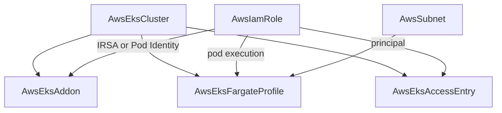

# AWS EKS Satellites: Managed Add-ons, Fargate Profiles, and Access Entries as First-Class Kinds

**Date**: July 3, 2026
**Type**: Feature
**Components**: API Definitions, AWS Provider, Pulumi CLI Integration, Terraform Modules, Testing Framework, Infra Charts

## Summary

Three new AWS kinds complete the EKS family: `AwsEksAddon` (EKS managed
add-ons with IRSA/Pod-Identity wiring by reference), `AwsEksFargateProfile`
(serverless pod placement with honest create-only semantics), and
`AwsEksAccessEntry` (the modern cluster-access model with folded
AWS-managed policy associations). All three compose onto `AwsEksCluster`
through output-backed references, ship with dual-engine parity,
generator-owned Terraform contracts, live E2E on both provisioners, and
first-class managed core add-ons in the eks-environment chart. The E2E
harness also gained a teardown-robustness fix: prerequisite teardown
failures now FAIL the run instead of passing with warnings, so a green
run guarantees zero orphaned prerequisites.

## Problem Statement / Motivation

The EKS control plane and node group reached full provider depth, but the
satellites around them did not exist: no way to install AWS-managed
add-ons (vpc-cni, coredns, kube-proxy, CSI drivers) as managed resources,
no Fargate profiles for serverless pods, and no access entries — meaning
cluster access still assumed the deprecated aws-auth ConfigMap model.
The eks-environment chart layered Helm-operator software but left the
core cluster add-ons as unmanaged bootstrap copies.

### Pain Points

- Cluster software lifecycle (versions, configuration, IAM identity of
  add-ons) was invisible to the resource graph.
- A cluster's IAM access grants were unrepresentable — the auto-created
  creator entry was the only access path Planton could express.
- Serverless pod placement (Fargate) was absent from the AWS surface.
- The harness reported teardown success even when a prerequisite destroy
  failed, silently leaking cloud resources until someone audited the
  account.

## Solution / What's New

### AwsEksAddon (kind 236, id_prefix `eksaddon`)

- Full `aws_eks_addon` surface: catalog name, optional pinned version
  (semver-with-v CEL; empty follows the AWS default so manifests never
  go stale), JSON `configuration_values`, `preserve` on delete, and the
  create-only custom `namespace_config`.
- **AWS's asymmetric conflict handling modeled exactly**: create accepts
  NONE/OVERWRITE, update additionally accepts PRESERVE — two separate
  CEL rules, so PRESERVE-at-create fails validation instead of the
  deploy. OVERWRITE at create is the documented adoption path for the
  bootstrap self-managed copies every default cluster starts with.
- **Both identity paths by reference**: `service_account_role_arn`
  (IRSA; requires the cluster's OIDC provider) and repeated
  `pod_identity_associations` (the modern no-OIDC-provider path).
  Roles carry their own policies — the module never mutates a role it
  references.

### AwsEksFargateProfile (kind 237, id_prefix `eksfp`)

- The full resource: cluster/pod-execution-role/subnets by reference,
  1–5 selectors (the AWS quota, CEL-enforced), each a namespace (with
  `*`/`?` wildcards) plus up to 5 AND-matched labels.
- **Honest immutability**: the entire profile is create-only in AWS;
  the spec and modules say so, and the docs record the overlap-during-
  migration pattern and AWS's per-cluster serialization of profile
  operations.
- Private-subnet requirement documented where users will hit it (AWS
  rejects subnets with an internet-gateway route).

### AwsEksAccessEntry (kind 238, id_prefix `eksae`)

- One entry per (cluster, principal) — AWS's own key, both create-only.
  `type` supports STANDARD plus the node types (EC2, EC2_LINUX,
  EC2_WINDOWS, FARGATE_LINUX, HYBRID_LINUX).
- **Beyond the provider floor**: the Terraform provider encodes NO
  type↔field conflict rules (AWS rejects at runtime); the spec's CEL
  forbids groups/username/associations on non-STANDARD types, and
  rejects reserved `system:` groups, so misuse fails at validation.
- **Policy associations folded, materialized per-name**:
  `aws_eks_access_policy_association` is pure per-principal glue, so
  associations live in the spec — while both engines create one
  provider resource per association keyed by policy name, so adding,
  re-scoping, or removing one diffs in place. Scope shape is
  CEL-enforced (namespace scope requires namespaces; cluster scope
  forbids them).

### E2E framework: teardown failures fail the run

`TeardownDependencies` now aggregates destroy/stack-removal failures and
returns them; the runner's DEPENDENCIES-DOWN phase fails on any of them
(previously it printed `[WARN]` lines and unconditionally reported
PASS). A green run now guarantees zero orphaned prerequisites. Unit
tests cover the aggregation contract: reverse order, no early stop, and
per-dependency error identification.

### E2E wiring for the three kinds

- Three ARN-keyed verifiers (DescribeAddon / DescribeFargateProfile /
  DescribeAccessEntry) — each satellite's ARN encodes the cluster name
  plus its own identity; the access-entry verifier reconstructs the
  principal ARN from the entry ARN's segments (IAM paths and non-standard
  partitions round-trip).
- The shared IAM-role fixture gained a fourth named document (the
  Fargate pod-execution role trusting `eks-fargate-pods.amazonaws.com`);
  the EKS cluster prerequisite now runs `authenticationMode: API` so
  access entries attach (additive for the node-group E2E — API-mode
  clusters auto-create node-role entries).
- Scenario design: the add-on smoke uses kube-proxy (reaches ACTIVE on a
  zero-node cluster) with OVERWRITE; the access-entry smoke grants a
  fixture role that is NOT the cluster creator; the Fargate smoke
  schedules nothing (profile creation validates the full wiring).

### Charts

`eks-environment` now manages the core add-on trio (vpc-cni, kube-proxy,
coredns) as first-class `AwsEksAddon` nodes behind a `coreAddonsEnabled`
toggle, each adopting the cluster's bootstrap copy with OVERWRITE;
coredns declares `depends_on` the node group because its replicas need
schedulable nodes. The Helm-operator installs are unchanged — they are
cluster software, not EKS-managed add-ons.

## Validation

- Spec/CEL tests for all three kinds (happy path + every error path);
  `pkg/outputs` conformance cases ×3; `pkg/iac/tofu/generators` drift
  guard (all three enrolled, contracts generator-owned from day one);
  E2E framework unit tests including the new teardown contract.
- `planton validate-refs --check` and `planton secret-coverage --check`
  green; `validate-outputs` dry-runs 6/6 (both engines × 3 kinds);
  `tofu init && tofu validate` ×3; release-equivalent Pulumi entrypoint
  builds ×3; `make build-go`; all presets, hack manifests, scenario
  manifests, and both modified prerequisite fixtures CLI-validated;
  site catalog regenerated.
- **Live dual-engine E2E: 6/6 green** — each run standing up the full
  VPC → subnets → roles → cluster chain (~13–20 min per engine):
  add-on 831s/828s, Fargate profile 978s/1191s, access entry 686s/789s
  (Pulumi/Terraform). Post-run account sweep: zero EKS clusters, zero
  non-default VPCs, zero tagged subnets, zero e2e IAM roles.

## Impact

The EKS wave is complete: cluster, node group, add-ons, Fargate, and
access management are all first-class, composable, dual-engine nodes.
An environment's entire EKS story — who can reach it, what runs on it,
which software AWS manages — is now visible in the resource graph.
