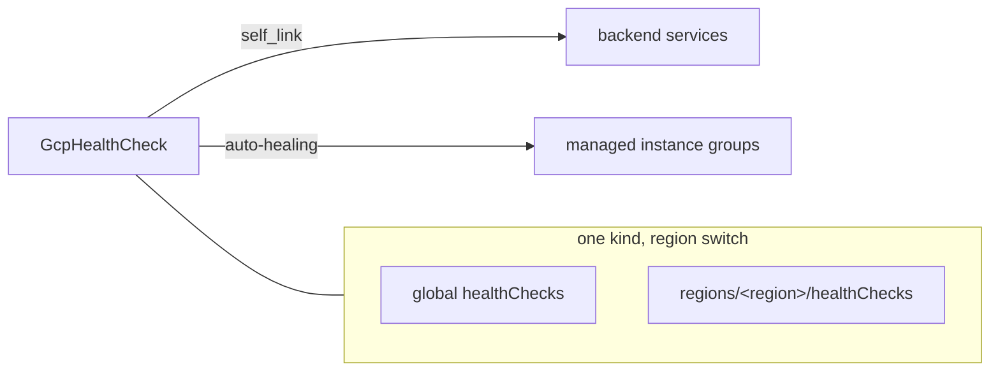
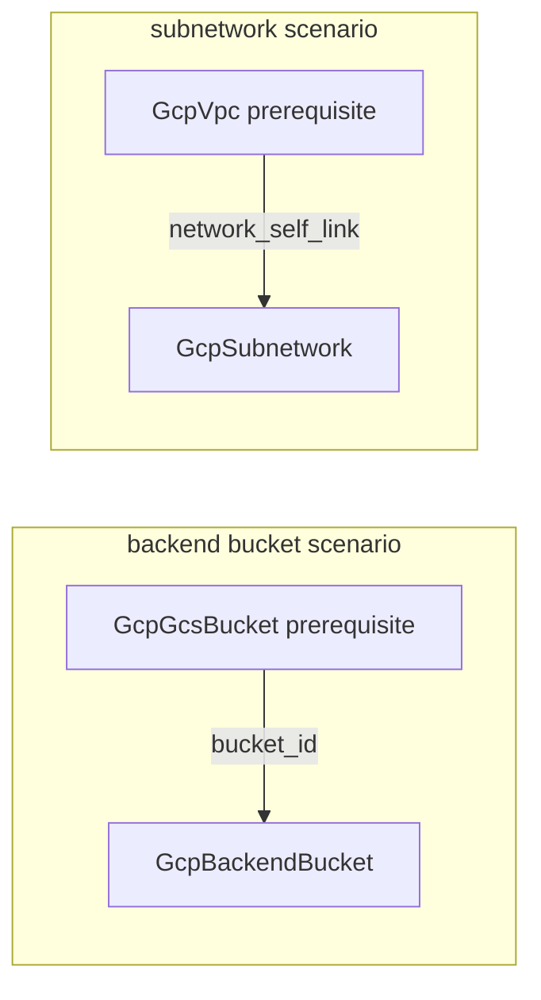

# GCP Health Check + Backend Bucket Kinds and Subnetwork Depth Rebuild

**Date**: July 3, 2026
**Type**: Feature
**Components**: GCP Provider, API Definitions, Provider Framework, Testing Framework

## Summary

Two new first-class GCP load-balancing kinds — `GcpHealthCheck` (enum 623) and `GcpBackendBucket` (enum 624) — plus a ground-up depth rebuild of `GcpSubnetwork` to the full provider surface. All three ship with dual-engine (Pulumi + OpenTofu) modules at 100% behavioral parity, presets, docs, spec tests, and live create→verify→destroy E2E coverage on both engines. The GCP E2E harness gains compute/storage verification and its first network-composition prerequisite chains (`GcpGcsBucket` → backend bucket, `GcpVpc` → subnetwork).

## Problem Statement / Motivation

Google's external HTTP(S) load balancer is not one resource — it is a family of independently owned API objects (health checks, backends, URL maps, proxies, forwarding rules) that reference each other. Composing real GCP serving architectures requires each of those objects to be a first-class, referenceable node.

### Pain Points

- No health-check kind existed, though every backend service references one and every managed instance group auto-heals through one.
- No backend-bucket kind existed, so GCS-backed static/CDN serving could not be composed into a load-balancer path at all.
- `GcpSubnetwork` modeled 7 of the provider's 23 input fields — no VPC flow logs, no proxy-only/PSC purposes (a hard prerequisite for regional Application Load Balancers), no dual-stack IPv6 — and carried a hardcoded `google = "6.19.0"` provider pin, a legacy hack-manifest location, and a Terraform/Pulumi output mismatch.

## Solution / What's New

### GcpHealthCheck (623)

One kind, two API collections: GCP models global and regional health checks as separate resources with a field-for-field identical probe surface, so the kind carries an optional `region` — empty creates `google_compute_health_check`, set creates `google_compute_region_health_check`. The probe protocol is a required oneof across all seven arms (`http`/`https`/`http2`/`tcp`/`ssl`/`grpc`/`grpc_tls`). CEL enforces pre-deploy everything GCP would otherwise reject at apply: timeout ≤ interval, port-specification coherence per arm, and the five `source_regions` constraints. Both modules run on `google-beta` because the gRPC-with-TLS block is preview-stage on the released 6.x line.

### GcpBackendBucket (624)

The static-content half of the serving path: serves a GCS bucket's objects through the external load balancer, optionally cached by Cloud CDN. The origin attaches by reference (`bucket_name` → `GcpGcsBucket`), the edge security policy by reference (`edge_security_policy` → `GcpCloudArmorPolicy`), and the full bucket-flavor `cdn_policy` is modeled (cache modes, TTLs, negative caching, cache keys, stale serving, request coalescing). Cloud CDN signed-URL keys are folded in as a `signed_url_keys` list (never FK-referenced, capped at 3 by GCP, lifecycle owned by the bucket) with `key_value` annotated sensitive — key material never reaches outputs and is marked secret in Pulumi state. CEL enforces the cache-mode/TTL coherence rules GCP silently strips and the CDN↔`INTERNAL_MANAGED` incompatibility.

### GcpSubnetwork depth rebuild

Spec deepened 7 → 17 fields at the provider floor: `purpose` (incl. `REGIONAL_MANAGED_PROXY` proxy-only subnets — the prerequisite for regional ALBs — and `PRIVATE_SERVICE_CONNECT`), `role`, dual-stack IPv6 (`stack_type`/`ipv6_access_type`/`external_ipv6_prefix`), IPv4/IPv6 private Google access, the `send_secondary_ip_range_if_empty` safety latch (a partial manifest can no longer wipe GKE pod ranges), `allow_subnet_cidr_routes_overlap`, and the full VPC Flow Logs block. Outputs gained `gateway_address`, `subnetwork_id`, and the allocated IPv6 prefixes. Fixed along the way: the hardcoded provider pin (now `~> 6.0` + `google-beta`), the legacy hack-manifest location, the missing Terraform `subnetwork_name` output, and stale placeholder/config debris in both engines. All seven inbound foreign-key references were preserved (extend-only outputs; `validate-refs` green).

### Ambient-project contract + E2E composition

`GcpVpc` and `GcpGcsBucket` were conformed to the ambient-project contract (empty `project_id` → the provider's default project) so they can serve as prerequisite deployments, and the kind registry gained `prerequisites: [GcpVpc]` on the subnetwork and `prerequisites: [GcpGcsBucket]` on the backend bucket. The GCP E2E harness gained compute and storage API clients plus five new verifiers. The GCS-bucket prerequisite manifest carries `${E2E_RUN_ID}` in its bucket name because GCS names are globally unique across all of GCP — a fixed scenario name could collide with any tenant's bucket anywhere.

All three new/updated kinds' modules (and the two conformed prerequisites) enable the Compute Engine API before creating resources (`disable_on_destroy = false`), so a fresh project works first try on both engines.

## Implementation Details

- **Released-schema verification caught two beta-only surfaces** the provider clone's main branch presents as GA: `grpc_tls_health_check` (health checks) and `allow_subnet_cidr_routes_overlap` (subnetworks). Both resources select `provider = google-beta` with a comment naming the beta feature; the Pulumi provider is beta-bridged by construction, so engines stay identical.
- **Registry hygiene**: a full-registry ID-prefix uniqueness scan found `KubernetesPerconaMysqlOperator` (834) reusing `k8sprcnpgop` from the Postgres operator (832) — fixed to `k8sprcnmsop`.
- **Outputs conformance**: three new cases in `pkg/outputs/conformance_test.go` (incl. the subnetwork's repeated secondary-range mapping) keep the cross-engine output shapes enforced in CI.
- **Workflow rules sharpened** from defects hit live: HCL's `coalesce()` skips empty strings (so it must never guard possibly-empty optional strings in variable validations), and presets must pass `planton validate` — angle-bracket placeholders cannot be used for pattern-validated fields.

## Validation

- Offline: `make protos` ×2; spec tests 24 + 20 + 23 (plus the two prerequisite kinds') green; release-equivalent Pulumi builds for all five touched kinds; `tofu validate` + offline `planton tofu plan` per kind through the real tfvars-converter path; `secret-coverage --check`; `validate-refs --check`; `validate-outputs` dry-runs with full proto population; every hack manifest, preset, scenario, and prerequisite manifest through `planton validate`; `make build-go`; framework tests (`pkg/outputs`, `pkg/refcheck`, `pkg/crkreflect`) green.
- Live (dual-engine, ephemeral create→verify→destroy): health check Pulumi 80.6s / Terraform 98.7s (global + regional scenarios), backend bucket 65s / 95s (with the GcsBucket prerequisite chain), subnetwork 135s / 148s (with the VPC prerequisite chain). Post-run sweeps: zero orphaned health checks, backend buckets, subnets, networks, or buckets.
- Audits: all three kinds **Fully Complete — PARITY ✅** with zero `PARITY-EXCEPTION`s (reports in each kind's `docs/audit/`).

## Impact

The load-balancing family now has its leaf (the probe every backend decision hangs on) and its static-content origin node, both composable by reference; subnets can express proxy-only and PSC purposes, dual-stack IPv6, and flow logging — unblocking the regional load-balancer path and network observability. The E2E harness's prerequisite chains now cover network and storage composition, so every subsequent LB-family kind can be live-tested against real composed dependencies with no new framework work.

## Related Work

- Builds on the GCP E2E harness and the IAM/WIF kinds (the harness's IAM verifiers and the `${E2E_RUN_ID}` token capability this work reuses).
- Sets up the next load-balancing kinds (backend service, URL map, proxies, forwarding rules), which will reference `GcpHealthCheck.self_link` and route to `GcpBackendBucket.self_link`.

---

**Status**: ✅ Production Ready
