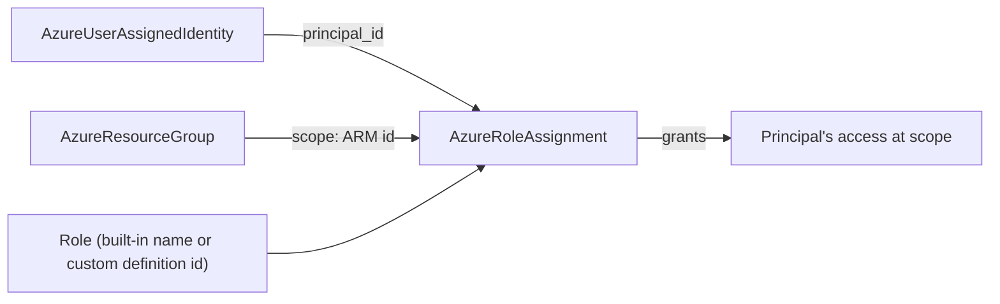

# AzureRoleAssignment: First-Class Azure RBAC Grants

**Date**: July 3, 2026
**Type**: Feature
**Components**: Azure Provider, API Definitions, Provider Framework, Testing Framework, CLI Commands

## Summary

Adds `AzureRoleAssignment` (enum 461), a first-class deployment component for
Azure RBAC role assignments — "grant principal X role Y at scope Z", the atomic
unit of Azure authorization. Both IaC engines ship at 100% behavioral parity on
the shared Azure Pulumi provider builder, proven by a live composed dual-engine
E2E (fixture resource group + fixture managed identity → Reader grant → verify
via the authorization API → destroy). The session also migrated
`AzureUserAssignedIdentity`'s Pulumi module onto the shared credential builder
and fixed two `planton tofu`/`terraform` CLI bugs surfaced by the validation
gate.

## Problem Statement / Motivation

Azure authorization could previously be expressed only through the role
assignments bundled inside `AzureUserAssignedIdentity`. That shape cannot grant
roles to principals the platform did not create (users, groups, external
service principals), couples an identity's lifecycle to its permissions, and
violates the composition principle that a module never mutates a resource it
merely references. Grants are many-per-principal and many-per-scope with
independent lifecycles — the textbook profile of a standalone kind.

## Solution / What's New

### The component

`apis/dev/planton/provider/azure/azureroleassignment/v1/` with the full
anatomy: four protos, spec tests (21 cases), both IaC modules, docs
(`README.md`, `docs/README.md`, `catalog-page.md`), three presets, E2E
profile/scenario, and registry entry with deploy-ordering prerequisites.

The spec models the complete `azurerm_role_assignment` surface (no skipped
fields), with composition-first reference defaults:

- `scope` — `StringValueOrRef`, defaults to an `AzureResourceGroup`'s ARM ID
  (the most common grant boundary); any ARM scope via explicit `valueFrom`.
- `role_definition_name` XOR `role_definition_id` — exactly-one-of via
  message-level CEL (built-in roles by name, custom roles by ID).
- `principal_id` — `StringValueOrRef`, defaults to an
  `AzureUserAssignedIdentity`'s principal-ID output; literal object IDs for
  users/groups/external SPs.
- `principal_type`, `description`, ABAC `condition` + `condition_version`,
  `delegated_managed_identity_resource_id` (cross-tenant),
  `skip_service_principal_aad_check` (fresh-principal replication-lag escape
  hatch), optional pinned GUID `name`.
- No `tags` — `Microsoft.Authorization` resources genuinely do not support ARM
  tags (documented, not omitted).

Stack outputs export the fully-scoped `role_assignment_id`, the GUID `name`,
`scope`, the **resolved** `role_definition_id` (even when the role was
referenced by name), `principal_id`, and `principal_type`.

### E2E composition (first composed Azure scenario)

The kind registry now drives the Azure harness's dependency graph:
`AzureRoleAssignment` declares `prerequisites: [AzureResourceGroup,
AzureUserAssignedIdentity]`, and `AzureUserAssignedIdentity` declares
`prerequisites: [AzureResourceGroup]`. New harness pieces:

- `aa_e2e/verify/role_assignment.go` — verifies via
  `armauthorization.RoleAssignmentsClient.GetByID` on the fully-scoped ARM ID
  (typed 404 = absent). New dep: `armauthorization/v2 v2.2.0` (stable line).
- `aa_e2e/verify/user_assigned_identity.go` — verifies via the generic ARM
  resources GetByID. A GET, not a HEAD: `Microsoft.ManagedIdentity` answers
  `CheckExistenceByID`'s HEAD with 405 Method Not Allowed (verified live).
- Dedicated prerequisite fixtures: `azureresourcegroup/v1/e2e/prerequisite.yaml`
  (distinct from the walking-skeleton smoke scenario) and
  `azureuserassignedidentity/v1/e2e/prerequisite.yaml` (an identity with NO
  bundled grants — the component under test owns the grant).

### AzureUserAssignedIdentity Pulumi builder migration

The identity's Pulumi module previously constructed its provider inline from
the static client secret — which dereferences a nil provider config under the
E2E framework's keyless path and silently breaks keyless (OIDC web-identity)
auth in production. It now builds through the shared
`pulumiazureprovider.Get`, which dispatches static / keyless / ambient
credentials. Its Terraform side was already canonical. (The identity's full
rework — extracting the bundled role assignments — is separate, deliberate
follow-up work.)

### CLI bug fixes (surfaced by this component's validation gate)

1. **`--stack-input` flag missing on `tofu`/`terraform` command groups** —
   the shared manifest resolver reads the flag on every command, so ANY
   `planton tofu <cmd>` / `planton terraform <cmd>` invocation failed with
   `flag accessed but not defined: stack-input` before `--manifest` was even
   considered. The flag is now registered on both groups (as it already was on
   `pulumi`). `cmd/planton/root/tofu.go`, `cmd/planton/root/terraform.go`.
2. **Relative `--module-dir` broke tofu var-file resolution** — the generated
   var-file path is joined onto the module dir, but the child process runs
   WITH the module dir as its working directory, so a caller-relative module
   dir made `tofu init` fail with "variables file does not exist".
   `GetModulePath` now normalizes a user-provided module dir to an absolute
   path. `pkg/iac/tofu/tofumodule/module_directory.go`.

### Guard and rule uplift

- `pkg/outputs/conformance_test.go`: added `AzureRoleAssignment` and
  `AzureResourceGroup` cases (the Azure catalog's first entries in the
  cross-engine output-shape guard).
- `e2e/README.md`: two durable authoring lessons — every registry prerequisite
  needs its own verifier + install profile (the dependency deployer verifies
  fixtures too), and existence probes should prefer GET-by-ID over HEAD unless
  the resource provider is known to implement HEAD.
- Audit rule + its README: dropped the `iac/pulumi/debug.sh` helper-file check
  — no component in the catalog ships one, so the checklist item only produced
  noise.

## Validation

- Offline (all green): `make protos`, kind-map + Gazelle regen, 21 spec tests,
  targeted builds + release-equivalent Pulumi builds (new kind + migrated
  identity module), `make build-go`, `go run . secret-coverage --check`
  (Azure slice stays 100%), `go run . validate-refs --check`,
  `tofu init`/`validate`/`fmt -check` + a full `planton tofu plan` against the
  hack manifest, `pkg/outputs` conformance, `validate-outputs` schema check,
  component audit (98%, PARITY ✅, COVERAGE ✅ — report at
  `.../azureroleassignment/v1/docs/audit/2026-07-03-113647.md`).
- Live dual-engine E2E against the real test subscription, all 8 phases per
  engine (DEPENDENCIES-UP → VALIDATE → DEPLOY → VERIFY-OUT → VERIFY-RES →
  DESTROY → VERIFY-CLN → DEPENDENCIES-DOWN):
  - `TestAzureRoleAssignment_Pulumi/minimal` — PASS
  - `TestAzureRoleAssignment_Terraform/minimal` — PASS (3m06s)
  - Zero orphaned resource groups after the runs (`az group list` empty).

## Impact

Azure environments can now express their full authorization graph as
composable, auditable nodes: workload identities grant themselves nothing; the
grants are first-class resources that reference identities and scopes. The
composed-E2E machinery (registry-driven prerequisites, fixture profiles,
per-kind verifiers) is now proven on Azure, so every subsequent Azure component
with references gets composed live coverage on the same rails. The two CLI
fixes unblock direct `planton tofu`/`terraform` usage for every provider.

## Related Work

- Azure live E2E harness (`2026-07-03-081126-azure-e2e-harness.md`)
- Shared Azure Pulumi provider builders (OIDC/keyless auth foundation)

---

**Status**: ✅ Production Ready
