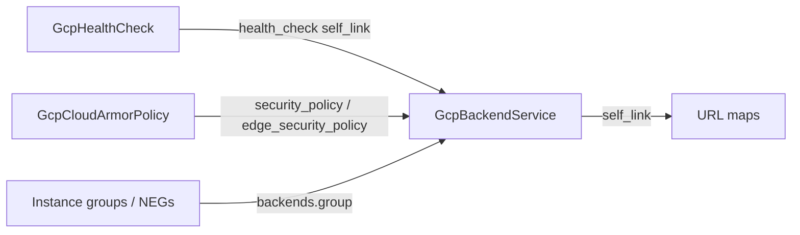

# GCP Backend Service Kind — the L7 Load-Balancing Hub

**Date**: July 3, 2026
**Type**: Feature
**Components**: API Definitions, GCP Provider, IaC Modules, Testing Framework

## Summary

Adds `GcpBackendService` (enum 625) — the global Compute Engine backend service, the hub of GCP's L7 load-balancing family. The kind models the full released-provider surface: backends with all balancing modes, the singular health-check reference, session affinity including strong cookie affinity, the backend-service-flavor Cloud CDN policy with its rich cache key, Identity-Aware Proxy, Cloud Armor attachment by reference, logging, the Traffic Director traffic-policy blocks, backend TLS/mTLS settings, the EXTERNAL→EXTERNAL_MANAGED canary migration, and folded signed-URL keys. Both engines ship at 100% behavioral parity with live dual-engine E2E green on the health-check prerequisite chain.

## Problem Statement / Motivation

The load-balancing family had its leaves — `GcpHealthCheck` probes and `GcpBackendBucket` static origins — but not its hub. Every URL map routes to backend services; target proxies and forwarding rules sit above the URL map. Without a first-class backend service, the family cannot compose upward: URL maps would have nothing real to reference, and the dynamic half of any serving path (instance groups, and soon serverless NEGs bridging Cloud Run) had no home.

### Pain Points

- No composable node owned the traffic contract: balancing modes, session affinity, CDN policy, IAP, and logging had nowhere to live except bundled black boxes.
- Cloud Armor policies existed as a kind but had no backend-service `security_policy` seam to attach to.
- IAP — the zero-trust pattern for internal tools — was unmodeled anywhere in the catalog.

## Solution / What's New

### The kind

- **Spec at the released-provider floor** (verified against a released 6.x schema dump, not the provider clone's main): 36 top-level fields and 20 nested messages covering protocol (incl. H2C), all four load-balancing schemes, backends with UTILIZATION/RATE/CONNECTION/CUSTOM_METRICS modes and every capacity dial, all 8 session-affinity modes, locality policies incl. custom xDS policies and consistent hashing, the full CDN policy, IAP, log config, circuit breakers, outlier detection, max stream duration, security settings (mTLS + AWS SigV4 origin signing), TLS settings, IP selection policy, migration controls, ORCA custom metrics, and up to 3 signed-URL keys.
- **`health_check` is singular** — the provider caps `health_checks` at exactly one; a repeated field would advertise capacity the API does not have. Optional only because serverless/internet NEG backends forbid it.
- **`backends[].group` is a ref without a default kind** — an instance-group or NEG self-link; the referenced kinds attach their `default_kind` as they land in the catalog, while `valueFrom.kind` composes explicitly today. The reference-integrity guard explicitly supports this multi-target shape.
- **14 message-level CEL rules** reject pre-deploy what GCP would reject or silently strip: scheme applicability (CDN, circuit breakers, outlier detection, consistent hash, max stream duration, backend preference), affinity-mode coherence, per-backend mode↔dial coherence, cache-mode/TTL coherence, query white/blacklist exclusivity, IAP client pairing, and migration-state coherence.
- **Three secrets, secure by default**: `iap.oauth2_client_secret`, `security_settings.aws_v4_authentication.access_key`, and `signed_url_keys[].key_value` are `(sensitive)`, `pulumi.ToSecret` in state, and never in outputs.

### Both engines, one contract

The Terraform module runs on plain `google ~> 6.0` — every modeled field is GA on the released line (the two beta-only blocks, dynamic forwarding and the zonal-affinity passthrough policy, are recorded skips). Both modules enable the Compute Engine API first, honor the ambient-project contract, normalize `""`/0 to unset so GCP API defaults apply, and pass `capacity_scaler` through whenever present because an explicit 0 is the drain-this-backend semantics (the field is `optional` in the proto precisely so unset and 0 are distinguishable). Module comments document the provider's out-of-band `setSecurityPolicy` calls, the NEG `max_utilization` strip, and the string-typed `max_stream_duration.seconds`.

## Implementation Details

- `apis/dev/planton/provider/gcp/gcpbackendservice/v1/` — 4 protos, 49-case spec test, both IaC modules, README + catalog page + research doc with the full 90/10 coverage table, 3 presets (external web backend, CDN-cached API, IAP-protected internal tool).
- Registry: enum 625 in the LB sub-band, `id_prefix: "gcpbs"`, `prerequisites: [GcpHealthCheck]` — declaring the prerequisite is the only E2E wiring needed; the harness resolves it transitively.
- E2E: `verify/backend_service.go` (compute `backendServices.get` + the exactly-one-health-check wiring assertion), `gcphealthcheck/v1/e2e/prerequisite.yaml` (the health check's first outing as a prerequisite), scenario exercising CDN + cache key + affinity + compression + sampled logging, dual-engine entrypoints.
- `pkg/outputs/conformance_test.go` gains the GcpBackendService case (4 outputs: `self_link`, `backend_service_name`, `generated_id`, `fingerprint`).

## Benefits

- The LB family can now compose upward: URL maps, proxies, and forwarding rules have their hub to reference, and the `GcpCloudCdn` retirement path is unblocked.
- IAP lands as a one-flag zero-trust gate for internal tools — the first IAP surface in the catalog.
- Cloud Armor policies gain their attachment seam (post-cache and pre-cache).

## Validation

- Offline: 49/49 spec tests; release-equivalent Pulumi build; `tofu validate` + offline `planton tofu plan` through the real tfvars converter (plan inspected field-by-field); `secret-coverage --check`; `validate-refs --check`; `validate-outputs` dry-runs 4/4 against both module dirs; `pkg/outputs` conformance green; every preset/hack/scenario manifest through `planton validate`; `make build-go`; kind-map + gazelle regenerated.
- Live (project planton-e2e, dual-engine): create → verify → destroy with the GcpHealthCheck prerequisite chain — Pulumi 110s, Terraform 121s. Zero orphans (post-run `gcloud compute backend-services list` and `health-checks list` both empty).
- Audit: **Fully Complete — PARITY ✅**, zero PARITY-EXCEPTIONs (`docs/audit/2026-07-03-122941.md`).

## Related Work

- Builds on the health-check and backend-bucket kinds (the family's leaves) and the E2E prerequisite chaining they proved.
- Forge flow rule 001 gains two durable refinements from this session: the released-schema probe can reuse any sibling kind's already-initialized `iac/tf` directory (and the same dump settles the GA-vs-beta module choice), and proto `optional` is required whenever an explicit zero must be distinguishable from unset.

---

**Status**: ✅ Production Ready
