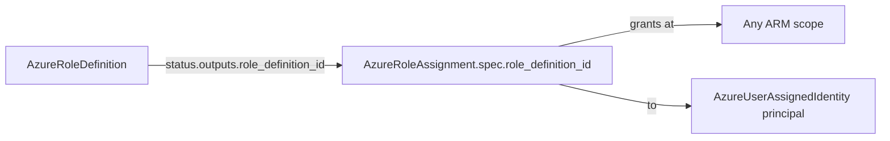

# AzureRoleDefinition: First-Class Custom Azure RBAC Roles

**Date**: July 3, 2026
**Type**: Feature
**Components**: Azure Provider, API Definitions, Pulumi CLI Integration, IAC Stack Runner, Testing Framework

## Summary

Adds `AzureRoleDefinition` (enum 462), a first-class deployment component for
custom Azure RBAC roles -- named, reusable permission bundles that role
assignments grant to principals. This completes the custom-role story started
by `AzureRoleAssignment`: an organization's role catalog is now
version-controlled, composable infrastructure, and an assignment binds a
custom role by referencing the definition's `role_definition_id` output.
Both IaC engines ship at 100% behavioral parity on the shared Azure pulumi
provider builder, proven by live dual-engine E2E against a real subscription.

## Problem Statement / Motivation

`AzureRoleAssignment` supports custom roles through its `role_definition_id`
field, but nothing on the platform could produce that ID -- custom roles had
to be hand-crafted in the portal or by scripts outside the resource graph.

### Pain Points

- Real organizations routinely need permission sets Azure's built-in roles
  don't express ("operate VMs but never create or delete", "read everything
  plus blob data", "Contributor except RBAC writes")
- Portal-crafted custom roles are invisible to infra charts: not reviewable,
  not referenceable, not reproducible
- The assignment kind's custom-role path pointed at IDs with no first-class
  producer

## Solution / What's New

### The component

`apis/dev/planton/provider/azure/azureroledefinition/v1/` -- the full
component anatomy. The spec models the complete azurerm v4.80 surface
(`azurerm_role_definition`), nothing skipped:

- `name` (required) -- tenant-unique display name
- `scope` (required) -- polymorphic creation scope: management group,
  subscription, or resource group; `StringValueOrRef` defaulting to an
  `AzureResourceGroup`'s ARM ID for composed environments
- `permissions` -- repeated blocks with `actions` / `not_actions` /
  `data_actions` / `not_data_actions`, mirroring ARM's list-of-blocks shape;
  comments teach control-plane vs data-plane and carve-out-vs-deny semantics
- `assignable_scopes` -- repeated `StringValueOrRef` (literals and references
  mix); omitted means Azure defaults it to `[scope]` on both engines
- `role_definition_id` -- optional pinned GUID (UUID-validated)
- No `tags` -- Microsoft.Authorization resources do not support ARM tags

### The composition seam

Stack outputs export `role_definition_id` as the FULLY-SCOPED ARM ID --
azurerm calls that attribute `role_definition_resource_id`, but Planton's
Azure surface consistently uses `role_definition_id` for the fully-scoped
form (it is exactly what the assignment kind documents and consumes), so the
seam needs zero translation. The bare GUID is exported separately as
`role_definition_guid`, plus `role_name`, `scope`, and the
Azure-recorded `assignable_scopes`.

### Both engines, one contract

- **Pulumi** (`iac/pulumi/`): `authorization.RoleDefinition` via the shared
  `pulumiazureprovider.Get` builder (static secret / keyless web identity /
  ambient chain all work)
- **Terraform** (`iac/tf/`): `azurerm_role_definition` on `azurerm ~> 4.0`
  with the canonical empty provider block; empty `assignable_scopes` passes
  null so azurerm applies the same server-side defaulting the Pulumi engine
  gets by omitting the argument
- Module comments document the operational grain: name/description/
  permissions/assignable-scopes update in place, scope and pinned GUID
  replace, updates and deletes are eventually consistent (minutes, not
  seconds), and Azure refuses to delete a definition that still has
  assignments

### Docs, presets, catalog

README, research doc (RBAC anatomy, authorization-model nuances, full
azurerm→spec field map, design decisions), catalog page, and 3 teaching
presets: explicit-actions VM operator (least privilege), blob-data-reader
(the control-plane vs data-plane lesson), and project-admin
wildcard-minus-carve-out with assignable-scope governance. Site catalog
regenerated.

### E2E

- `verify/role_definition.go` -- `armauthorization/v2`
  `RoleDefinitionsClient.GetByID` on the fully-scoped ARM ID, typed-404
  absence check
- Registry-driven composed scenario: custom role
  (`Microsoft.Resources/subscriptions/resourceGroups/read` only) scoped at
  the shared fixture resource group -- no literal subscription IDs in
  fixtures; the RG prerequisite profile is reused as-is
- Live nuance captured: ARM returns the definition's fully-scoped ID at
  subscription level even when created at RG scope; the verifier keys on the
  module's exported ID, so verification is scope-representation agnostic

## Validation (what ran and passed)

- Offline: `make protos`; kind-map + gazelle regen; 18/18 spec test cases;
  targeted builds + release-equivalent Pulumi build; `make build-go`;
  `secret-coverage --check` (Azure slice stays 100%); `validate-refs --check`;
  `pkg/outputs` conformance case (scalars + the repeated
  `assignable_scopes`); `tofu init/validate/fmt` + full `planton tofu plan`
  on the hack manifest (1 to add, all 5 outputs); audit 98% Fully Complete,
  PARITY ✅, COVERAGE ✅ (`v1/docs/audit/2026-07-03-125229.md`)
- Live (test subscription `8158df85-…`):
  `TestAzureRoleDefinition_Pulumi/minimal` PASS (6m08s) and
  `TestAzureRoleDefinition_Terraform/minimal` PASS (6m49s) -- all 8 phases
  each (deps-up → validate → deploy → verify-out → verify-res → destroy →
  verify-cln → deps-down). The ~4.5-minute destroy is Azure's
  eventual-consistency delete polling, as documented in the modules.
  `az group list` and `az role definition list --custom-role-only` both
  empty afterward -- zero orphans.

## Workflow uplift (rides along)

Retired the `debug.sh` artifact from the component workflow: zero of ~370
components ship one, so the prescription only produced noise. Cleaned from
forge flow rule `012-pulumi-docs.mdc` (now README-only), the
`pulumi_docs_write.py` writer (debug-file parameter removed), the forge
orchestrator's phase text and success criteria, the forge/deployment-component
READMEs, `FORGE_ANALYSIS.md`, the complete/delete rules, and the doctrine's
file tree, checklists, and scoring line (`architecture/deployment-component.md`).
Also removed the stale commented-out `binary: ./debug.sh` block from
`azureroleassignment`'s `Pulumi.yaml`.

## Impact

- Azure orgs can now express their full RBAC posture -- identities, custom
  roles, and grants -- as composable, reviewable resources in one graph
- The identity/RBAC family is one component away from complete
  (`AzureFederatedIdentityCredential` remains, then the
  `AzureUserAssignedIdentity` bundled-grant extraction)
- 3 of ~39 Azure Pulumi modules now run on the shared keyless-compatible
  provider builder

## Related Work

- `2026-07-03-115439-azure-role-assignment-component.md` -- the assignment
  kind this component's output feeds
- `2026-07-03-081126-azure-e2e-harness.md` -- the live E2E harness this
  component's proof runs on

---

**Status**: ✅ Production Ready
