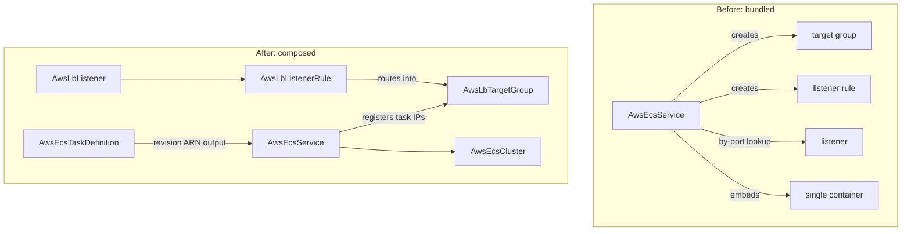

# AWS ECS Restructuring: First-Class Task Definitions and a Composed Service

**Date**: July 3, 2026
**Type**: Breaking Change
**Components**: API Definitions, AWS Provider, IAC Modules, E2E Framework, Infra Charts

## Summary

`AwsEcsService` was an 80/20 bundle: a single hardcoded container, an
embedded ALB block whose modules created a target group and listener rule
behind the service's back, and a by-port listener lookup that forced charts
to carry an explicit `depends_on` hack. This change splits the container
blueprint into a new first-class **`AwsEcsTaskDefinition`** kind (enum 239)
and rebuilds **`AwsEcsService`** as pure scheduling at the full
`aws_ecs_service` provider surface, composing onto the first-class
load-balancing kinds. Both kinds ship dual-engine modules at 100% parity,
presets, docs, and live dual-engine E2E (4/4 green).

## Problem Statement

### Pain Points

- **The container blueprint was trapped inside the service.** AWS models
  the task definition as its own immutable, revision-per-change resource
  (nearly every argument is create-only) -- the same shape as an EC2
  launch template, which is a first-class kind. Embedding it meant no
  sidecars, no revision semantics, no reuse by future scheduled-task
  kinds.
- **The service created resources it should reference.** Its modules
  created an `aws_lb_target_group` and `aws_lb_listener_rule` internally
  and looked the listener up **by port**, even though `AwsLbTargetGroup`,
  `AwsLbListener`, and `AwsLbListenerRule` are first-class kinds. The
  ecs-environment chart compensated with an explicit listener
  `depends_on` relationship.
- **Most of the real service surface was unrepresentable**: capacity
  provider blends (FARGATE_SPOT), deployment circuit breaker, alarm-gated
  rollbacks, native blue/green, Service Connect, managed EBS task
  volumes, placement, AZ rebalancing, ECS Exec.
- Three of the service's nine outputs were fabricated (`service_url`,
  `service_discovery_name`, an empty `target_group_arn`).

## Solution

### The composition, before and after

### AwsEcsTaskDefinition (239, `ecstd`) -- new kind

The immutable container blueprint, modeled structurally instead of as the
ECS API's opaque JSON: multi-container tasks with per-container sizing,
named ports (the Service Connect join key), env/secrets-by-ARN,
env-files, health checks, `dependsOn` startup ordering, mount points,
FireLens routing, ulimits, GPU reservations, and in-place restart
policies; task-level Fargate sizing, `runtime_platform` (ARM64/Windows),
ephemeral storage, EFS + host-path volumes, split execution/task roles by
reference, and `skip_destroy`. A zero-configuration logging default
creates one `/ecs/<family>` CloudWatch group with per-container stream
prefixes -- or references an existing `AwsCloudwatchLogGroup`.

**Revision-roll composition:** the `task_definition_arn` output carries
the revision, so a service referencing it rolls automatically whenever a
new revision registers -- "change the image tag, the service rolls" is
the resource graph, not deploy tooling.

### AwsEcsService -- rebuilt at the full provider surface

- `load_balancers` is now `repeated` {target-group ref, container name,
  container port} with an optional blue/green `advanced_configuration`
  (alternate target group + production/test listener rules by ref); the
  embedded ALB block, TG/rule creation, and by-port lookup are gone.
- `task_definition` and `cluster_arn` are required refs; capacity is
  launch type XOR a capacity-provider blend; deployments are guarded by
  the circuit breaker, CloudWatch-alarm gating (`AwsCloudwatchAlarm`
  refs), and ECS-native BLUE_GREEN with canary/linear shifting, bake
  time, and Lambda lifecycle hooks; Service Connect, Cloud Map
  registries, managed EBS volumes, placement, AZ rebalancing
  (honest tri-state), tag propagation, ECS Exec, and force-delete round
  out the surface. 16 CEL rules keep invalid combinations (DAEMON on
  Fargate, grace period without load balancers, canary+linear, ...) from
  ever reaching AWS.
- Folded autoscaling grew request-count tracking:
  `ALBRequestCountPerTarget` composes its resource label from the ALB's
  and target group's `arn_suffix` outputs -- **`AwsAlb` gained the
  `arn_suffix` output** (both engines) to complete the pair.
- Outputs rebuilt to real values: `service_arn` / `service_name` /
  `cluster_arn` / `task_definition_arn`.

### Charts

`charts/aws/ecs-environment` now renders four nodes per service --
task definition, target group, host-routing listener rule, and the
service -- replacing the embedded-ALB shape. The one explicit
relationship left is service→rule, because AWS rejects `CreateService`
until the target group is listener-associated, and the rule creates that
association.

### E2E

- New verifiers for `awsecstaskdefinition`, `awsecsservice`, **and
  `awsecscluster`** (a prerequisite must be verifiable): ARN-keyed,
  ACTIVE-aware -- ECS keeps deleted services/clusters and deregistered
  revisions describable as INACTIVE, so absence checks status, not
  describability.
- Registry prerequisites: task definition ← [AwsIamRole]; service ←
  [AwsEcsCluster, AwsEcsTaskDefinition, AwsSubnet]. New Fargate-cluster
  install fixture; the shared IAM-role profile grew a fifth document (the
  ECS task-execution role, required by AWS at registration time for
  Fargate + awslogs).
- **Live dual-engine E2E: 4/4 green** -- task definition (Pulumi 2m16s /
  Terraform 2m44s) and the service chain VPC → subnets → execution role →
  cluster → task definition → service at `desiredCount: 0` (Pulumi 5m13s
  / Terraform 7m05s). Zero tasks launched; post-run account sweep clean.

## Live-Run Catches

1. **AWS couples awslogs to the execution role at registration time** --
   `RegisterTaskDefinition` rejects a Fargate task using awslogs without
   an execution role. Now a CEL rule (fails at validate, not at the
   provider), a registry prerequisite, and the new role fixture.
2. **HCL's non-short-circuiting `&&` in `count` expressions** -- the
   autoscaling policy counts guarded `var.spec.autoscaling.cpu != null`
   behind `&&`, which errors when `autoscaling` itself is null. Same
   class as the EKS session's dynamic-block catch; rule 013 now states
   the trap applies to every expression context.
3. **A prerequisite kind needs its own verifier** -- the harness verifies
   dependencies after deploying them, so declaring `AwsEcsCluster` as a
   prerequisite required registering a verifier for it even though the
   cluster has no E2E lane of its own. Folded into the forge rule.

## Breaking Changes

**BREAKING CHANGE:** `AwsEcsServiceSpec` is restructured -- the embedded
`container`, `alb`, and `iam` blocks are removed; the container blueprint
lives in the new `AwsEcsTaskDefinition` kind referenced via
`task_definition`; load-balancer wiring is `load_balancers[]` with
target-group refs. Stack outputs drop `service_url`,
`service_discovery_name`, `target_group_arn`, `ecs_cluster_name`, and the
log-group outputs (now on the task definition). Nobody uses the system
yet; no migration path is provided by design.

## Validation Report

Offline gate all green: spec/CEL tests ×2 kinds (happy + every error
path), `pkg/outputs` conformance ×3 (both new kinds + the extended AwsAlb
case), `TestVariablesTFDrift` (both kinds generator-owned),
`validate-refs`, `secret-coverage` (stale baseline entry removed; honest
ARN-map exemptions), `validate-outputs` dry-runs 6/6, `tofu init &&
validate` ×2 (service floor lifted to `>= 6.50.0` -- the first release
carrying the full blue/green surface), release-equivalent Pulumi builds +
`Pulumi.yaml` checks, `make build-go`, 6 presets + 2 hack manifests + 2
scenarios + 2 fixtures + 4 rendered chart documents CLI-validated,
mechanical field-parity sweep (zero PARITY-EXCEPTIONs -- pulumi-aws
v7.35.0 carries the complete new ECS surface), site catalog regenerated.
Live gate: dual-engine E2E 4/4 green, account swept clean.

## Related Work

- The load-balancing decomposition introduced the first-class
  `AwsLbTargetGroup`/`AwsLbListener`/`AwsLbListenerRule` kinds this
  service now composes onto.
- The launch-template/ASG split set the template-kind precedent
  (immutable versioned blueprint, referenced by the thing that runs it)
  that the task definition follows.

---

**Status**: ✅ Production Ready
