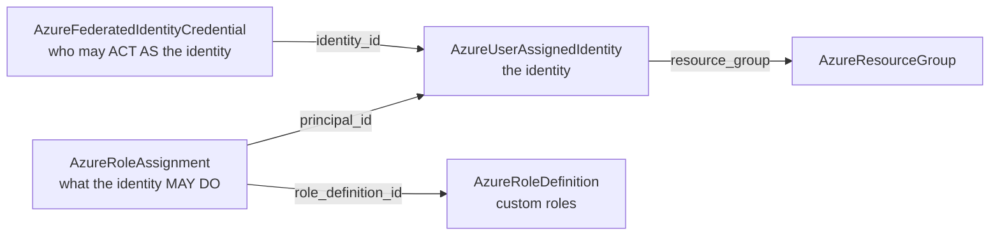

# Azure Federated Identity Credential Component + User-Assigned Identity Rework

**Date**: July 3, 2026
**Type**: Feature
**Components**: API Definitions, Azure Provider, Pulumi CLI Integration, IAC Stack Runner, Testing Framework

## Summary

Completes Azure's identity story with two changes that land together because they are two
halves of one design: a new first-class `AzureFederatedIdentityCredential` component (the
keyless-OIDC unlock for GitHub Actions CI and AKS workload identity), and a rework of
`AzureUserAssignedIdentity` to be identity-only — its formerly embedded role assignments
move to the standalone `AzureRoleAssignment` component, while the identity gains the full
azurerm v4 surface (`isolation_scope`, user `tags`). Both components are proven with live
dual-engine E2E against a real Azure subscription.

## Problem Statement / Motivation

Azure's modern answer to "how does anything outside Azure authenticate without a stored
secret" is workload identity federation: an external system's OIDC token is exchanged for
a managed identity's credentials. The catalog could not express this at all — there was no
federated-credential resource, so GitHub Actions pipelines needed stored client secrets
and AKS workloads could not use workload identity through Planton.

At the same time, the user-assigned identity component bundled an optional list of role
assignments inside its spec. That bundling predated the standalone RBAC components and
carried three structural problems:

### Pain Points

- **No keyless path**: no way to declare "this GitHub repo / this Kubernetes service
  account may act as this identity" — the single highest-value identity capability for
  CI/CD and AKS organizations
- **A module mutating what it references**: the identity's modules wrote role assignments
  at OTHER resources' scopes — grants the identity module does not own
- **A shallow duplicate grant surface**: the embedded mini-grant (scope + role name only)
  could never carry ABAC conditions, custom-role binding by ID, principal types, or
  cross-tenant fields — all of which the standalone `AzureRoleAssignment` already models
- **Missing provider surface**: the identity spec lacked `isolation_scope` (azurerm v4.59+)
  and user `tags` (the Azure governance grain)

## Solution / What's New

### The three-kind identity composition

Each concern is an independent, referenceable node: trust rules and grants are added and
revoked without touching the identity, whose replacement would otherwise mint a new
principal and invalidate everything.

### AzureFederatedIdentityCredential (new, enum 463)

- **Spec**: `name` (unique per identity), `user_assigned_identity`
  (`StringValueOrRef` → the identity's `identity_id` output), `issuer`, `subject`, and
  `audience` (defaulting to `api://AzureADTokenExchange`, the audience Azure AD's
  token-exchange endpoint expects). The full azurerm v4 surface; deliberately no
  `resource_group` field — azurerm v4 derives it from the parent ID and removes the
  standalone argument in v5, so both modules derive it too rather than modeling
  contradictable redundant state.
- **Both engines**: TF `azurerm_federated_identity_credential` on `~> 4.0` with the
  canonical empty provider block, using the v4-canonical `user_assigned_identity_id`
  argument; Pulumi `armmsi.FederatedIdentityCredential` via the shared
  `pulumiazureprovider.Get` builder (keyless-compatible). The audience's wire shape
  (a one-element list) is normalized identically on both sides.
- **Docs/presets**: research doc covering the three-way claim match (`iss`/`sub`/`aud`),
  GitHub subject formats, and the AKS `system:serviceaccount:{ns}:{sa}` flow; three
  teaching presets (GitHub Actions OIDC, AKS workload identity, generic external issuer),
  each showing the consuming side (workflow YAML, service-account annotation).

### AzureUserAssignedIdentity (reworked)

- **Spec**: `role_assignments` and its nested message removed; `isolation_scope` (proto
  enum mirroring ARM's opt-in `Regional` mode) and user `tags` (merged over the
  metadata-derived tags in BOTH engines, user tags winning) added; fields renumbered
  contiguously; comments rewritten as timeless Azure-only prose.
- **Modules**: both engines reduced to the single identity resource with rich authoring
  comments (the replacement-mints-a-new-principal blast radius, tag-merge order,
  isolation-scope defaulting so unspecified == ARM default on both engines).
- **Presets**: the bundled-grants preset replaced with composition-teaching presets
  (standard, CI-deployer, governance-tagged).
- **Zero blast radius verified**: the only chart consuming the identity does not use
  `role_assignments`; the E2E fixture profile never carried grants; the identity's stack
  outputs are unchanged.

### Shared dependency bump

`pulumi-azure/sdk/v6` v6.28.0 → **v6.38.0**, bringing `isolation_scope` to the classic
provider (azurerm added it in v4.59). Validated with targeted release-equivalent builds
and the repo-wide `make build-go`.

## Implementation Details

- Registry: `AzureFederatedIdentityCredential = 463` (identity sub-band, `azfic`),
  `prerequisites: [AzureUserAssignedIdentity]` — the honest direct dependency; the
  resource group chains transitively through the identity's own prerequisite, exactly how
  the harness resolves fixtures.
- E2E: new ARM `GetByID` verifier for the credential (GET over HEAD —
  Microsoft.ManagedIdentity answers HEAD with 405); a first-class identity scenario added
  alongside its existing fixture profile (the fixture serves other kinds' composed tests;
  the scenario is the identity's own proof, exercising the tag merge); four new test
  entrypoints in `e2e/azure/azure_test.go`.
- Outputs conformance: `pkg/outputs/conformance_test.go` gains cases for BOTH kinds (the
  identity had none).
- Workflow uplift (learn-once): the hack-manifest forge flow rule now requires the
  `value:`/`valueFrom:` wrapper form for `StringValueOrRef` fields and prescribes a
  `planton tofu plan` run as its validation step — a bare scalar passes every offline
  check and then fails manifest validation with a cryptic protoyaml error.

## Validation (what ran and passed)

- Offline: `make protos`; kind-map + gazelle regen; 19/19 (credential) and 15/15
  (identity) spec tests; targeted builds + release-equivalent Pulumi builds;
  `make build-go`; `secret-coverage --check` (Azure slice stays 100%; neither kind
  carries secret material); `validate-refs --check`; `pkg/outputs` conformance with the
  two new cases; `tofu init/validate/fmt` + full `planton tofu plan` on both hack
  manifests; audits 98% Fully Complete, PARITY ✅ COVERAGE ✅ for both kinds.
- Live (test subscription, ephemeral, zero orphans confirmed via `az group list` +
  `az identity list`):
  - `TestAzureFederatedIdentityCredential_Pulumi/minimal` PASS (174s) and
    `_Terraform/minimal` PASS (183s) — all 8 phases each (fixture RG + fixture identity
    → GitHub-shaped credential → ARM verify → destroy → verify-gone)
  - `TestAzureUserAssignedIdentity_Pulumi/minimal` PASS (135s) and `_Terraform/minimal`
    PASS (160s) — all 8 phases each (tagged identity → verify → destroy)

## Impact

- **Keyless CI/CD and AKS workload identity are now expressible**: identity + grant +
  trust rule, all by reference, no client secret anywhere.
- **The identity component stops owning grants it doesn't own** — composed environments
  express permissions through the full-surface `AzureRoleAssignment` instead of a shallow
  embedded duplicate.
- 4 of ~39 Azure Pulumi modules now run on the shared provider builder (keyless-ready).

## Related Work

- `2026-07-03-115439-azure-role-assignment-component.md` — the standalone grant component
  the extraction lands on
- `2026-07-03-130142-azure-role-definition-component.md` — custom roles; assignments bind
  their fully-scoped IDs
- `2026-07-03-081126-azure-e2e-harness.md` — the live dual-engine harness these proofs
  run on

---

**Status**: ✅ Production Ready
