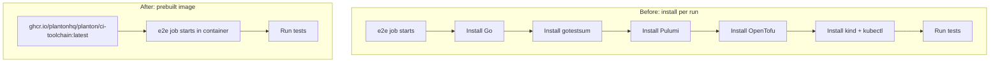

# A Common CI Toolchain Image Replaces Per-Run Tool Installs in E2E and TF-Lint

**Date**: July 3, 2026
**Type**: Enhancement
**Components**: Build System, Testing Framework, CI/CD, Error Handling

## Summary

The e2e and Terraform-lint CI jobs used to reinstall their entire toolchain
(Go, gotestsum, Pulumi, OpenTofu, kind, kubectl) on every run via `curl | sh`
and `go install`. This change bakes that toolchain into one prebuilt image
published to GHCR (`ghcr.io/plantonhq/planton/ci-toolchain`) and switches the
target jobs to run inside it, so the tools are present at container start
instead of being fetched mid-job. It also removes a real reliability failure:
the OpenTofu installer's "latest" lookup hits the rate-limited `api.github.com`
REST API, which fails under an exhausted anonymous quota.

## Problem Statement / Motivation

Four workflows -- [e2e-aws.yaml](.github/workflows/e2e-aws.yaml),
[e2e-auth0.yaml](.github/workflows/e2e-auth0.yaml),
[e2e-kubernetes.yaml](.github/workflows/e2e-kubernetes.yaml), and
[lint.terraform-modules.yaml](.github/workflows/lint.terraform-modules.yaml) --
each opened with a stack of "Install X" steps that downloaded and installed the
same tools from the public internet on every single run and every matrix leg.

### Pain Points

- **Redundant, slow installs**: every job leg re-fetched Pulumi (~119 MB),
  OpenTofu, kind, kubectl, and `go install`ed gotestsum before doing any real
  work. The Kubernetes e2e matrix multiplies this across many cells.
- **Network-fragility**: each install is a live dependency on an upstream host
  (`get.pulumi.com`, `get.opentofu.org`, `dl.k8s.io`, the Go module proxy). Any
  one being slow or down fails the job.
- **The OpenTofu rate-limit trap**: `install-opentofu.sh` resolves "latest" by
  calling `https://api.github.com/repos/opentofu/opentofu/releases/latest`, an
  endpoint capped at 60 requests/hour per IP for unauthenticated callers. It
  usually squeaks by on fresh GitHub runners but fails deterministically once
  the quota is spent -- which is exactly what happened the first time this image
  was built locally:

  ```
  Determining latest OpenTofu version...
  Failed to obtain the latest release from the GitHub API.
  ```

- **Drift**: install versions were scattered and inconsistent -- kind was pinned
  (`@v0.27.0`), kubectl floated (`stable.txt`), OpenTofu floated (latest), and
  AWS CLI was whatever the runner happened to ship.

## Solution / What's New

One image, built once, reused by every toolchain job.



### The image -- `tools/ci/docker/Dockerfile`

Based on `golang:1.26-bookworm` (Go tracks `go.mod`, the one intentional pin).
It bakes in the full toolchain plus the tools a `container:` job does *not*
inherit from the `ubuntu-latest` runner (aws, gh, jq, zip, git, docker-cli):

- gotestsum, Pulumi, AWS CLI v2, kubectl -- installed at **latest** at build
  time, matching the previous per-run "latest" behavior.
- kind -- kept pinned at `v0.27.0`, because its version is coupled to the
  Kubernetes node-image versions the e2e framework boots. This is the only tool
  whose "latest" would be a genuine compatibility risk.

### The build pipeline -- `.github/workflows/build.ci-image.yaml`

Triggers **only** on changes under `tools/ci/docker/**` (plus manual dispatch):

- **Pull request** -> build only, no push. Verifies the Dockerfile still builds.
- **Push to main** -> build and push two tags: an immutable UTC timestamp tag
  (`YYYY-MM-DD-HH-MM-SS`) for audit/rollback, and `latest`, which every
  dependent workflow pulls.

## Implementation Details

### Reliable "always latest" for OpenTofu

Rather than pin a version (the user wanted latest to keep flowing) or authenticate
the API call, the Dockerfile resolves the latest version from the
`github.com/.../releases/latest` **redirect** -- plain web, not the metered REST
API -- and passes it explicitly, which skips the installer's own rate-limited
lookup entirely:

```dockerfile
latest_url="$(curl -fsSL -o /dev/null -w '%{url_effective}' \
  https://github.com/opentofu/opentofu/releases/latest)"; \
tofu_version="${latest_url##*/tag/v}"; \
/tmp/install-opentofu.sh --install-method standalone --skip-verify \
  --opentofu-version "${tofu_version}"
```

### kind needs the host Docker daemon

`kind` creates clusters as Docker containers, and a `container:` job has no
daemon of its own. The Kubernetes e2e job therefore mounts the host runner's
Docker socket and runs as root:

```yaml
container:
  image: ghcr.io/plantonhq/planton/ci-toolchain:latest
  options: --user root -v /var/run/docker.sock:/var/run/docker.sock
```

The image ships only the docker *client* (no docker-in-docker); it talks to the
host daemon through the mounted socket. The `discover` and `summary` jobs stay on
plain `ubuntu-latest` since they are pure jq/bash.

### Migration pattern

Each target job gained a `container:` line and dropped its now-redundant install
steps (`actions/setup-go`, `Install gotestsum/Pulumi/OpenTofu/kind/kubectl`). The
AWS e2e job kept its OIDC `configure-aws-credentials` + `aws sts
get-caller-identity` steps -- both work inside the container because `aws` is
baked in.

## Verification

The image built cleanly end-to-end and every tool resolves inside it:

```
go        go1.26.4
gotestsum v1.13.0
kind      0.27.0        (pinned)
kubectl   v1.36.2       (latest stable)
pulumi    v3.250.0
tofu      v1.12.3       (latest, via redirect - previously failing)
aws-cli   2.35.15       (latest v2)
gh        2.96.0
```

## Benefits

- **Faster jobs**: no per-run, per-matrix-leg tool downloads; tools are present
  at container start.
- **Fewer flakes**: removes live network dependencies on five upstream install
  endpoints from the hot path, and eliminates the OpenTofu API rate-limit failure.
- **Single source of truth**: one Dockerfile defines the toolchain instead of
  install steps duplicated across four workflows.
- **Auditable upgrades**: the timestamp tag records exactly which tool set each
  build produced, so a bad upgrade can be traced and rolled back.

## Impact

- **CI/build only** -- no CLI, runtime, or user-facing behavior changes.
- Affects [e2e-aws.yaml](.github/workflows/e2e-aws.yaml),
  [e2e-auth0.yaml](.github/workflows/e2e-auth0.yaml),
  [e2e-kubernetes.yaml](.github/workflows/e2e-kubernetes.yaml), and
  [lint.terraform-modules.yaml](.github/workflows/lint.terraform-modules.yaml).
- The image must be published once (dispatch `build.ci-image`) before the
  migrated workflows can pull `:latest`.

## Design Decisions

- **Latest, not pinned (except kind + Go)**: mirrors the prior per-run behavior;
  the timestamp tag provides the audit trail, and any future breaking tool
  release is fixed by pinning that one tool in the Dockerfile (which conveniently
  retriggers a rebuild under the path filter).
- **Scope limited to the toolchain jobs**: the website (GitHub Pages actions) and
  CLI release (GoReleaser action + older pinned Go) jobs were intentionally left
  on standard runners, where a shared image adds complexity for little gain.
- **`latest` is a shared moving target**: because all dependent jobs pull
  `:latest`, a rebuild upgrades tools for all of them at once -- an accepted
  trade-off for keeping a single, current toolchain.

## Related Work

Complements the existing release pipeline documented in
[.github/workflows/docs/auto-tags.md](.github/workflows/docs/auto-tags.md), which
uses the same built-in `GITHUB_TOKEN` pattern this build workflow relies on for
GHCR authentication.

---

**Status**: Production Ready
**Timeline**: Single session (analysis, image, pipeline, migration, build verification)
